# Deploy Azure Kubernetes Cluster

## Lab scenario

Azure Kubernetes Service (AKS) is a managed Kubernetes service that lets you quickly deploy and manage clusters. In this task, you:

 - Deploy an AKS cluster using the Azure portal.
 - Run a sample multi-container application with a group of microservices and web front ends simulating a retail scenario.

## Lab objectives

In this lab, you will complete the following exercise: 

Exercise 1: Create an AKS cluster
Exercise 2: Connect to the cluster
Exercise 3: Deploy the application
Exercise 4: Test the application

### Exercise 1: Create an AKS cluster

1. In a new web browser window or tab, navigate to the Azure portal (``portal.azure.com``).

1. On the Azure portal home page, select **+ Create a resource** **(1)**, in the search bar **Azure Kubernetes Service aks** **(2)** click enter, click on  **Create** **(3)** and select **Azure Kubernetes Service (AKS)** **(4)**.

    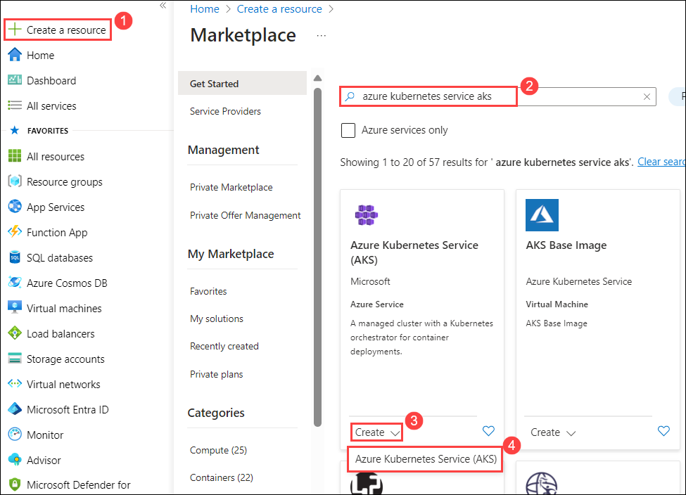

1. On the **Basics** tab of **Create Kubernetes Cluster**, configure the following options and click on **Next** **(11)**. 

    - **Subscription**: Select Avaiable Subscription **(1)**.
    - **Resource group**: Select `<inject key="resourcegroup" enableCopy="false"/>` **(2)**.
    - **Cluster preset configuration**: Select `Dev/Test` **(3)**.
    - **Kubernetes cluster name**: Enter `myAKSCluster-<inject key="DeploymentID"  enableCopy="false"/>` **(4)**.
    - **Region**: **(5)**.
    - **Availability zones**: Select `None` **(6)**.
    - **AKS pricing tier**: Select `free` **(7)**.
    - **Kubernetes Version**: Select `default` version **(8)**.
    - **Automatic upgrade**: Leave the setting set to the `Enabled with patch (recommended)` **(9)**.
    - **Authentication and authorization**: Leave the setting set to `Local accounts with Kubernetes RBAC` **(10)**.
    
        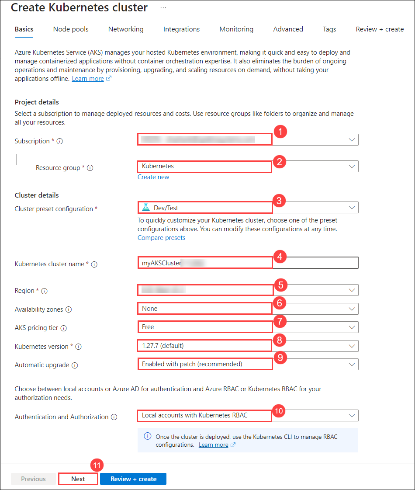

1. On the **Node pools** tab, select **agentpool** **(1)** node pool, click on **Delete** **(2)** and click on **+ Add node pool** **(3)**.

    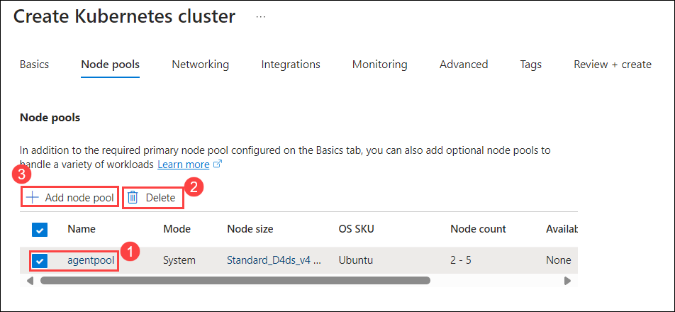

1. Enter the following detils in **Update node pool** tab and click on **Update** **(5)**.

    - **Node pool name**: Enter node name as `nplinux` **(1)**.
    - **OS SKU**: select `Ubuntu Linux` **(2)**.
    - **Availability zones**: setting to `None` **(3)**.
    - **Node size**: select `Choose a size` **(4)**. 
        - On the **Select a VM size** page, select `D2s_v3` **(1)**, then choose the `Select` **(2)** button.

            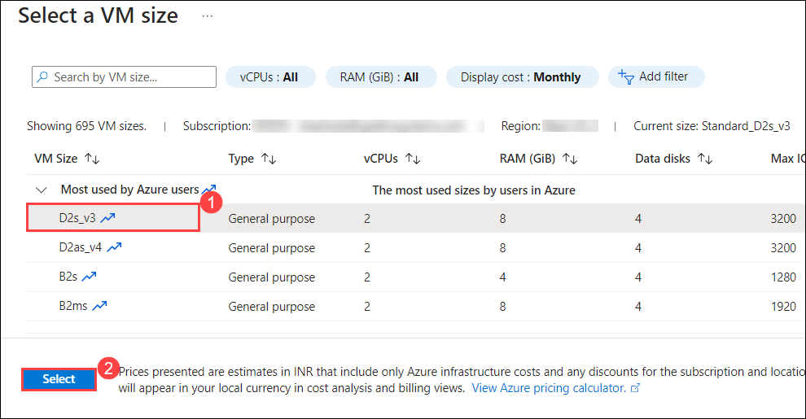
    
    - **Scale method**: Leave the setting set to `Autoscale` **(5)**.

        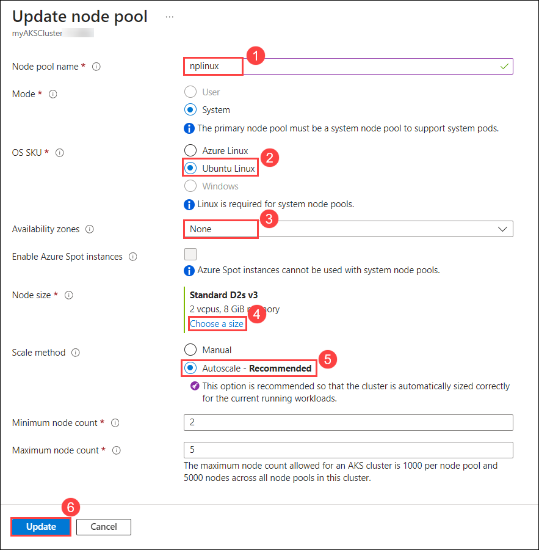

1. On the **Node pools** tab, click on **Review + create**.

    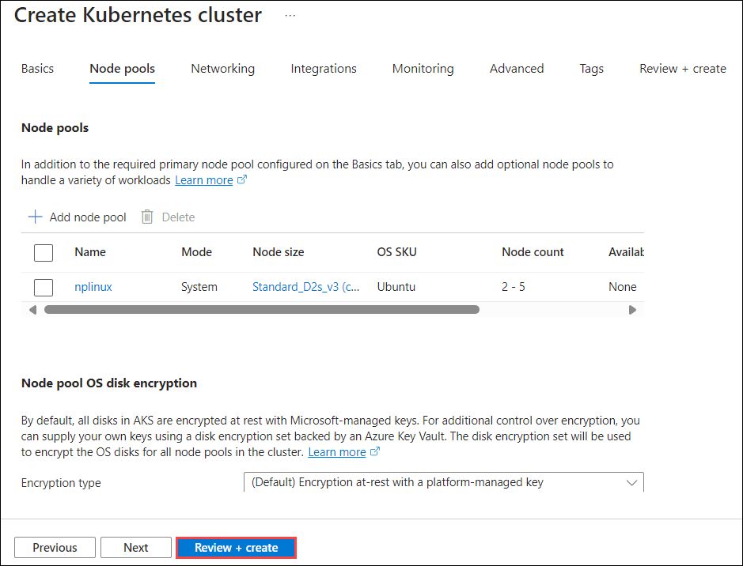

1. On the **Review + create** tab, click on **Create**.

    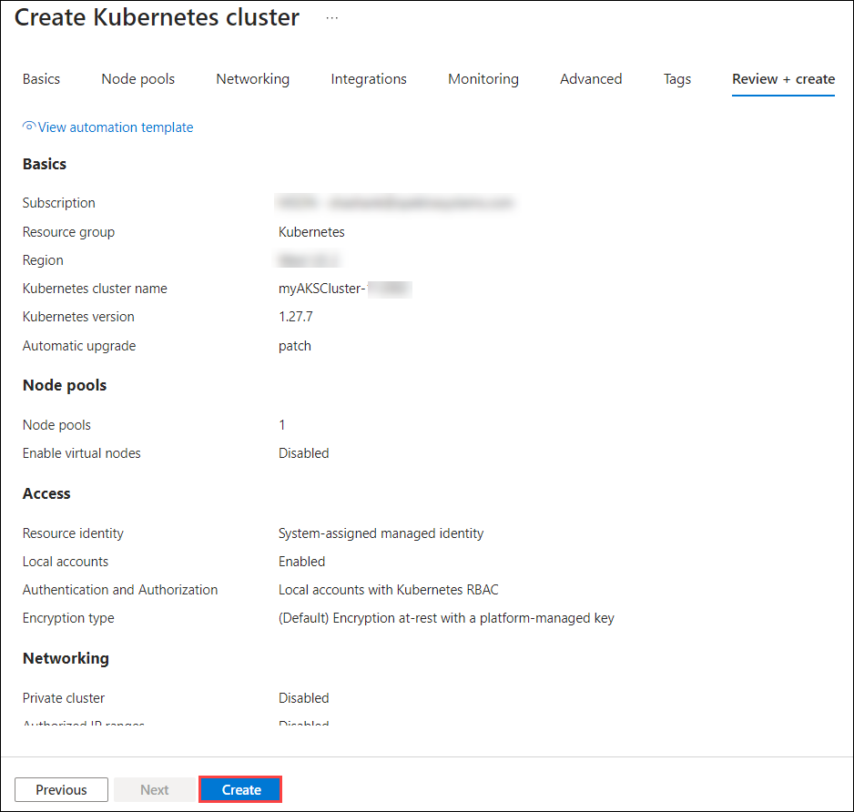

    > **Note**: Deployment will take 5 to 10 minutes to create the AKS cluster.

### Exercise 2: Connect to the Cluster

1. In the Azure port click on **Cloud Shell**, open it with the >_ button on the top of the Azure portal and select `PowerShell`.

    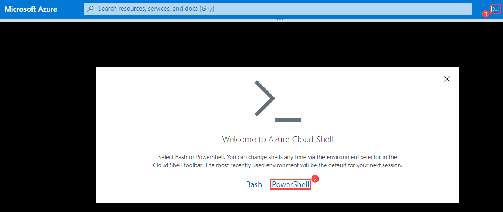

1. In the **You have no storage mounted** , click on `Show advanced settings`.

    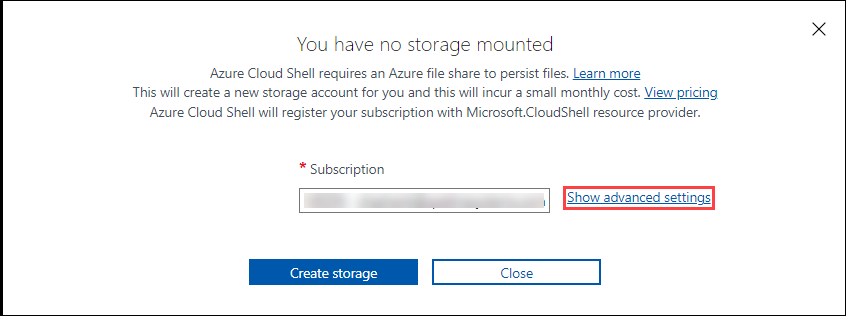

1. Create an Azure Storage account for the Azure file share, enter the following details and click on `Create account` **(5)**.

    - **Resource group**: Select `Use existing` **(1)** and from drop down select select the `<inject key="resourcegroup" enableCopy="true"/>` **(2)** Resource group.
    - **Storage account**: Enter the name as `storage<inject key="DeploymentID"  enableCopy="false"/>` **(3)**.
    - **File share**: Enter `blob` **(4)**

    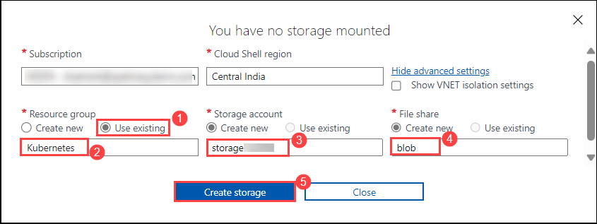

1. Configure `kubectl` to connect to your Kubernetes cluster using the `Import-AzAksCredential` cmdlet. This command downloads credentials and configures the Kubernetes CLI to use them.

    ```
    Import-AzAksCredential -ResourceGroupName <resouresegroupname> -Name <myAKSClustername>
    ```

    > **Note**: Replace `<resouresegroupname>` with `<inject key="resourcegroup" enableCopy="true"/>` and <myAKSClustername> with `<inject key="DeploymentID"  enableCopy="true"/>`.

1. Confirm Do you want to import the Kubernetes config?, type `y` and press `Enter`.

    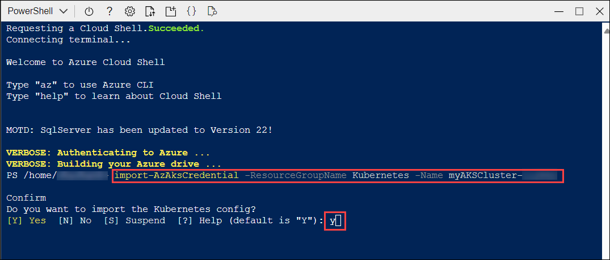

1. Verify the connection to your cluster using `kubectl` to return a list of the cluster nodes.

    ```
    kubectl get nodes
    ```

    > The following example output shows the single node created in the previous steps. Make sure the node status is Ready.

    

### Exercise 3: Deploy the application

To deploy the application, you use a manifest file to create all the objects required to run the AKS Store application. A Kubernetes manifest file defines a cluster's desired state, such as which container images to run. The manifest includes the following Kubernetes deployments and services:

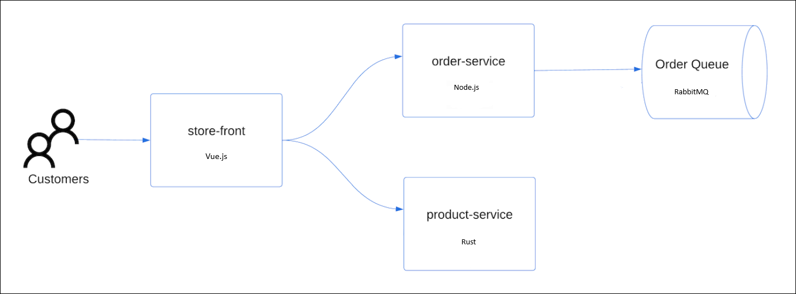

- **Store front**: Web application for customers to view products and place orders.
- **Product service**: Shows product information.
- **Order service**: Places orders.
- **Rabbit MQ**: Message queue for an order queue.

1. Create a file named `aks-store-quickstart.yaml` by running below command.

    ```
    vi aks-store-quickstart.yaml
    ```

1. Press `i` to get into insert mode. Paste the following manifest into the editor:

    ```yaml
    apiVersion: apps/v1
    kind: Deployment
    metadata:
      name: rabbitmq
    spec:
      replicas: 1
      selector:
        matchLabels:
          app: rabbitmq
      template:
        metadata:
          labels:
            app: rabbitmq
        spec:
          nodeSelector:
            "kubernetes.io/os": linux
          containers:
          - name: rabbitmq
            image: mcr.microsoft.com/mirror/docker/library/rabbitmq:3.10-management-alpine
            ports:
            - containerPort: 5672
              name: rabbitmq-amqp
            - containerPort: 15672
              name: rabbitmq-http
            env:
            - name: RABBITMQ_DEFAULT_USER
              value: "username"
            - name: RABBITMQ_DEFAULT_PASS
              value: "password"
            resources:
              requests:
                cpu: 10m
                memory: 128Mi
              limits:
                cpu: 250m
                memory: 256Mi
            volumeMounts:
            - name: rabbitmq-enabled-plugins
              mountPath: /etc/rabbitmq/enabled_plugins
              subPath: enabled_plugins
          volumes:
          - name: rabbitmq-enabled-plugins
            configMap:
              name: rabbitmq-enabled-plugins
              items:
              - key: rabbitmq_enabled_plugins
                path: enabled_plugins
    ---
    apiVersion: v1
    data:
      rabbitmq_enabled_plugins: |
        [rabbitmq_management,rabbitmq_prometheus,rabbitmq_amqp1_0].
    kind: ConfigMap
    metadata:
      name: rabbitmq-enabled-plugins
    ---
    apiVersion: v1
    kind: Service
    metadata:
      name: rabbitmq
    spec:
      selector:
        app: rabbitmq
      ports:
        - name: rabbitmq-amqp
          port: 5672
          targetPort: 5672
        - name: rabbitmq-http
          port: 15672
          targetPort: 15672
      type: ClusterIP
    ---
    apiVersion: apps/v1
    kind: Deployment
    metadata:
      name: order-service
    spec:
      replicas: 1
      selector:
        matchLabels:
          app: order-service
      template:
        metadata:
          labels:
            app: order-service
        spec:
          nodeSelector:
            "kubernetes.io/os": linux
          containers:
          - name: order-service
            image: ghcr.io/azure-samples/aks-store-demo/order-service:latest
            ports:
            - containerPort: 3000
            env:
            - name: ORDER_QUEUE_HOSTNAME
              value: "rabbitmq"
            - name: ORDER_QUEUE_PORT
              value: "5672"
            - name: ORDER_QUEUE_USERNAME
              value: "username"
            - name: ORDER_QUEUE_PASSWORD
              value: "password"
            - name: ORDER_QUEUE_NAME
              value: "orders"
            - name: FASTIFY_ADDRESS
              value: "0.0.0.0"
            resources:
              requests:
                cpu: 1m
                memory: 50Mi
              limits:
                cpu: 75m
                memory: 128Mi
          initContainers:
          - name: wait-for-rabbitmq
            image: busybox
            command: ['sh', '-c', 'until nc -zv rabbitmq 5672; do echo waiting for rabbitmq; sleep 2; done;']
            resources:
              requests:
                cpu: 1m
                memory: 50Mi
              limits:
                cpu: 75m
                memory: 128Mi
    ---
    apiVersion: v1
    kind: Service
    metadata:
      name: order-service
    spec:
      type: ClusterIP
      ports:
      - name: http
        port: 3000
        targetPort: 3000
      selector:
        app: order-service
    ---
    apiVersion: apps/v1
    kind: Deployment
    metadata:
      name: product-service
    spec:
      replicas: 1
      selector:
        matchLabels:
          app: product-service
      template:
        metadata:
          labels:
            app: product-service
        spec:
          nodeSelector:
            "kubernetes.io/os": linux
          containers:
          - name: product-service
            image: ghcr.io/azure-samples/aks-store-demo/product-service:latest
            ports:
            - containerPort: 3002
            resources:
              requests:
                cpu: 1m
                memory: 1Mi
              limits:
                cpu: 1m
                memory: 7Mi
    ---
    apiVersion: v1
    kind: Service
    metadata:
      name: product-service
    spec:
      type: ClusterIP
      ports:
      - name: http
        port: 3002
        targetPort: 3002
      selector:
        app: product-service
    ---
    apiVersion: apps/v1
    kind: Deployment
    metadata:
      name: store-front
    spec:
      replicas: 1
      selector:
        matchLabels:
          app: store-front
      template:
        metadata:
          labels:
            app: store-front
        spec:
          nodeSelector:
            "kubernetes.io/os": linux
          containers:
          - name: store-front
            image: ghcr.io/azure-samples/aks-store-demo/store-front:latest
            ports:
            - containerPort: 8080
              name: store-front
            env:
            - name: VUE_APP_ORDER_SERVICE_URL
              value: "http://order-service:3000/"
            - name: VUE_APP_PRODUCT_SERVICE_URL
              value: "http://product-service:3002/"
            resources:
              requests:
                cpu: 1m
                memory: 200Mi
              limits:
                cpu: 1000m
                memory: 512Mi
    ---
    apiVersion: v1
    kind: Service
    metadata:
      name: store-front
    spec:
      ports:
      - port: 80
        targetPort: 8080
      selector:
        app: store-front
      type: LoadBalancer
    ```

1. Then press ESC, write :wq to save your changes and close the file.

    > **Note**: If ESC doesn't work press ctrl+[ and then write :wq to save your changes and close the file.

1. Deploy the application using the `kubectl apply` command and specify the name of your YAML manifest:

    ```console
    kubectl apply -f aks-store-quickstart.yaml
    ```

    The following example output shows the deployments and services:

    ```output
    deployment.apps/rabbitmq created
    service/rabbitmq created
    deployment.apps/order-service created
    service/order-service created
    deployment.apps/product-service created
    service/product-service created
    deployment.apps/store-front created
    service/store-front created
    ```
### Exercise 4: Test the application

When the application runs, a Kubernetes service exposes the application's front end to the internet. This process can take a few minutes to complete.

1. Check the status of the deployed pods using the [kubectl get pods][kubectl-get] command. Make sure all pods are `Running` before proceeding.

    ```console
    kubectl get pods
    ```

1. Check for a public IP address for the store-front application. Monitor progress using the [kubectl get service][kubectl-get] command with the `--watch` argument.

    ```azurecli
    kubectl get service store-front --watch
    ```

    The **EXTERNAL-IP** output for the `store-front` service initially shows as *pending*:

    ```output
    NAME          TYPE           CLUSTER-IP    EXTERNAL-IP   PORT(S)        AGE
    store-front   LoadBalancer   10.0.100.10   <pending>     80:30025/TCP   4h4m
    ```

    Once the **EXTERNAL-IP** address changes from *pending* to an actual public IP address, use `CTRL-C` to stop the `kubectl` watch process.

    The following example output shows a valid public IP address assigned to the service:

    ```output
    NAME          TYPE           CLUSTER-IP    EXTERNAL-IP    PORT(S)        AGE
    store-front   LoadBalancer   10.0.100.10   20.62.159.19   80:30025/TCP   4h5m
    ```

1. Open a web browser to the external IP address of your service to see the Azure Store app in action.

    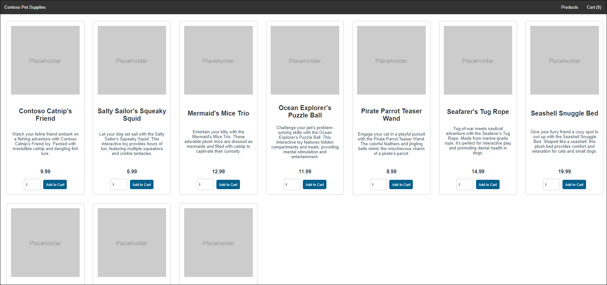

