# Lab 03 - Resource Manager Locks

## Lab scenario 

You have been asked to create a proof of concept showing how resource locks can be used to prevent accidental deletion or changes. Specifically, you need to:
- Create a ReadOnly lock.
- Create a Delete lock.
 
## Lab objectives

In this lab, you will complete the following exercise:
- Exercise 1: Resource Manager Locks.

## Estimated timing: 30 minutes

## Architecture diagram


## Exercise 1: Resource Manager Locks

In this exercise, you will complete the following tasks:

- Task 1: Create a storage account.
- Task 2: Add a ReadOnly lock on the storage account. 
- Task 3: Test the ReadOnly lock. 
- Task 4: Remove the ReadOnly lock and create a Delete lock.
- Task 5: Test the Delete lock.

### Task 1: Create a storage account

In this task, you will create a storage account for the lab.

1. Once you have signed in to Azure Portal close all the notifications and use the **Cloud Shell** button **[\>_]** to the right of the search bar at the top of the page to create a new Cloud Shell in the Azure portal.

   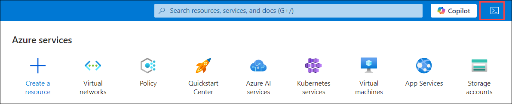

1. The first time you open the Cloud Shell, you may be prompted to choose the type of shell you want to use (*Bash* or *PowerShell*). Select **PowerShell**. If you do not see this option, skip the step.  

   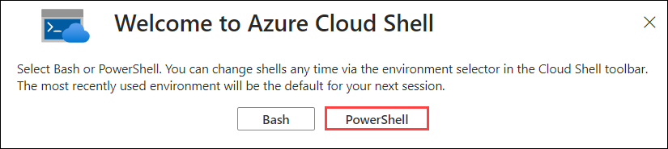

1. On the **Getting started**, select **Mount storage account (2)** and select your subscription under storage account subscription **(2)**. Click on **Apply (3)**.

   

1. On the **Mount storage account** tab, select **I want to create a storage account (1)**. Click on **Next (2)**.

    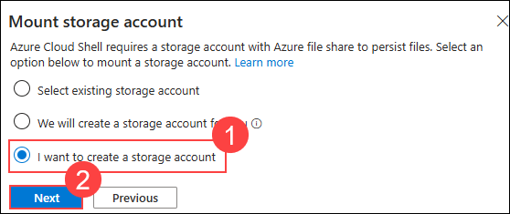

1. On Create storage account page, provide the following details then click on **Create (6)**.

    - **Subscription**: **Leave the default (1)** 
    
    - **Resource group:** **AZ500LAB03-<inject key="DeploymentID" enableCopy="false"/>**
    
    - **Storage account:** Enter **storage<inject key="DeploymentID" enableCopy="false"/> (3)**
    
    - **File share:** Enter **fileshare<inject key="DeploymentID" enableCopy="false"/> (4)**
    
    - **Region:** **<inject key="Region" enableCopy="false"/> (5)**.

      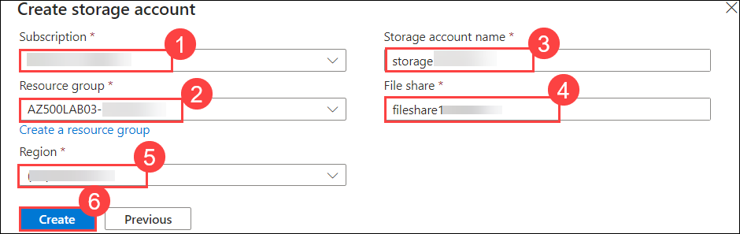   

      >**Note**: It might take about a minute for the Cloud Shell pane to show up.

1. Ensure **PowerShell** is selected in the drop-down menu in the upper-left corner of the Cloud Shell pane.

1. In the PowerShell session within the Cloud Shell pane, run the following to create a storage account in the newly created resource group:
    
    ```powershell
    New-AzStorageAccount -ResourceGroupName AZ500LAB03-[DeploymentID] -Name [storageAccountName] -Location  EastUS -SkuName Standard_LRS -Kind StorageV2 
    ```
   
   >**Note**: In the above code snippet, replace the **[DeploymentID]** with **<inject key="DeploymentID" enableCopy="false"/>**, and **[storageAccountName]** **strgacc<inject key="DeploymentID" enableCopy="false"/>**.The following image is provided for your reference.
   
      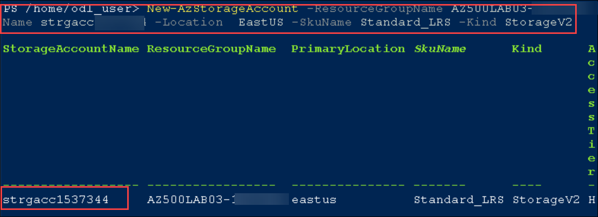
	
      >**Note**: Wait until the storage account is created. This might take a couple of minutes. 

1. Close the Cloud Shell pane.

### Task 2: Add a ReadOnly lock on the storage account 

In this task, you will add a read-only lock to the storage account. This will protect the resource from accidental deletion or modification. 

1. In the Azure portal, in the **Search resources, services, and docs** text box at the top of the Azure portal page, type **Resource groups (1)** and select **Resource groups (2)** from the services.

   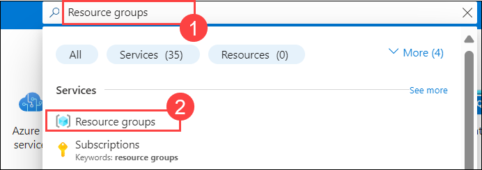

1. On the **Resource groups** blade, select the **AZ500LAB03-<inject key="DeploymentID" enableCopy="false"/>** resource group entry.
   
1. On the **AZ500LAB03-<inject key="DeploymentID" enableCopy="false"/>** resource group blade, in the list of resources, select the new storage account **strgacc<inject key="DeploymentID" enableCopy="false"/>**.

   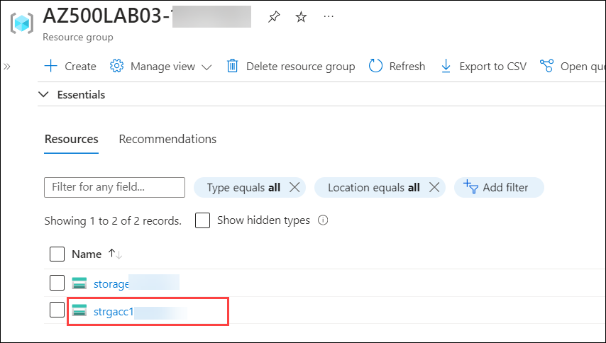
  
1. Under the **Settings** section in the left navigation pane, click on the **Locks (1)** icon. Click on **+ Add (2)**.

   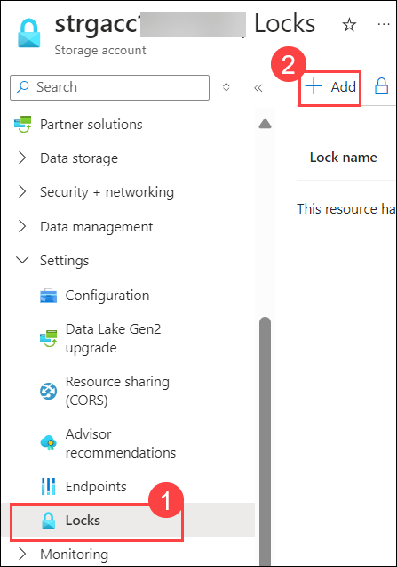

1. On the **Add lock** page, specify the following settings and then click on **OK (3)**. 

   |Setting|Value|
   |---|---|
   |Lock name|**ReadOnly Lock (1)**|
   |Lock type|**Read-only (2)**|

   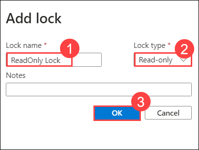

    >**Note**:  The storage account is now protected from accidental deletion and modification.

### Task 3: Test the ReadOnly lock 

1. In the **Settings** section of the storage account blade, click on **Configuration (1)**. Set the **Secure transfer required** option to **Disabled (2)** and then click on **Save (3)**.

   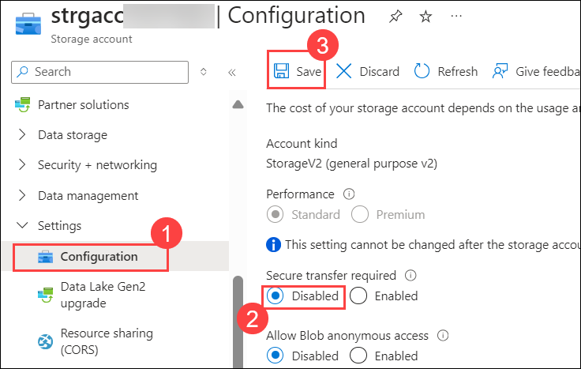

1. You should be able to spot a notification stating **Failed to update storage account**.

1. Click on the **Notifications (1)** icon in the toolbar at the top of the Azure portal and review the notification, which will resemble the following text: **(2)**

   >**"Failed to update storage account 'xxxxxxxx'. Error: The scope 'xxxxxxxx' cannot perform write operation because following scope(s) are locked: '/subscriptions/xxxxx-xxx-xxxx-xxxx-xxxxxxxx/resourceGroups/AZ500LAB03/providers/Microsoft.Storage/storageAccounts/xxxxxxx'. Please remove the lock and try again"**

    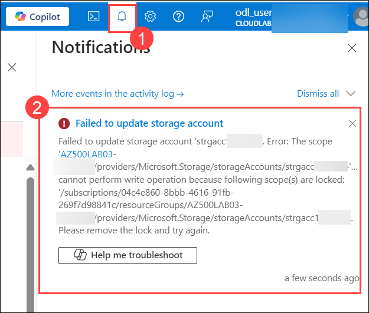   

1. Return the **Configuration** blade of the storage account and click on **Discard**. 

   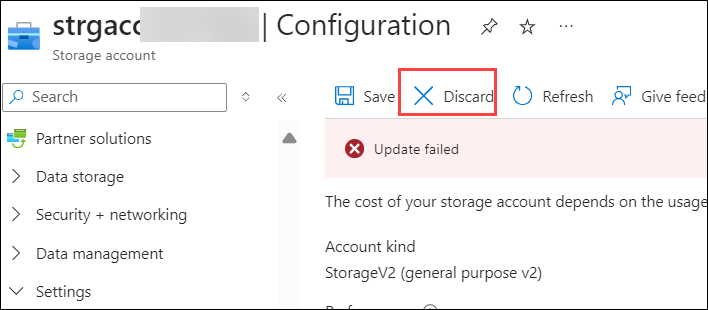

1. On the storage account blade, select **Overview** and, on the **Overview (1)** blade, click on **Delete (2)**.

   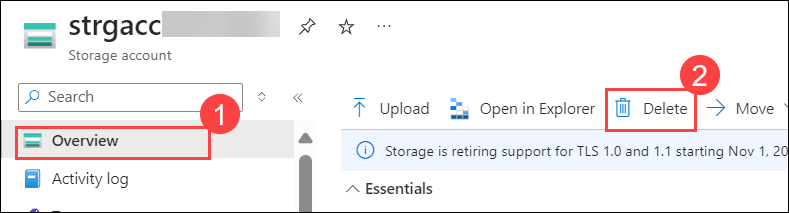

1. On the **Delete storage account** blade, we notice that the delete button is disabled with the following warning sign :

   >**'storage-acc-name' can't be deleted because this resource or its parent has a lock. Locks must be removed before this resource can be deleted.**

    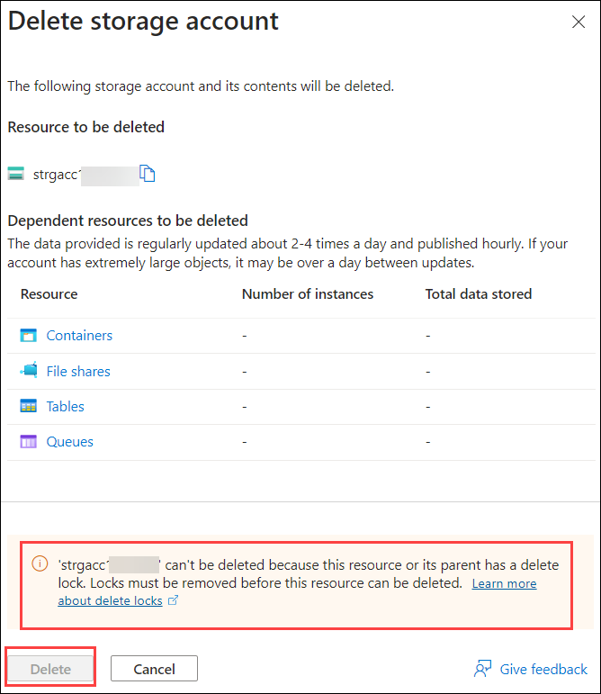   
	
     >**Note**:  You have now verified that a ReadOnly lock will stop accidental deletion and modification of a resource.

### Task 4: Remove the ReadOnly lock and Create a Delete lock

In this task, you remove the ReadOnly lock from the storage account and create a Delete lock. 

1. In the Azure portal, navigate back to the blade displaying properties of the newly created storage account.

1. In the **Settings** section, select **Locks (1)**. On the **Locks** blade, click on the **Delete (2)** icon on the far right of the **ReadOnly Lock** entry.

   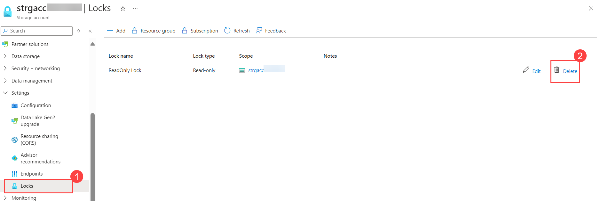

   >**Note**: Please refresh the page if ReadOnly Lock entry is listed.

1. Click on **+ Add (1)** and specify the following settings and then click on **OK (4)**.

   |Setting|Value|
   |---|---|
   |Lock name|**Delete Lock (2)**|
   |Lock type|**Delete (3)**|

   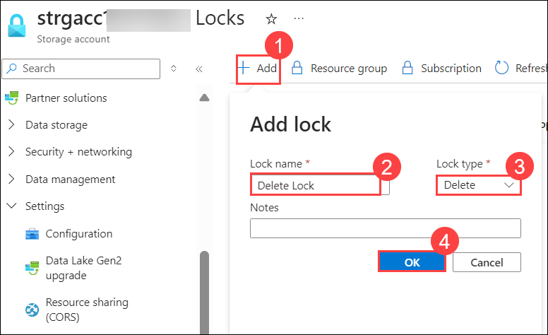

### Task 5: Test the Delete lock

In this task, you will test the Delete lock. You should be able to modify the storage account, but not delete it. 

1. In the **Settings** section of the storage account blade, click on **Configuration (1)**. Set the **Secure transfer required** option to **Disabled (2)** and then click on **Save (3)**.

   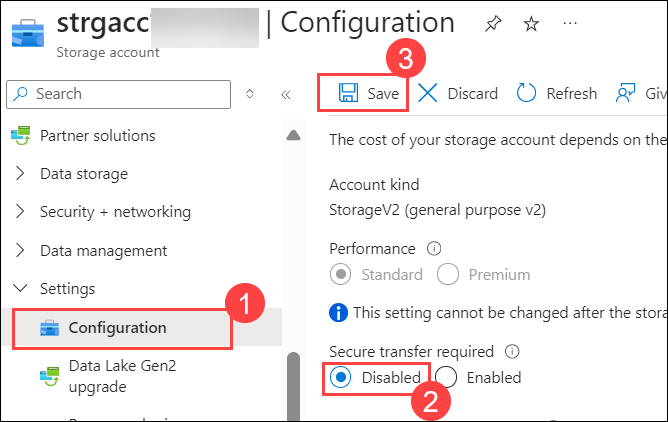

   >**Note**:  This time, the change should be successful.

3. On the storage account blade, select **Overview** and, on the **Overview (1)** blade, click on **Delete (2)**.

   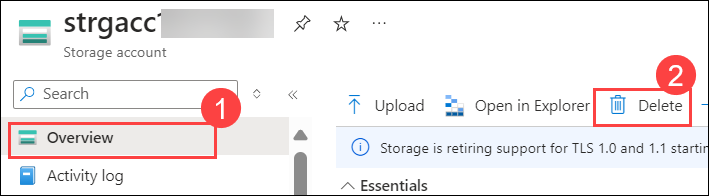

4. On the **Delete storage account** blade, we notice that the delete button is disabled with the following warning sign :

   >**'storage-acc-name' can't be deleted because this resource or its parent has a delete lock. Locks must be removed before this resource can be deleted.**

    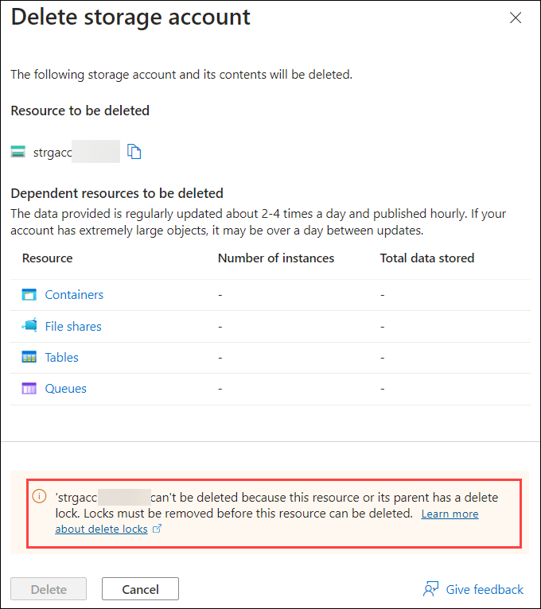   

     >**Note**:  You have now verified that a **Delete** lock will allow configuration changes but stop accidental deletion.

     >**Note**:  By using Resource Locks you can implement an extra line of defense against accidental or malicious changes and/or deletion of the most important resources. Resource locks can be removed by any user with the **Owner** role, but doing so requires a conscious effort. Locks supplement Role Based Access Control. 

5. In the Azure portal, navigate back to the blade displaying properties of the newly created storage account.

6. In the **Settings** section, select **Locks (1)**. On the **Locks** blade, click on the **Delete (2)** icon on the far right of the **Delete Lock** entry.

   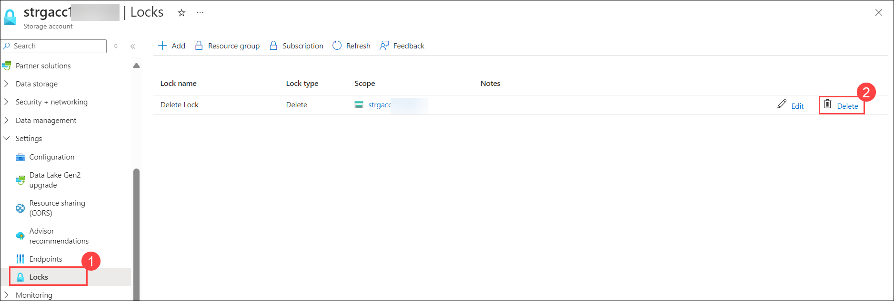

    >**Note**: Please refresh the page once **Delete Lock** is deleted.

    > **Results:** In this exercise, you learned to use Resource Manager locks to protect resources from modification and accidental deletion.

> **Congratulations** on completing the task! Now, it's time to validate it. Here are the steps:
   - If you receive a success message, you can proceed to the next task.
   - If not, carefully read the error message and retry the step, following the instructions in the lab guide.
   - If you need any assistance, please contact us at labs-support@spektrasystems.com. We are available 24/7 to help you out.
 
   <validation step="4173f566-a229-4c2f-afe8-5fef0c693142" />
   
### Review

In this lab, you have completed:
- Created a Storage account.
- Added a ReadOnly lock on the storage account.
- Tested the ReadOnly lock.
- Removed the ReadOnly lock and create a Delete lock.
- Tested the Delete lock.

### You have successfully completed the lab
