# Lab 04: Configuring and Securing ACR and AKS

## Lab scenario

You have been asked to deploy a proof of concept with Azure Container Registry and Azure Kubernetes Service. In this lab scenario, you are tasked with deploying a proof of concept (PoC) that demonstrates the integration of Azure Container Registry (ACR) and Azure Kubernetes Service (AKS). The PoC will involve building a Docker image using a Dockerfile, pushing the image to ACR for storage, and configuring AKS to orchestrate containerized applications. Additionally, you will focus on securing the containerized applications and ensuring that they can be accessed both internally within the cluster and externally by end users.

## Lab objectives

In this lab, you will complete the following tasks:
- Task 1: Create an Azure Container Registry
- Task 2: Create a Dockerfile, build a container and push it to Azure Container Registry
- Task 3: Create an Azure Kubernetes Service cluster
- Task 4: Grant the AKS cluster permissions to access the ACR
- Task 5: Deploy an external service to AKS
- Task 6: Verify you can access an external AKS-hosted service
- Task 7: Deploy an internal service to AKS
- Task 8: Verify you can access an internal AKS-hosted service

## Estimated timing: 45 minutes

## Architecture Diagram

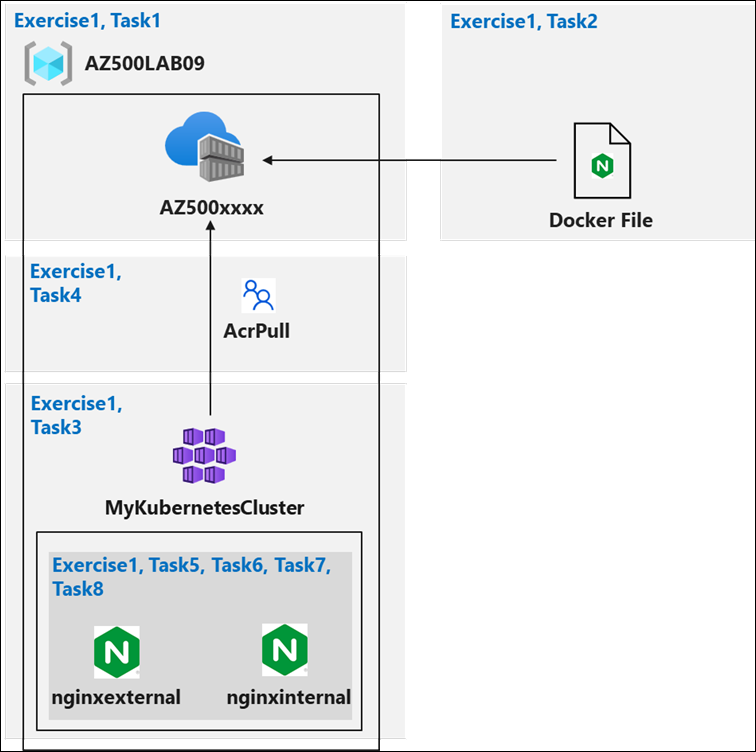

## Exercise 1: Configuring and Securing ACR and AKS

### Task 1: Create an Azure Container Registry

In this task, you will create a resource group for the lab an Azure Container Registry.

1. Use the **[\>_] (1)** button to the right of the search bar at the top of the page to create a new Cloud Shell in the Azure portal.

    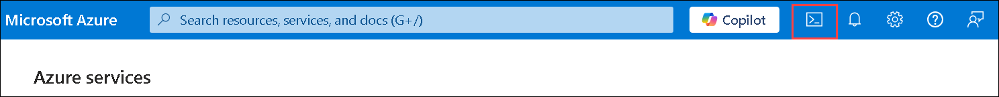
   
1. Select **Bash (2)** environment.
    
    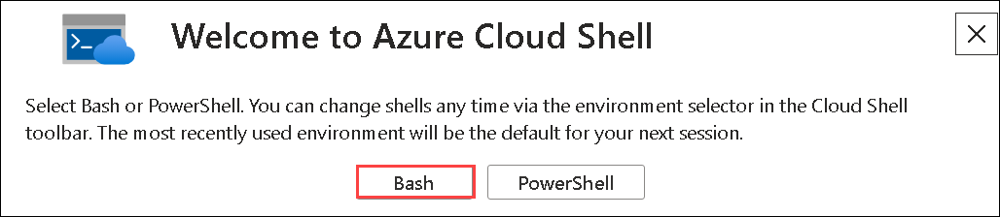
   
1. In the **Getting Started** menu, choose **Mount storage account (1)**,select your default **Subscription (2)** from the dropdown and click on **Apply (3)**

   

1. On the **Mount Storage account**, select **We will create a storage account for you (1)** and click on **Next (2)**

   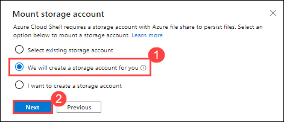

1. In the Bash session within the Cloud Shell pane, run the following to create a new resource group for this lab:

    ```sh
    az group create --name AZ500LAB04 --location eastus
    ```

1. In the Bash session within the Cloud Shell pane, run the following to verify the resource group was created:

    ```
    az group list --query "[?name=='AZ500LAB04']" -o table
    ```

     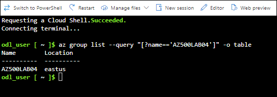

1. In the Bash session within the Cloud Shell pane, run the following to create a new Azure Container Registry (ACR) instance (The name of the ACR must be globally unique): 

    ```sh
    az acr create --resource-group AZ500LAB04 --name az500$RANDOM$RANDOM --sku Basic
    ```

1. In the Bash session within the Cloud Shell pane, run the following to confirm that the new ACR was created:

    ```sh
    az acr list --resource-group AZ500LAB04
    ```

     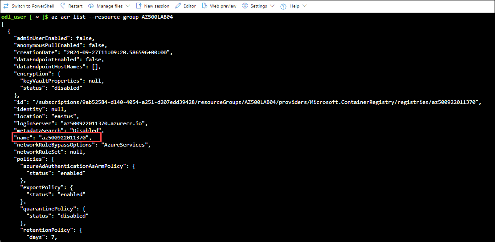

    >**Note**: Record the name of the ACR. You will need it in the next task.

### Task 2: Create a Dockerfile, build a container and push it to Azure Container Registry

In this task, you will create a Dockerfile, build an image from the Dockerfile, and deploy the image to the ACR. 

1. In the Bash session within the Cloud Shell pane, run the following to create a Dockerfile to create a Nginx-based image: 

    ```sh
    echo FROM nginx > Dockerfile
    ```

1. In the Bash session within the Cloud Shell pane, run the following to build an image from the Dockerfile and push the image to the new ACR. 

    >**Note**: The trailing period at the end of the command line is required. It designates the current directory as the location of Dockerfile. 

    ```sh
    ACRNAME=$(az acr list --resource-group AZ500LAB04 --query '[].{Name:name}' --output tsv)

    az acr build --image sample/nginx:v1 --registry $ACRNAME --file Dockerfile .
    ```

     

     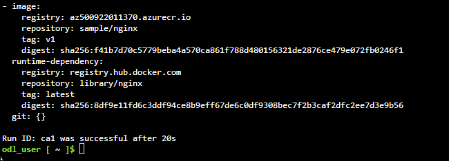

    >**Note**: Wait for the command to successfully complete. This might take about 2 minutes.

1. Close the Cloud Shell pane.

1. In the Azure portal, in the **Search resources, services, and docs** text box at the top of the Azure portal page, type/search for **Resource groups (1)** and select **Resource groups (2)**.

    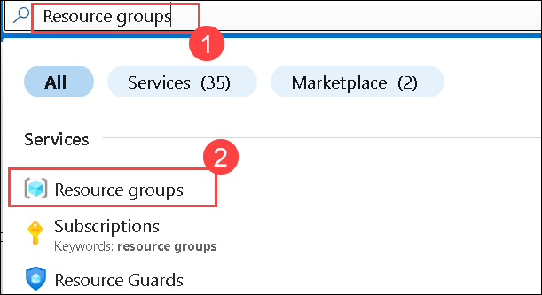  

1. Navigate to the **AZ500LAB04** resource group and, in the list of resources.

    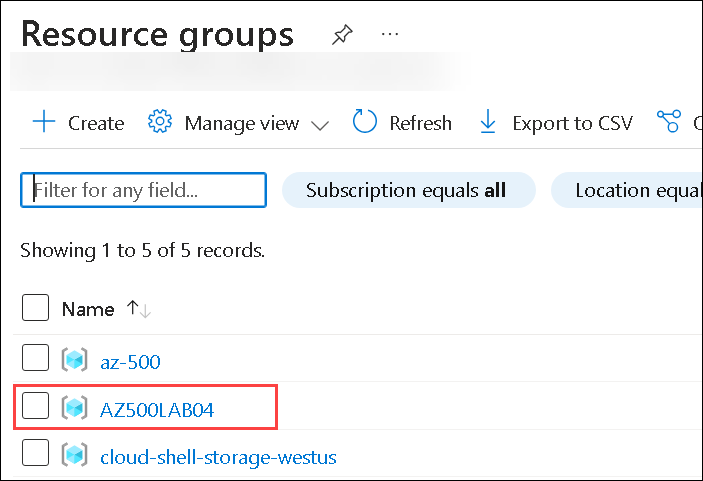  

1. Click the entry representing the Azure Container Registry instance you provisioned in the previous task.

    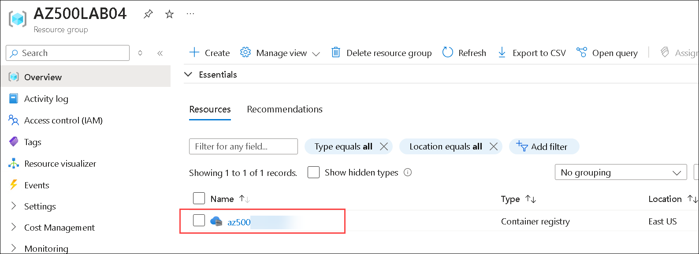  

1. On the Container registry blade, in the **Services** section, click **Repositories**.

    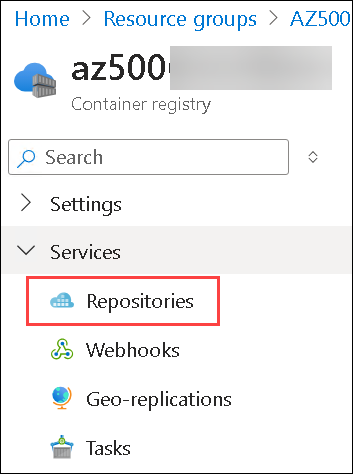  

1. Verify that the list of repositories includes the new container image named **sample/nginx**.

    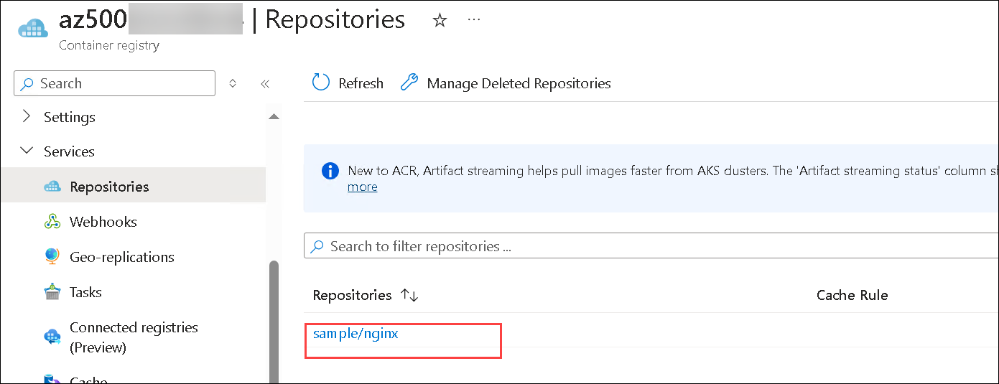  

1. Click the **sample/nginx** entry and verify presence of the **v1** tag that identifies the image version. Click on **v1**.

      

1. View the image manifest.

    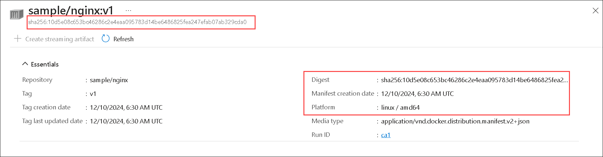  

    >**Note**: The manifest includes the sha256 digest, manifest creation date, and platform entries. 

### Task 3: Create an Azure Kubernetes Service cluster

In this task, you will create an Azure Kubernetes service and review the deployed resources. 

1. In the Azure portal, in the **Search resources, services, and docs** text box at the top of the Azure portal page, type **Kubernetes services (1)** and select the **Kubernetes services (2)** from the services.

    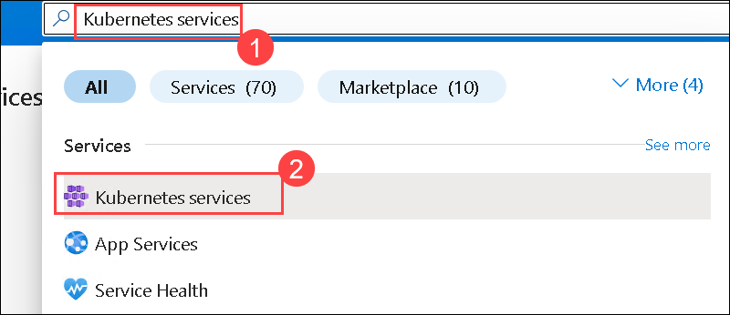  

1. On the **Kubernetes services** blade, click **+ Create (1)** and, in the drop-down menu, click on **Kubernetes cluster (2)**.

    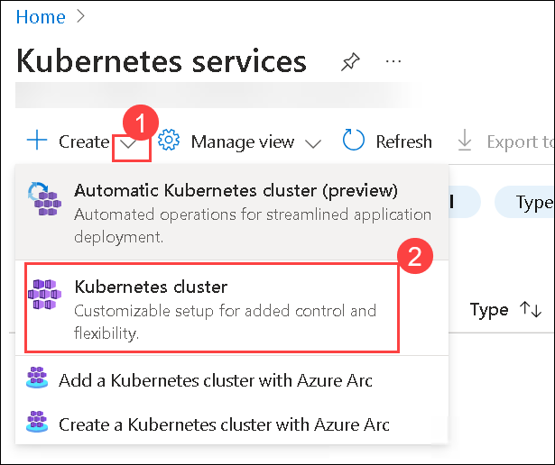  

1. On the **Basics** tab of the **Create Kubernetes cluster** blade, Now specify the following settings (leave others with their default values) and then click on **Next (7)**.

    |Setting|Value|
    |----|----|
    |Subscription|**Use default subscription (1)**|
    |Resource group|**AZ500LAB04 (2)**|
    |Cluster preset configuration|**Dev/Test (3)**|    
    |Kubernetes cluster name|**MyKubernetesCluster (4)**|
    |Region|**(US) East US (5)**|
    |Availability zones |**None (6)**|

     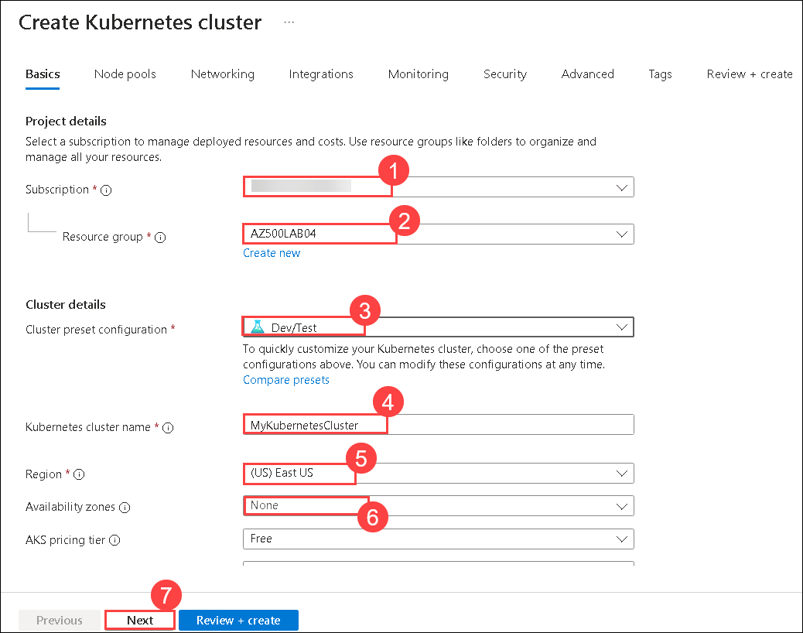  

1. On the **Node Pools** tab of the **Create Kubernetes cluster** blade, specify the following settings (leave others with their default values) and Click **Next (2)**:

    |Setting|Value|
    |----|----|
    |Enable virtual nodes|**Uncheck checkbox (1)**|

    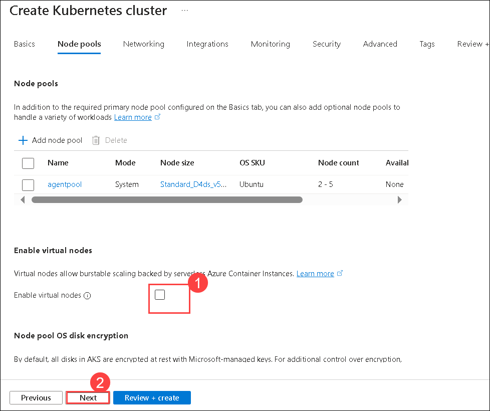      
 
1. On the **Networking** tab of the **Create Kubernetes cluster** blade, specify the following settings (leave others with their default values) and then click on **Monitoring (2)** tab.

    |Setting|Value|
    |----|----|
    |Network configuration|**Azure CNI Overlay (1)**|
    |DNS name prefix|**Leave the default value**|

    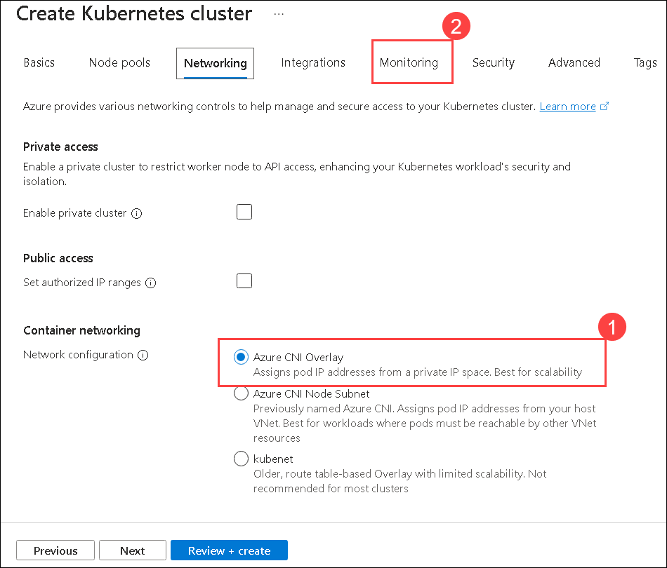  

     >**Note**: AKS can be configured as a private cluster. This assigns a private IP to the API server to ensure network traffic between your API server and your node pools remains on the private network only. For more information, visit [Create a private Azure Kubernetes Service cluster](https://docs.microsoft.com/en-us/azure/aks/private-clusters) page.

1. On the **Monitoring** tab of the **Create Kubernetes cluster** blade, uncheck the box of **Enable container logs (1)** under **Container Insights** and then click on **Review+create (2)**.

    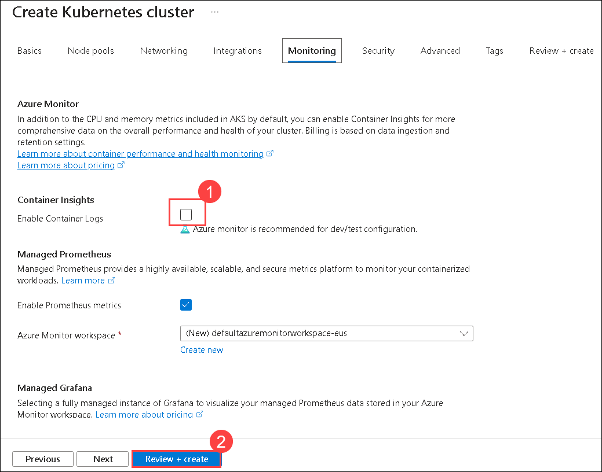  

1. Then click on **Create**.

    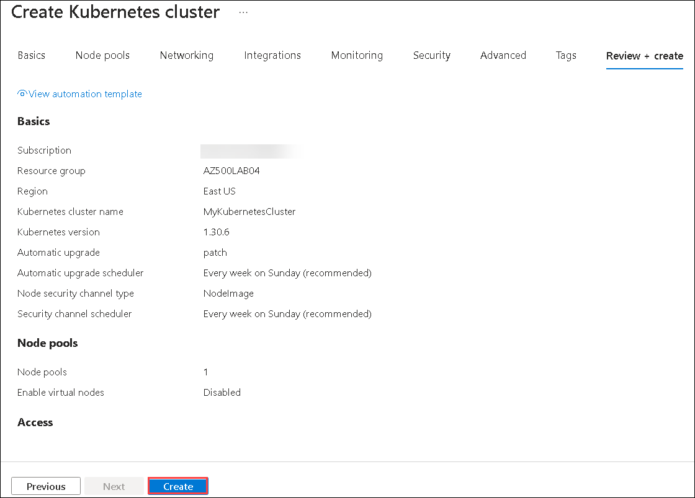  

    >**Note**: Wait for the deployment to complete. This might take about 10 minutes.

1. Once the deployment completes, in the Azure portal, in the **Search resources, services, and docs** text box at the top of the Azure portal page, type/search and select **Resource groups**.

1. On the **Resource groups** blade, in the listing of resource groups, note a new resource group named **MC_AZ500LAB04_MyKubernetesCluster_eastus** that holds components of the AKS Nodes. 

    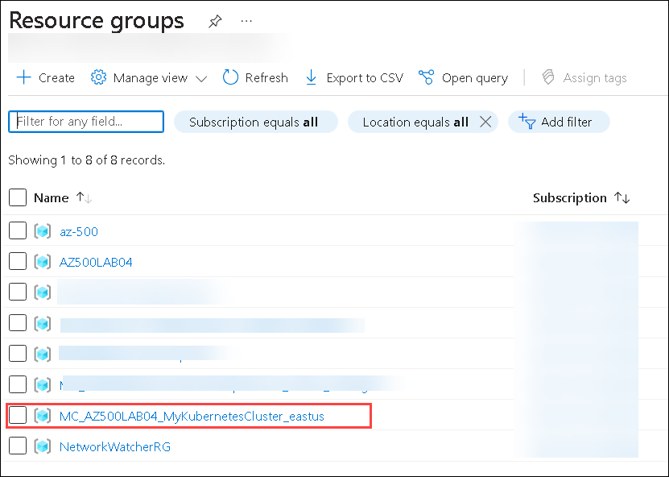  

1. Review resources in this resource group.     

          
	
1. Navigate back to the **Resource groups** blade and click the **AZ500LAB04** entry. 

    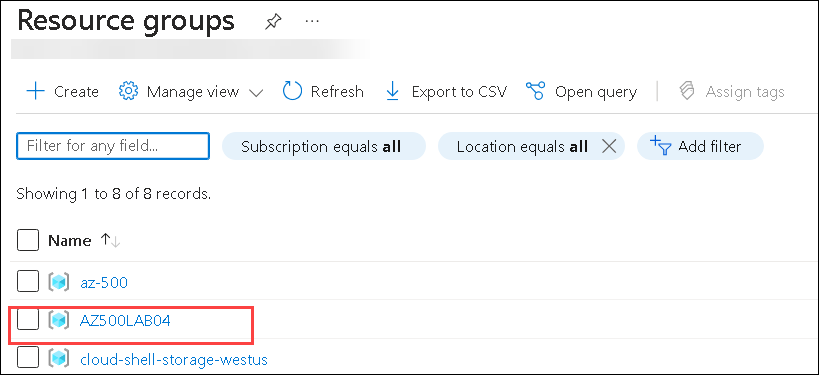 
 
    >**Note**: In the list of resources, note the AKS Cluster and the corresponding virtual network.

    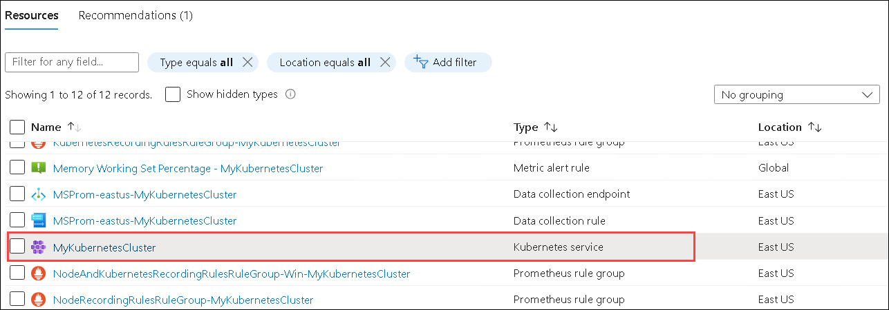     

1. In the Azure portal, open a Bash session in the Cloud Shell. 

    >**Note**: Ensure **Bash** is selected in the drop-down menu in the upper-left corner of the Cloud Shell pane.

1. In the Bash session within the Cloud Shell pane, run the following to connect to the Kubernetes cluster:

    ```sh
    az aks get-credentials --resource-group AZ500LAB04 --name MyKubernetesCluster
    ```

    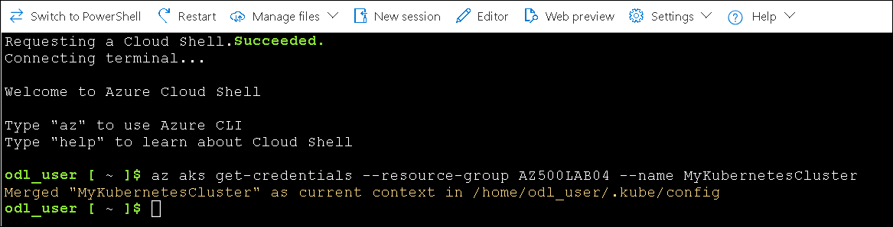     

1. In the Bash session within the Cloud Shell pane, run the following to list nodes of the Kubernetes cluster: 

    ```sh
    kubectl get nodes
    ```

    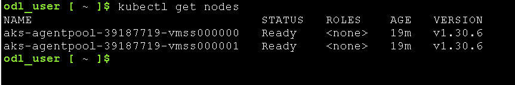     

    >**Note**: Verify that the **Status** of the cluster node is listed as **Ready**.

### Task 4: Grant the AKS cluster permissions to access the ACR and manage its virtual network

In this task, you will grant the AKS cluster permission to access the ACR and manage its virtual network. 

1. In the Bash session within the Cloud Shell pane, run the following to configure the AKS cluster to use the Azure Container Registry instance you created earlier in this lab. 

    ```sh
    ACRNAME=$(az acr list --resource-group AZ500LAB04 --query '[].{Name:name}' --output tsv)

    az aks update -n MyKubernetesCluster -g AZ500LAB04 --attach-acr $ACRNAME
    ```

    >**Note**: This command grants the 'acrpull' role assignment to the ACR. 

    >**Note**: It may take a few minutes for this command to complete. 

1. In the Bash session within the Cloud Shell pane, run the following to grant the AKS cluster the Contributor role to its virtual network. 

    ```sh
    RG_AKS=AZ500LAB04

    RG_VNET=MC_AZ500LAB04_MyKubernetesCluster_eastus	

    AKS_VNET_NAME=aks-vnet-30198516

    AKS_CLUSTER_NAME=MyKubernetesCluster

    AKS_VNET_ID=$(az network vnet show --name $AKS_VNET_NAME --resource-group $RG_VNET --query id -o tsv)

    AKS_MANAGED_ID=$(az aks show --name $AKS_CLUSTER_NAME --resource-group $RG_AKS --query identity.principalId -o tsv)

    az role assignment create --assignee $AKS_MANAGED_ID --role "Contributor" --scope $AKS_VNET_ID
    ```

    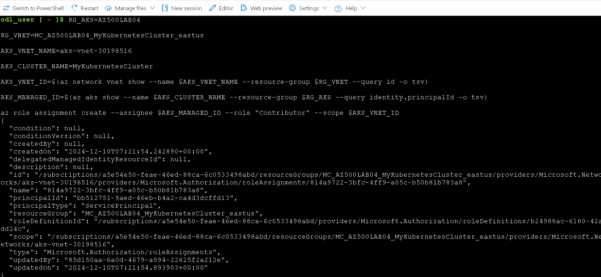       

### Task 5: Deploy an external service to AKS

In this task, you will download the Manifest files, edit the YAML file, and apply your changes to the cluster. 

1. In the Bash session within the Cloud Shell pane, click the **Manage Files (1)**, in the drop-down menu, click **Upload (2)**.

    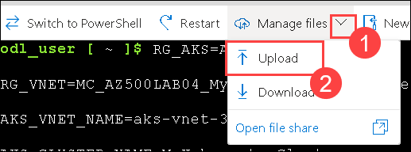   

1. In the **Open** dialog box, navigate to the location where you downloaded the lab files. Navigate to  **C:\AllFiles\AZ500-AzureSecurityTechnologies-lab-files\Allfiles\Labs\09** folder, select `nginxexternal.yaml` and `nginxinternal.yaml` file and then click on **Open**. 

1. In the Bash session within the Cloud Shell pane, run the following to identify the name of the Azure Container Registry instance:

    ```sh
    echo $ACRNAME
    ```

    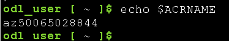   

     >**Note**: Record the Azure Container Registry instance name. You will need it later in this task.

1. In the Bash session within the Cloud Shell pane, run the following to open the nginxexternal.yaml file, so you can edit its content. 

    ```sh
    code ./nginxexternal.yaml
    ```

    >**Note**: This is the *external* yaml file.

1. Select **Confirm** for a pop-up prompting you to switch to the classic version in Azure Cloud Shell to edit the file.

1. If your unable to get the Code editor, please run the below command again.

    ```sh
    code ./nginxexternal.yaml
    ```

    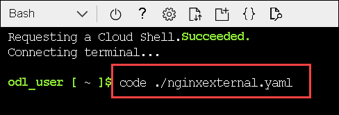   

1. In the editor pane, scroll down to **line 24** and replace the **`<ACRUniquename>`** placeholder with the ACR name.

       

1. In the editor pane, in the upper right corner, on keyboard press **CTRL + S** to save the file.

1. In the Bash session within the Cloud Shell pane, run the following to apply the change to the cluster:

    ```sh
    kubectl apply -f nginxexternal.yaml
    ```

1. Review the output of the command you run in the previous task to verify that the deployment and the corresponding service have been created. The resulting output will be displayed like this

    `
    deployment.apps/nginxexternal created
    service/nginxexternal created
    `

### Task 6: Verify you can access an external AKS-hosted service

In this task, verify the container can be accessed externally using the public IP address.

1. In the Bash session within the Cloud Shell pane, run the following to retrieve information about the nginxexternal service including name, type, IP addresses, and ports. 

    ```sh
    kubectl get service nginxexternal
    ```

1. In the Bash session within the Cloud Shell pane, review the output and record the value in the **External-IP** column. You will need it in the next step. 

    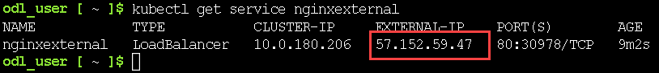     

1. Open a new broswer and browse to the IP address you identified in the previous step.

1. Ensure the **Welcome to nginx!** page displays. 

    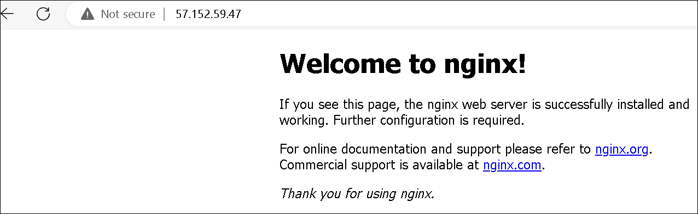     

### Task 7: Deploy an internal service to AKS

In this task, you will deploy the internal facing service on the AKS. 

1. In the Bash session within the Cloud Shell pane, run the following to open the nginxintenal.yaml file, so you can edit its content. 

    ```sh
    code ./nginxinternal.yaml
    ```

    >**Note**: This is the *internal* yaml file.

1. If prompted, select **Confirm** for a pop-up prompting you to switch to the classic version in Azure Cloud Shell to edit the file.

1. If your unable to get the Code editor, please run the below command again.

    ```sh
    code ./nginxinternal.yaml
    ```

1. In the editor pane, scroll down to the line containing the reference to the container image and replace the **`<ACRUniquename>`** placeholder with the ACR name.

1. In the editor pane, in the upper right corner, on keyboard press **CTRL + S** to save the file.

1. In the Bash session within the Cloud Shell pane, run the following to apply the change to the cluster:

    ```sh
    kubectl apply -f nginxinternal.yaml
    ```

1.  In the Bash session within the Cloud Shell pane, review the output to verify your deployment and the service have been created. The resulting output will be displayed like this.

    `
    deployment.apps/nginxinternal created
    service/nginxinternal created
    `

    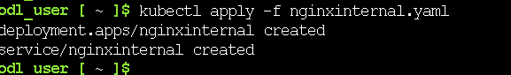     
    
1. In the Bash session within the Cloud Shell pane, run the following to retrieve information about the nginxinternal service including name, type, IP addresses, and ports. 

    ```sh
    kubectl get service nginxinternal
    ```

             

1. In the Bash session within the Cloud Shell pane, review the output. The External-IP is, in this case, a private IP address. If it is in a **Pending** state, then try to run the previous command again.

         

    >**Note**: Record this IP address. You will need it in the next task. 

    >**Note**: To access the internal service endpoint, you will connect interactively to one of the pods running in the cluster. 

    >**Note**: Alternatively, you could use the CLUSTER-IP address.

### Task 8: Verify you can access an internal AKS-hosted service

In this task, you will use one of the pods running on the AKS cluster to access the internal service. 

1. In the Bash session within the Cloud Shell pane, run the following to list the pods in the default namespace on the AKS cluster:

    ```sh
    kubectl get pods
    ```

    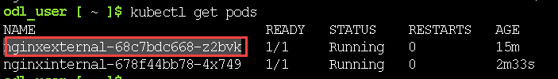         

1. In the listing of the pods, copy the first entry in the **NAME** column.

    >**Note**: This is the pod you will use in the subsequent steps.

1. In the Bash session within the Cloud Shell pane, run the following to connect interactively to the first pod (replace the `<pod_name>` placeholder with the name you copied in the previous step):

    ```sh
    kubectl exec -it <pod_name> -- /bin/bash
    ```

1. After the `#`, run the following to verify that the nginx web site is available via the private IP address of the service (replace the `<internal_IP>` placeholder with the IP address you recorded in the previous task):

    ```sh
    curl http://<internal_IP>
    ```

     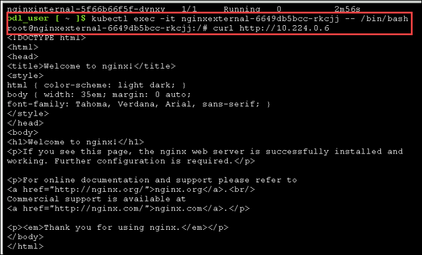

1. Close the Cloud Shell pane.

> **Result:** You have configured and secured ACR and AKS.

> **Congratulations** on completing the task! Now, it's time to validate it. Here are the steps:
> - Hit the Validate button for the corresponding task.If you receive a success message, you can proceed to the next task. 
> - If not, carefully read the error message and retry the step, following the instructions in the lab guide.
> - If you need any assistance, please contact us at labs-support@spektrasystems.com. We are available 24/7 to help you out.

<validation step="f74f6cd9-a7e4-40d3-a11b-cf38751bb93f" />

### Review

In this lab, you have completed:
- Created an Azure Container Registry
- Created a Dockerfile, build a container and push it to Azure Container Registry
- Created an Azure Kubernetes Service cluster
- Granted the AKS cluster permissions to access the ACR
- Deployed an external service to AKS
- Verified you can access an external AKS-hosted service
- Deployed an internal service to AKS
- Verified you can access an internal AKS-hosted service

### You have successfully completed the lab
