# Lab 05: Securing Azure SQL Database

## Lab scenario
You have been asked to review security features for Azure SQL database. Specifically, you are interested in:
- Protection against attacks such as SQL injection and data exfiltration. 
- Ability to discover and classify database information into categories such as Confidential. 
- Ability to audit database server and database queries and log events. 

## Lab objectives
In this lab, you will complete the following exercise:
- Exercise 1: Implement SQL Database security features

## Estimated timing: 30 minutes

## Architecture Diagram

## Exercise 1: Implement SQL Database security features

In this exercise, you will complete the following tasks:

- Task 1: Deploy an Azure SQL Database
- Task 2: Configure Advanced Data Protection
- Task 3: Configure Data Classification
- Task 4: Configure Auditing

### Task 1: Deploy an Azure SQL Database

In this task, you will use a template to deploy the lab infrastructure. 

1. In the Azure portal, in the **Search resources, services, and docs** text box at the top of the Azure portal page, type **Deploy a custom template** and hit **Enter** key.
   
    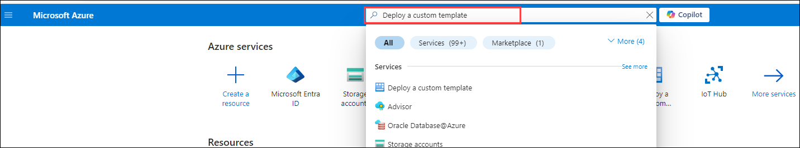

1. On the **Custom deployment** blade, click the **Build your own template in the editor** option.
    
    
    
1. On the **Edit template** blade, click **Load file**, locate the **C:\AllFiles\AZ500-AzureSecurityTechnologies-lab-files\Allfiles\Labs\\11\\azuredeploy.json** file and click **Open**.

    >**Note**: Review the content of the template and note that it deploys an Azure SQL database.
    
    
   
1. On the **Edit template** blade, click **Save**.

1. On the **Custom deployment** blade, ensure that the following settings are configured (leave rest with the default values):

   |Setting|Value|
   |---|---|
   |Subscription|the name of the Azure subscription you will be using in this lab **(1)**|
   |Resource group|click **Create new** and type the name **AZ500LAB05**  **(2)**|
   |Location|**(US) East US (3)**|

1. Click **Review + Create (4)** and then click **Create**.

    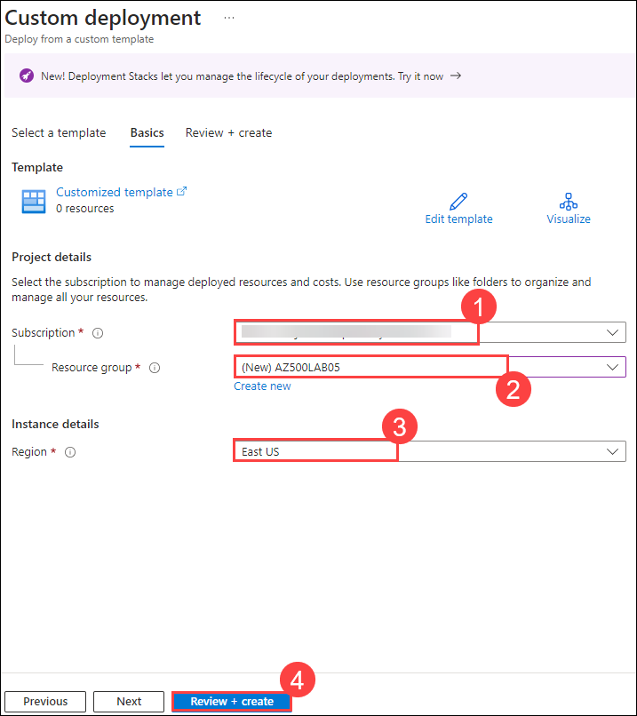   

    >**Note**: Wait for the deployment to complete. It might take up to 5 minutes.

### Task 2: Configure Advanced Data Protection

1. In the Azure portal, in the **Search resources, services, and docs** text box at the top of the Azure portal page, type **Resource groups** and press the **Enter** key.

1. On the **Resource groups** blade, in the list of resource group, click the **AZ500LAB05** entry.

1. On the **AZ500LAB05** blade, click the entry representing the newly created SQL Server.
   
    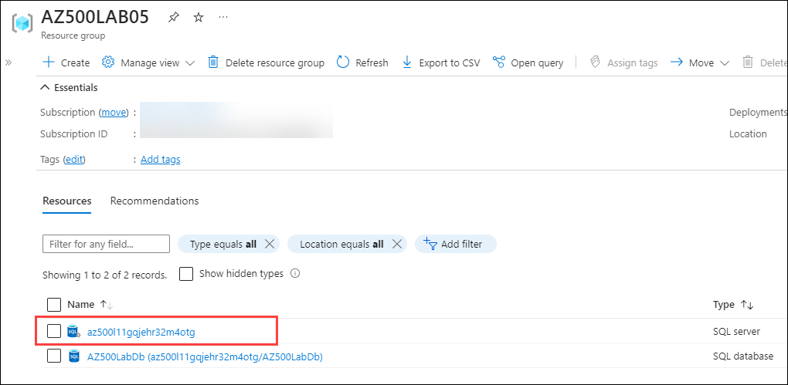
   
1. On the SQL server blade, in the **Security** section, click **Microsoft Defender for Cloud (1)**, select **Enable (2)**.
    
    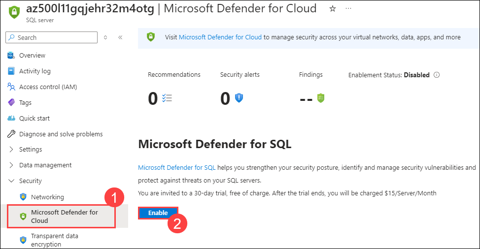
    
      >**Note**: Wait until notification indicates Azure Defender for SQL has been successfully enabled.

1. On the SQL server blade, in the **Security** section, on the **Microsoft Defender for Cloud** page, in the **Microsoft Defender for SQL: Enabled at the server-level (Configure)** parameter, click **(configure)**.  

      >**Note**: Refresh the browser if **(configure)** is not displaying.
    
    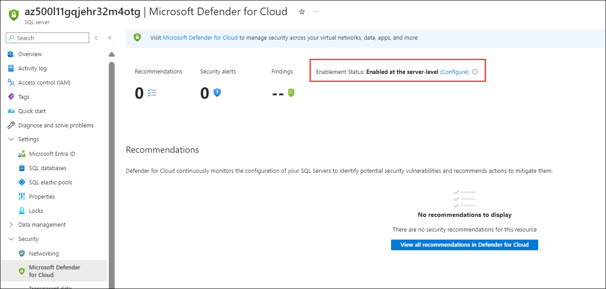
    
1. On the **Server Settings** blade, review the information about pricing and the trial period, **VULNERABILITY ASSESSMENT SETTINGS** and **ADVANCED THREAT PROTECTION SETTINGS**.

1. Back to **Microsoft Defender for Cloud** blade, review **Recommendations** and **Security alerts**.

      >**Note**: It may take 10-15 minutes for recommendations to appear on the **Microsoft Defender for Cloud** blade. Rather than waiting, proceed to the next task but consider returning to this blade once you complete all the remaining tasks.
      
### Task 3: Configure Data Classification

In this task, you will discover and classify information in SQL database for GPDR and data protection compliance.

1. On the SQL server blade, in the **Settings** section, click **SQL Databases (1)**.

1. In the list of databases, select the **AZ500LabDb (2)** entry.
   
    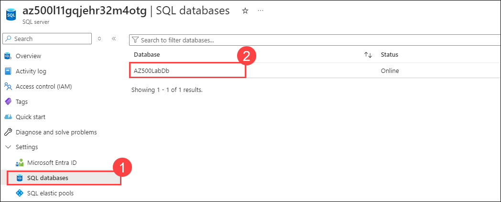
   
1. On the **AZ500LabDb** SQL database blade, in the **Security** section, click **Data Discovery & Classification (1)**.

1. On the **Data Discovery & Classification** blade, click the **Classification (2)** tab.

    >**Note**: The classification engine scans your database for columns containing potentially sensitive data and provides a list of recommended column classifications.

1. Click the text message **We have found 15 columns with classification recommendations (3)** displayed on blue bar at the top of the blade.
    
   
1. Review the listed columns and the recommended sensitivity label.
   
    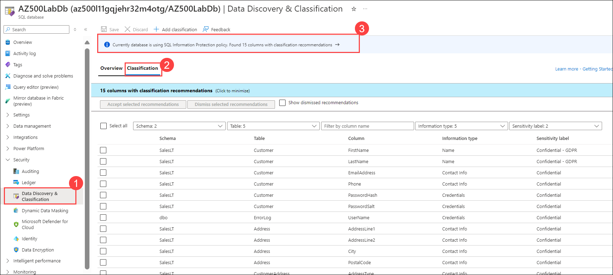
   
1. Enable the **Select all (1)** checkbox and then click **Accept Selected Recommendations (2)**.

    >**Note**: Alternatively, you could select only certain columns and dismiss others. 

    >**Note**: You have the option to change the information type and sensitivity label.
    
    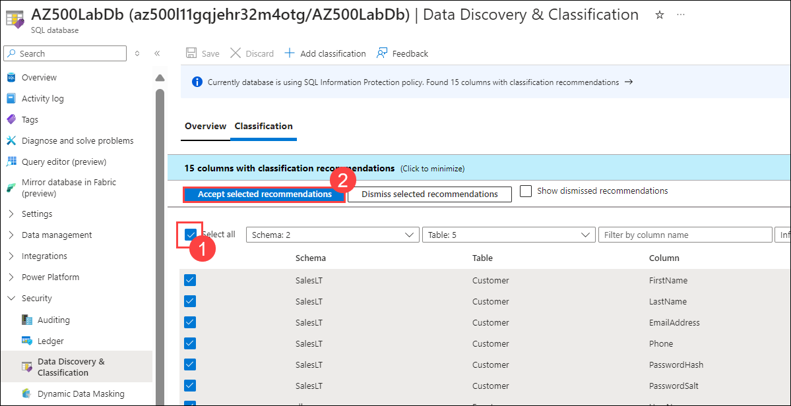
   
1. Once you have completed your review click **Save**. 

    >**Note**: This will complete the classification and persistently label the database columns with the new classification metadata. 

1. Back on the **Data Discovery & Classification (1)** blade **Overview (2)** tab, note that it has been updated to account for the latest classification information.

    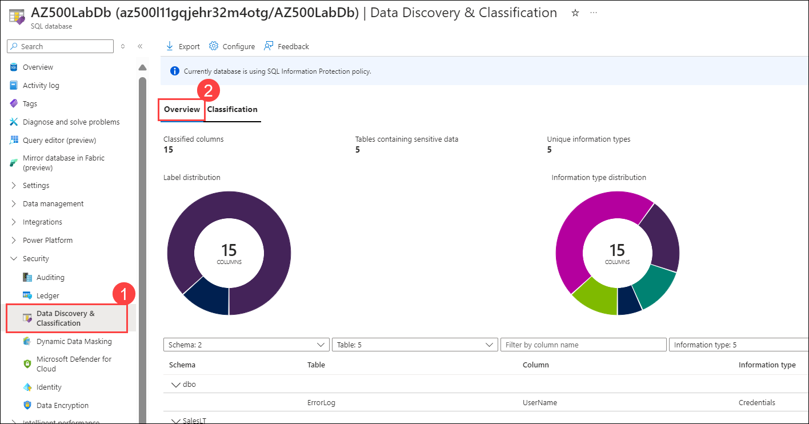

### Task 4 : Configure auditing 

In this task, you will first configure server level auditing and then configure database level auditing. 

1. In the Azure portal, navigate back to the SQL Server blade.

1. On the SQL Server blade, in the **Security** section, click **Auditing (1)**.

    >**Note**: This is server level auditing. The default auditing settings include all the queries and stored procedures executed against the database, as well as successful and failed logins.

1. Set the **Enable Azure SQL Auditing** switch to **ON (2)** to enable auditing. 

1. Select the **Storage** checkbox and entry boxes for **Subscription** and **Storage Account** will display.	

1. Choose your **Subscription (3)** from the dropdown list.	

1. Click **Storage account (4)** and choose **Create new**.	
    
1. On the **Create storage account** blade, in the **Name (1)** box, type a globally unique name consisting of between 3 and 24 lower case letters and digits, click **OK (2)**.
   
    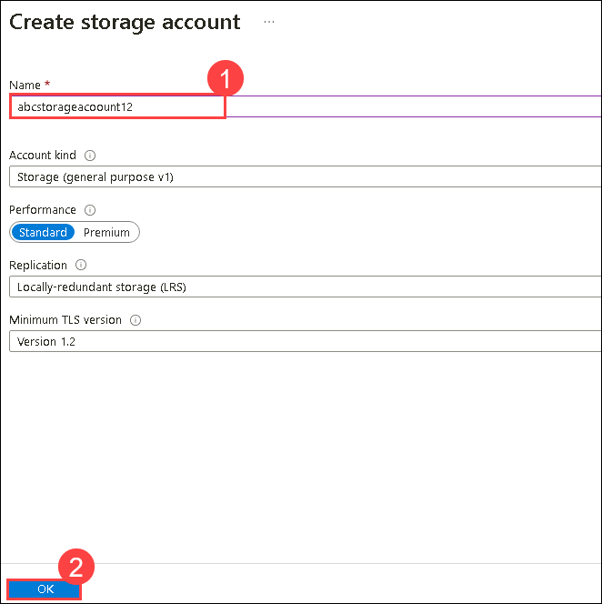

    >**Note**: You may need to refresh the browser before the storage account becomes available.

1. Back on the **Auditing** blade, under **Advanced properties** set **Retention (days)** to **5 (5)** and click **save (6)**.
    
    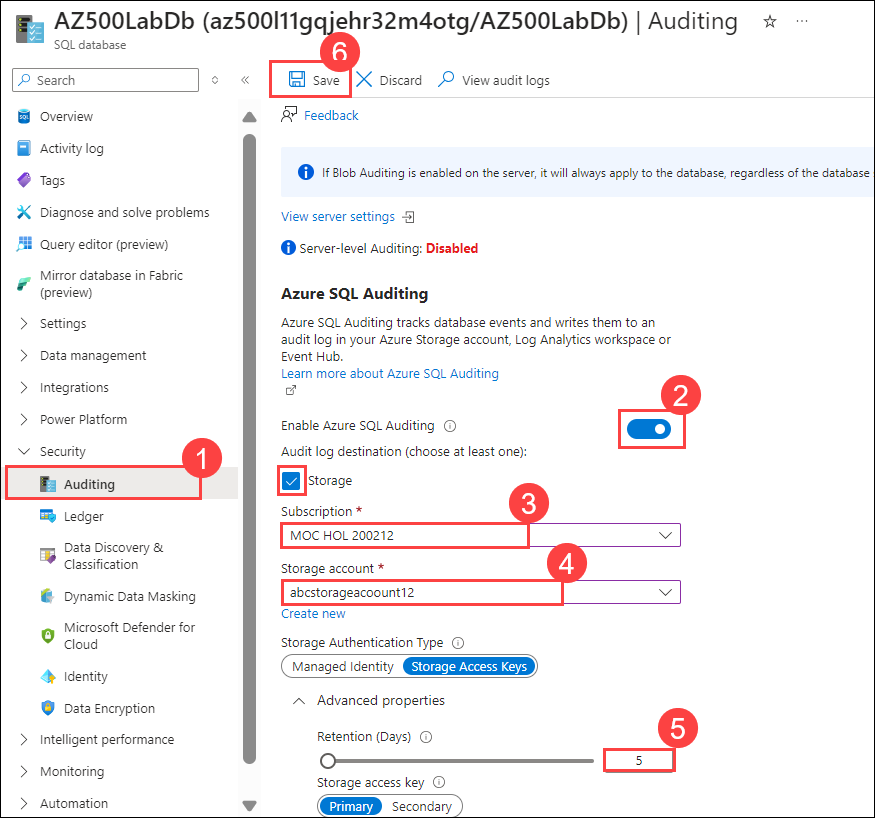
   
    >**Note**: If you receive an error message regarding invalid storage container path then the storage account may not have have been provisioned yet. Wait a few minutes, click **Storage account**, on the **Choose storage account** blade, select the newly created storage account and back on the Auditing blade, click **Save**.

1. On the server blade, in the **Settings** section, click **SQL Databases**.

1. In the list of databases, select the **AZ500LabDb** entry. 

1. On the **AZ500LabDb** SQL database blade, in the **Security** section, click **Auditing (1)**.
    
    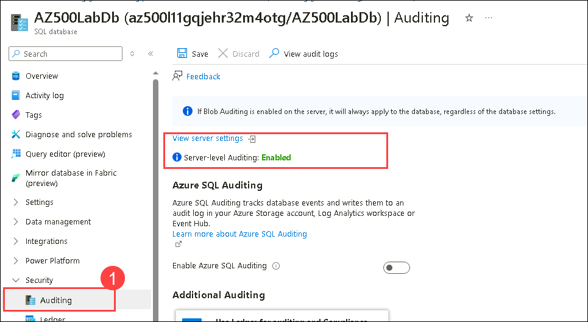
    
    >**Note**: This is database level auditing. Server-level auditing is already enabled. 
  
    >**Note**: Audits can be written to an Azure storage account, to a Log Analytics workspace, or to the Event Hub. You can configure any combination of these options.

    >**Note**: If storage-based auditing is enabled on the server, it will always apply to the database, regardless of the database settings.

1. Switch back to DB, Auditing and Click **View Audit Logs**.
    
    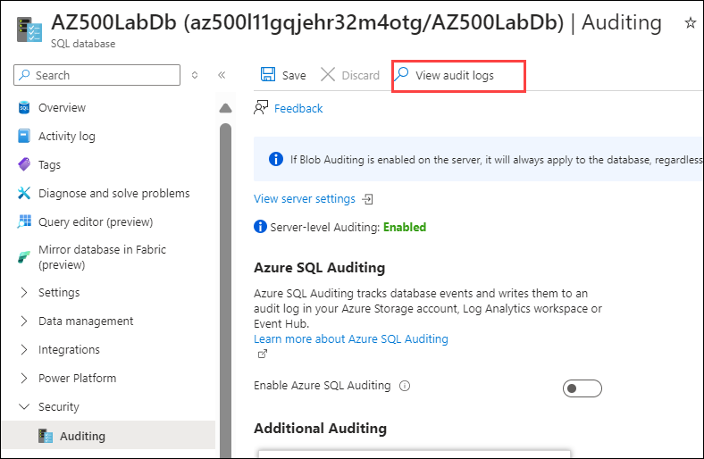
    
1. On the **Audit records** blade, note that you can switch between Server audit and Database audit. 

    >**Note**: Since this SQL server and database were created recently, it is unlikely that any events will be available at this point. 

    > **Results:** You have created a SQL server and database, configured data classification, and auditing.
    
   > **Congratulations** on completing the task! Now, it's time to validate it. Here are the steps:
   - If you receive a success message, you can proceed to the next task.
   - If not, carefully read the error message and retry the step, following the instructions in the lab guide.
   - If you need any assistance, please contact us at cloudlabs-support@spektrasystems.com. We are available 24/7 to help you out.
 
   <validation step="b614de5a-3bf9-4457-9566-2ebbaf298146" />
   

### You have successfully completed the lab
