# Lab 06: Service Endpoints and Securing Storage

## Lab scenario

In this lab scenario, you are tasked with creating a proof of concept (PoC) to demonstrate securing Azure file shares. The PoC will involve setting up a storage endpoint to ensure that all traffic to Azure Storage remains within the Azure backbone network. Additionally, you will configure the storage endpoint to allow access only from resources within a specific subnet, while verifying that resources outside of this subnet are unable to access the storage, thereby ensuring enhanced security for the Azure file shares.

> For all the resources in this lab, we are using the **East US** region.

## Lab objectives

In this lab, you will complete the following exercise:

- Exercise 1: Service endpoints and security storage

## Estimated timing: 45 minutes

## Architecture Diagram

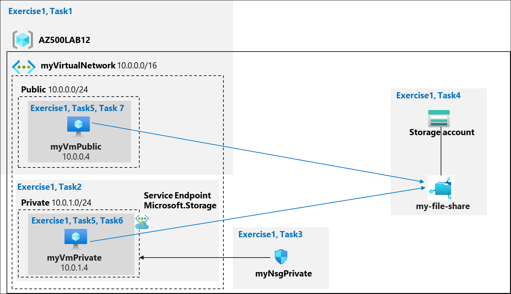

## Exercise 1: Service endpoints and security storage

In this exercise, you will create a virtual network, add a subnet, and configure a storage endpoint. You will then set up network security groups to restrict subnet access and allow RDP on the public subnet, followed by creating a storage account with a file share and deploying virtual machines into subnets. Finally, you will test storage connections from the private subnet to confirm access is allowed, and from the public subnet to ensure access is denied.

### Task 1: Create a virtual network

In this task, you will create a virtual network.

1. In the Azure portal, in the **Search resources, services, and docs** text box at the top of the Azure portal page, type **Virtual networks (1)** and select **Virtual networks (2)** from the services.

   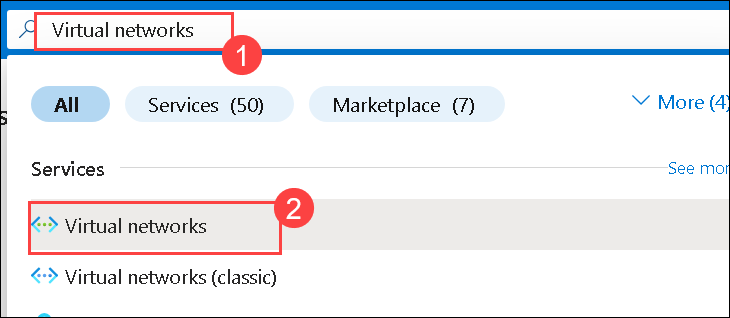

1. On the **Virtual Networks** blade, click **+ Create**.

1. On the **Basics** tab of the **Create virtual network** blade, specify the following settings (leave others with their default values) and click on **IP Addresses (5)** tab.

    |Setting|Value|
    |---|---|
    |Subscription|**Leave the default subscription (1)**|
    |Resource group|click **Create new** and type the name **AZ500LAB06** then click **OK** **(2)**|
    |Name|**myVirtualNetwork (3)**|
    |Region|**(US) East US (4)**|

   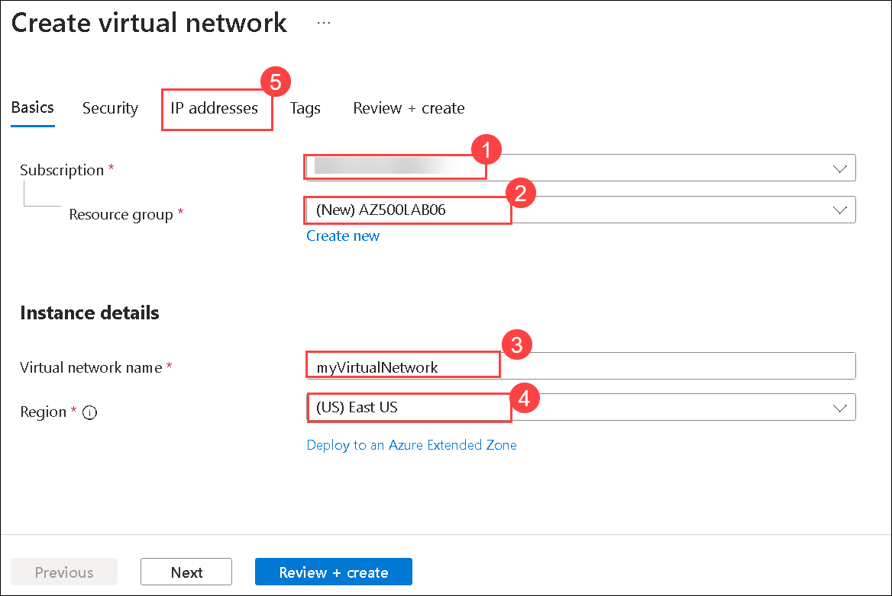    

1. On the **IP addresses** tab of the **Create virtual network** blade, set the **IPv4 address space** to **10.0.0.0/16 (1)**. In the **Subnet name** column, click **default (2)** and, on the **Edit subnet** blade, specify the following settings, click **Save (5)** and then click on **Review+create (6)**.

    |Setting|Value|
    |---|---|
    |Subnet name|**Public (3)**|
    |Subnet address range|**10.0.0.0/24 (4)**|

   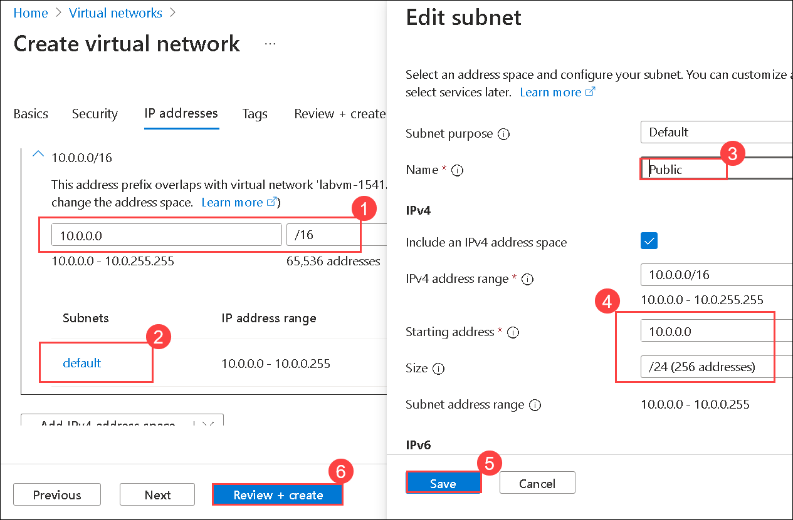

1. On the **Review + create** tab of the **Create virtual network** blade, click **Create**.

    >**Note**:If you are not able to edit the **default** first create the virtual network and go to subnets in created Virtual network and delete the Default Subnet and add **Public** Subnet 

1. Click on **Go to resources**.    

### Task 2: Add a subnet to the virtual network and configure a storage endpoint

In this task, you will create another subnet and enable a service endpoint on that subnet. Service endpoints are enabled per service, per subnet. 

1. In the Azure portal, navigate back to the **Virtual Networks** blade.

1. On the **Virtual networks** blade, click the **myVirtualNetwork** entry.

1. On the **myVirtualNetwork** blade, in the **Settings** section, click **Subnets**.

1. On the **myVirtualNetwork \| Subnets (1)** blade, click **+ Subnet (2)**. 
	
	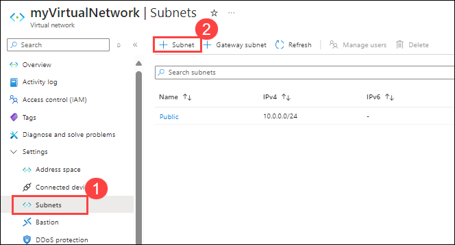
	
1. On the **Add subnet** blade, specify the following settings (leave others with their default values) and then click on **Add (3)**.

    |Setting|Value|
    |---|---|
    |Subnet name|**Private (1)**|
    |Subnet address range|**10.0.1.0/24 (2)**|
    |Service endpoints|**Leave the default of None**|

    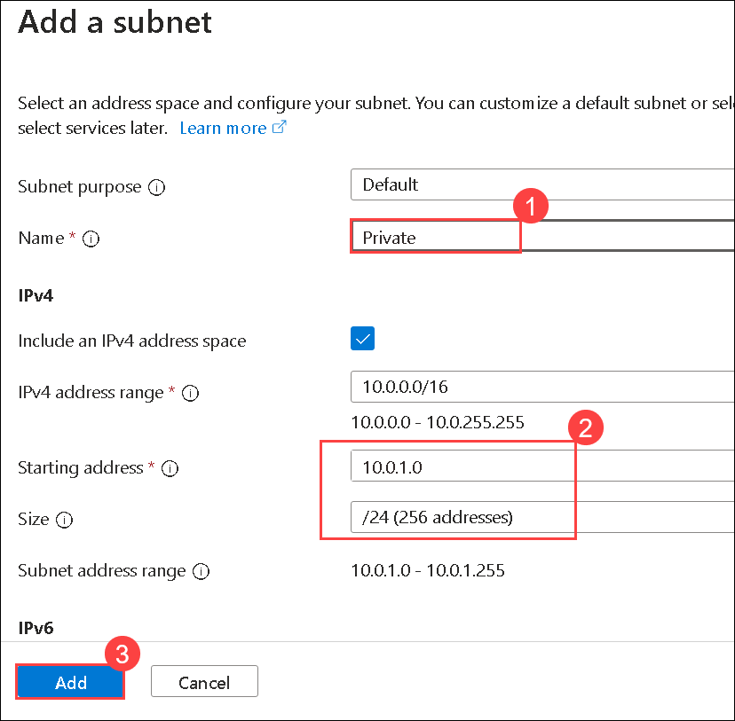    

     >**Note**: The virtual network now has two subnets: Public and Private. 
	
### Task 3: Configure a network security group to restrict access to the subnet

In this task, you will create a network security group with two outbound security rules (Storage and internet) and one inbound security rule (RDP). You will also associate the network security group with the Private subnet. This will restrict outbound traffic from Azure VMs connected to that subnet.

1. In the Azure portal, in the **Search resources, services, and docs** text box at the top of the Azure portal page, type **Network security groups (1)** and select **Network security groups (2)** from the services.

	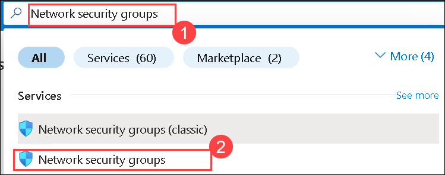

1. On the **Network security groups** blade, click **+ Create**.

1. On the **Basics** tab of the **Create network security group** blade, specify the following settings and then click on **Review+create (5)**.

    |Setting|Value|
    |---|---|
    |Subscription|**Leave the default subscription (1)**|
    |Resource group|**AZ500LAB06 (2)**|
    |Name|**myNsgPrivate (3)**|
    |Region|**East US (4)**|

	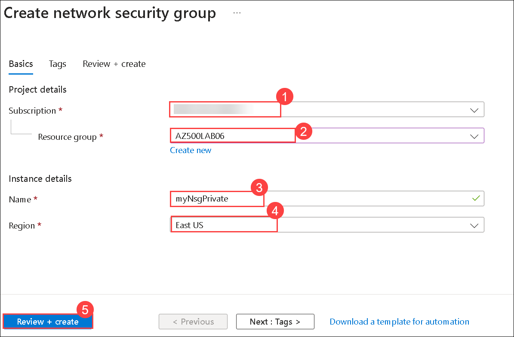    

1. Once the validation is passed, click **Create**.

    >**Note**: In the next steps, you will create an outbound security rule that allows communication to the Azure Storage service. 

1. Click on **Go to resources**.    

1. On the **myNsgPrivate** blade, in the **Settings** section, click **Outbound security rules**.

1. On the **myNsgPrivate \| Outbound security rules** blade, click **+ Add**.

1. On the **Add outbound security rule** blade, specify the following settings to explicitly allow outbound traffic to Azure Storage (leave all other values with their default settings) and then click **Add (11)**.

    |Setting|Value|
    |---|---|
    |Source|**Service Tag (1)**|
    |Source service tag|**VirtualNetwork (2)**|
    |Source port ranges|**\*** **(3)**|
    |Destination|**Service Tag (4)**|
    |Destination service tag|**Storage (5)**|
    |Destination port ranges|**\*** **(6)**|
    |Protocol|**Any (7)**|
    |Action|**Allow (8)**|
    |Priority|**1000 (9)**|
    |Name|**Allow-Storage-All (10)**|

	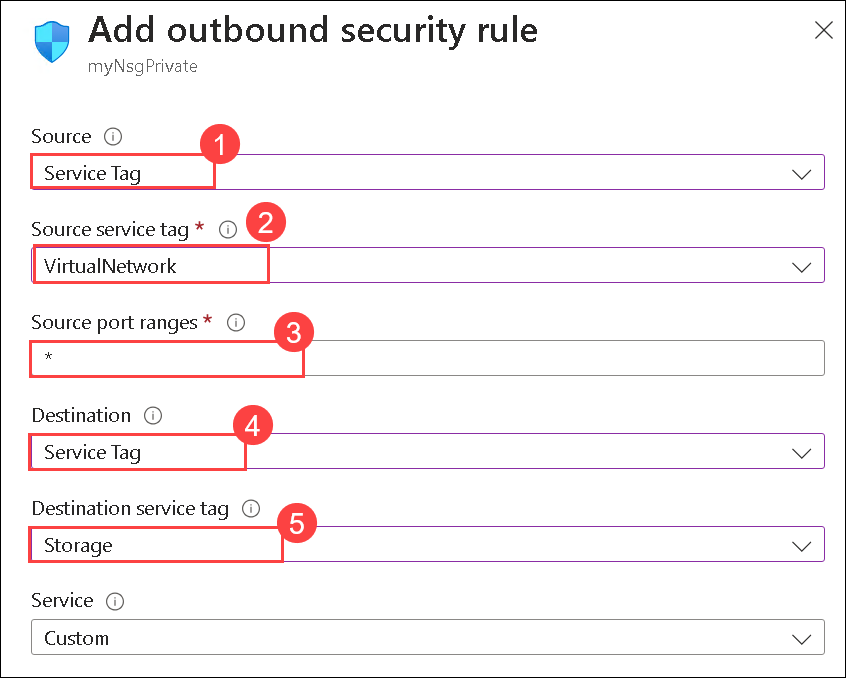

	    

1. On the **myNsgPrivate** blade, in the **Settings** section, click **Outbound security rules**, and then click **+ Add**.

1. On the **Add outbound security rule** blade, specify the following settings to explicitly deny outbound traffic to Internet (leave all other values with their default settings) and then click on **Add (11)**

    |Setting|Value|
    |---|---|
    |Source|**Service Tag (1)**|
    |Source service tag|**VirtualNetwork (2)**|
    |Source port ranges|**\*** **(3)**|
    |Destination|**Service Tag (4)**|
    |Destination service tag|**Internet (5)**|
    |Destination port ranges|**\*** **(6)**|
    |Protocol|**Any (7)**|
    |Action|**Deny (8)**|
    |Priority|**1100 (9)**|
    |Name|**Deny-Internet-All (10)**|
	
	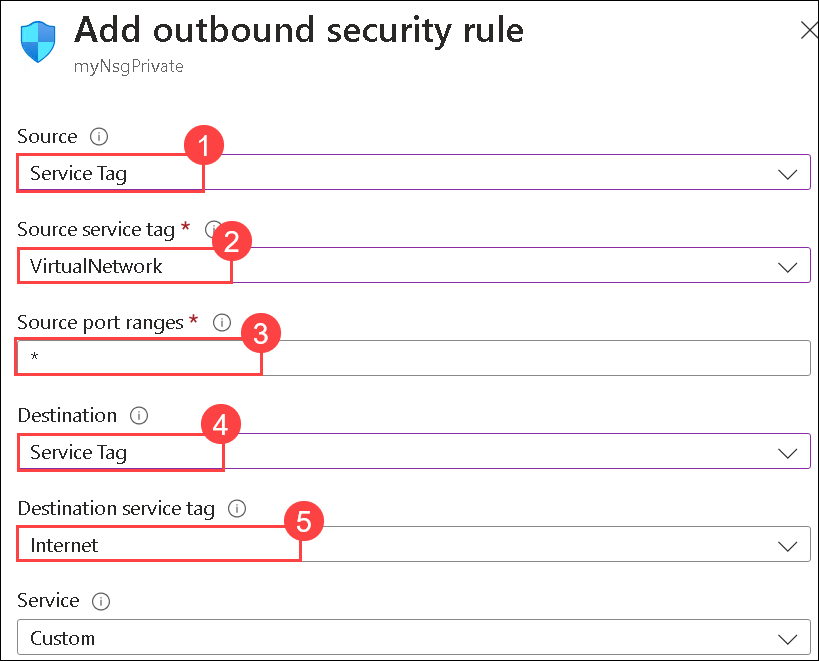

	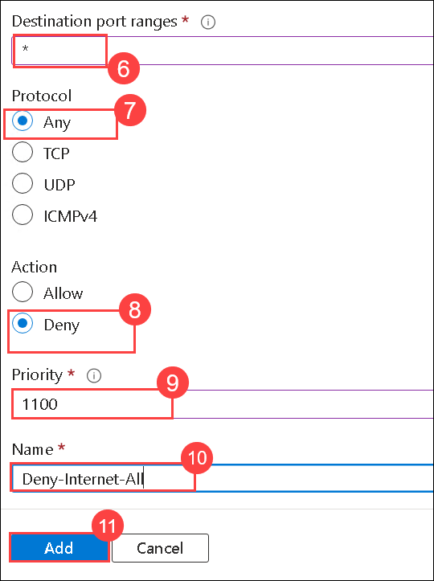    

     >**Note**: This rule overrides a default rule in all network security groups that allows outbound internet communication. 

     >**Note**: In the next steps, you will create an inbound security rule that allows Remote Desktop Protocol (RDP) traffic to the subnet. The rule overrides a default security rule that denies all inbound traffic from the internet. Remote Desktop connections are allowed to the subnet so that connectivity can be tested in a later step.

1. On the **myNsgPrivate** blade, in the **Settings** section, click **Inbound security rules (1)** and then click **+ Add (2)**.

	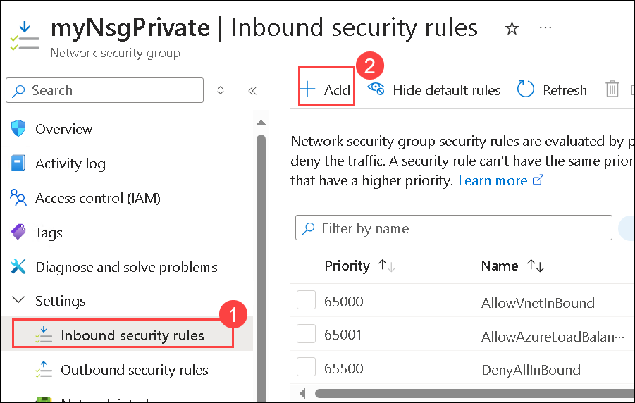

1. On the **Add inbound security rule** blade, specify the following settings (leave all other values with their default values): 

    |Setting|Value|
    |---|---|
    |Source|**Any**|
    |Source port ranges|**\***|
    |Destination|**Service Tag**|
    |Destination service tag|**VirtualNetwork**|
    |Destination port ranges|**3389**|
    |Protocol|**TCP**|
    |Action|**Allow**|
    |Priority|**1200**|                                                    
    |Name|**Allow-RDP-All**|

1. On the **Add inbound security rule** blade, click **Add** to create the new inbound rule. 

    >**Note**: Now you will associate the network security group with the Private subnet.

1. Naviagte to the **Subnets (1)** blade, select **+ Associate (2)** and specify the following settings in the **Associate subnet** section and then click **OK (5)**:

    |Setting|Value|
    |---|---|
    |Virtual network|**myVirtualNetwork (3)**|
    |Subnet|**Private (4)**|

	    
    
### Task 4: Configure a network security group to allow rdp on the public subnet

In this task, you will create a network security group with one inbound security rule (RDP). You will also associate the network security group with the Public subnet. This will allow RDP access to the Public VM.

1. In the Azure portal, in the **Search resources, services, and docs** text box at the top of the Azure portal page, type **Network security groups (1)** and select **Network security groups (2)** from the services.

	

1. On the **Network security groups** blade, click **+ Create**.

1. On the **Basics** tab of the **Create network security group** blade, specify the following settings and then click on **Review + create (5)**.

    |Setting|Value|
    |---|---|
    |Subscription|**Leave the deafult subscription (1)**|
    |Resource group|**AZ500LAB06 (2)**|
    |Name|**myNsgPublic (3)**|
    |Region|**East US (4)**|

	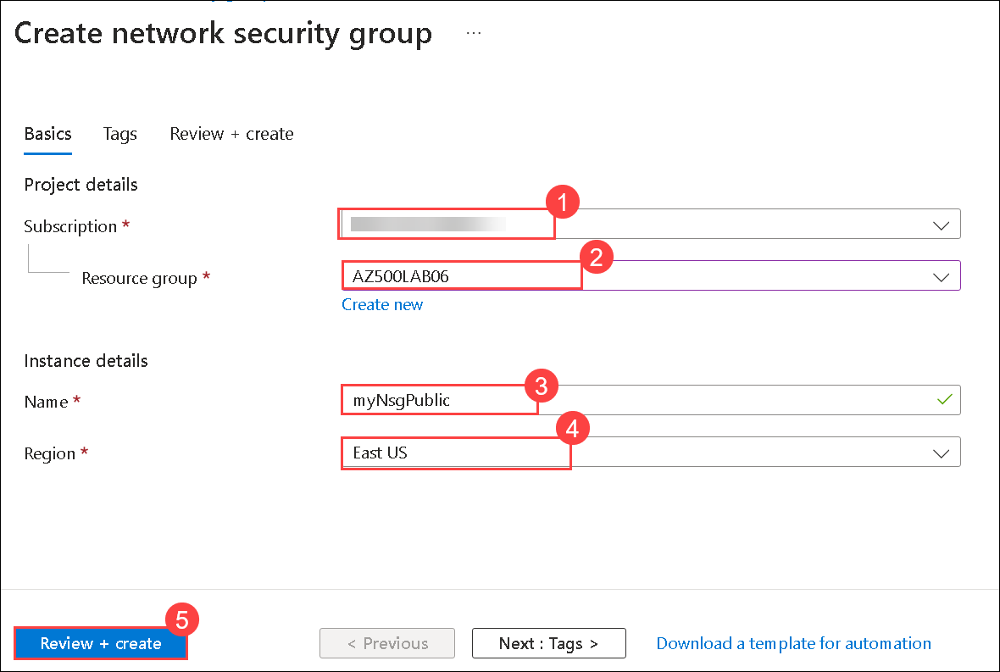    

1. Click on **Create**.

    >**Note**: In the next steps, you will create an outbound security rule that allows communication to the Azure Storage service. 

1. Click on **Go to resources.**

1. On the **myNsgPublic** blade, in the **Settings** section, click **Inbound security rules (1)** and then click **+ Add (2)**.

	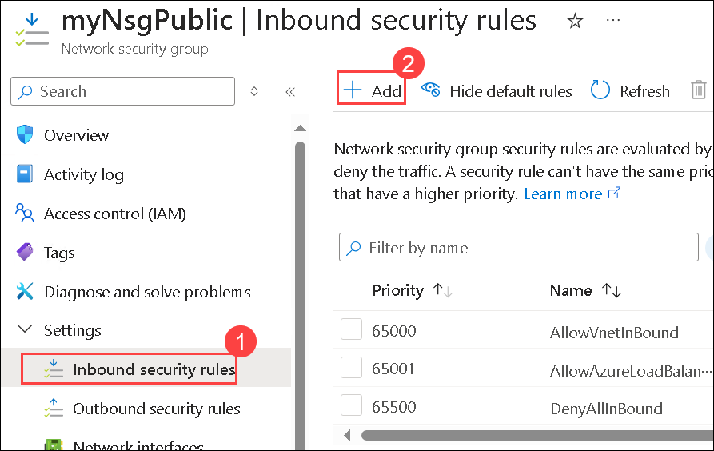

1. On the **Add inbound security rule** blade, specify the following settings (leave all other values with their default values): 

    |Setting|Value|
    |---|---|
    |Source|**Any**|
    |Source port ranges|**\***|
    |Destination|**Service Tag**|
    |Destination service tag|**VirtualNetwork**|
    |Destination port ranges|**3389**|
    |Protocol|**TCP**|
    |Action|**Allow**|
    |Priority|**1200**|                                                    
    |Name|**Allow-RDP-All**|

1. On the **Add inbound security rule** blade, click **Add** to create the new inbound rule. 

    >**Note**: Now you will associate the network security group with the Public subnet.

1. Navigate to the **Subnets (1)** blade, select **+ Associate (2)** and specify the following settings in the **Associate subnet** section and then click **OK (5)**:

    |Setting|Value|
    |---|---|
    |Virtual network|**myVirtualNetwork (3)**|
    |Subnet|**Public (4)**|

	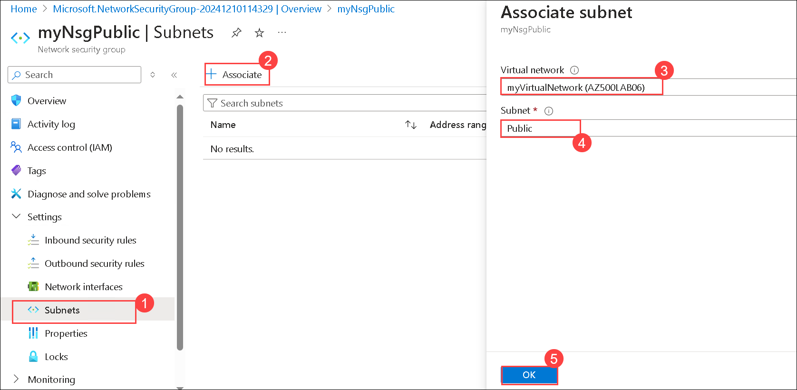    

### Task 5: Create a storage account with a file share

In this task, you will create a storage account with a file share and obtain the storage account key.  

1. In the Azure portal, in the **Search resources, services, and docs** text box at the top of the Azure portal page, type **Storage accounts (1)** and select **Storage accounts (2)** from the services.

	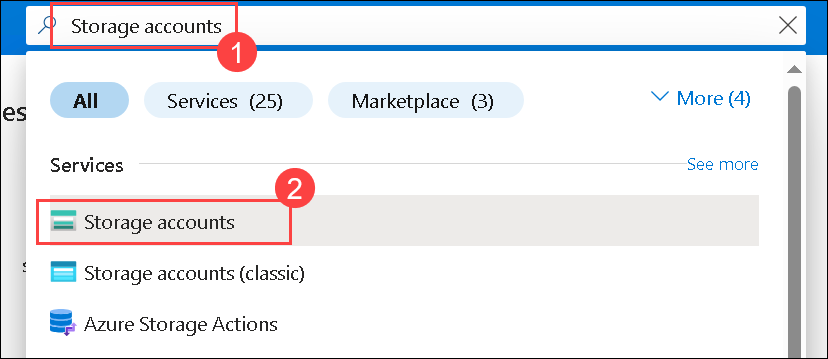

2. On the **Storage accounts** blade, click **+ Create**.

3. On the **Basics** tab of the **Create storage account** blade, specify the following settings (leave others with their default values) and then click on **Review+create (7)**.

    |Setting|Value|
    |---|---|
    |Subscription|**Leave the deafult Subscription (1)**|
    |Resource group|**AZ500LAB06 (2)**|
    |Storage account name|**storage<inject key="DeploymentID" enableCopy="false"/> (3)**|
    |Location|**(US) EastUS (4)**|
    |Performance|**Standard (general-purpose v2 account) (5)**|
    |Redundancy|**Locally redundant storage (LRS) (6)**|

	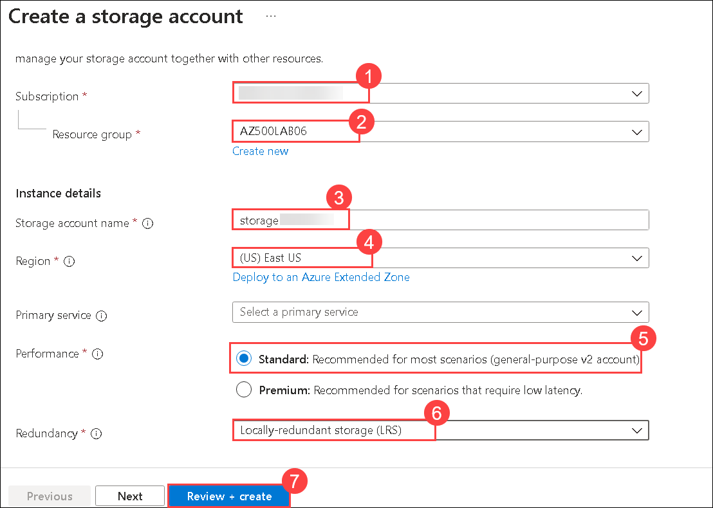    
    
     >**Note**: **DeploymentID** can be found under the **Environment Details** tab.

4. Wait for the validation process to complete, and then click **Create**.

    >**Note**: Wait for the Storage account to be created. This should take about 2 minutes.

5. In the Azure portal, in the **Search resources, services, and docs** text box at the top of the Azure portal page, type **Resource groups (1)** and select **Resource groups (2)** from the services.

	    

6. On the **Resource groups** blade, in the list of resource group, click the **AZ500LAB06** entry.

7. On the **AZ500LAB06** resource group blade, in the list of resources, click the entry representing the newly created storage account.

	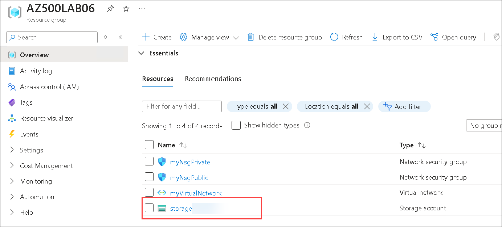 

8. On the storage account **Overview** blade, click **File Shares (1)** under the **Data storage** tab, and then click **+ File Share (2)**.

    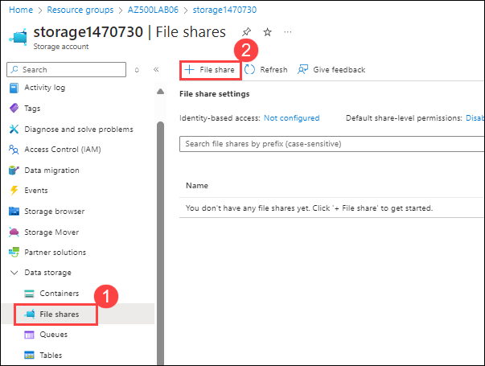

9. On the **New file share** blade, specify the following settings and click **Next: Backup > (2)**:

    |Setting|Value|
    |---|---|
    |Name|**my-file-share (1)**|

    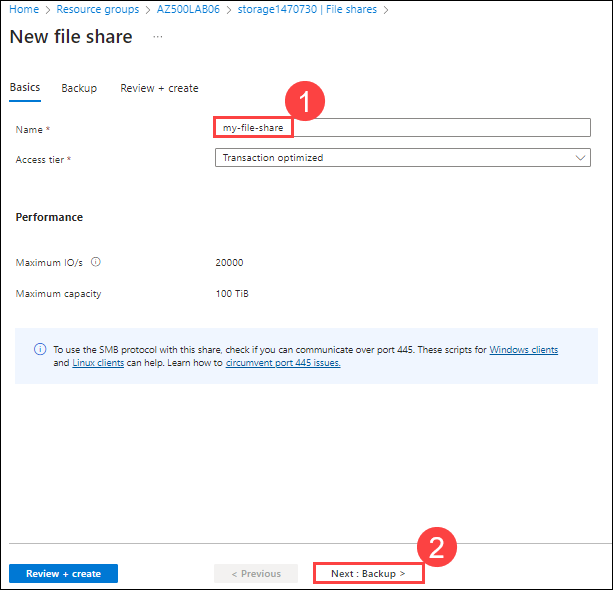

10. On the **Backup** blade, ensure the **Enable backup** option is disabled **(1)** and then click on **Review+create (2)**

    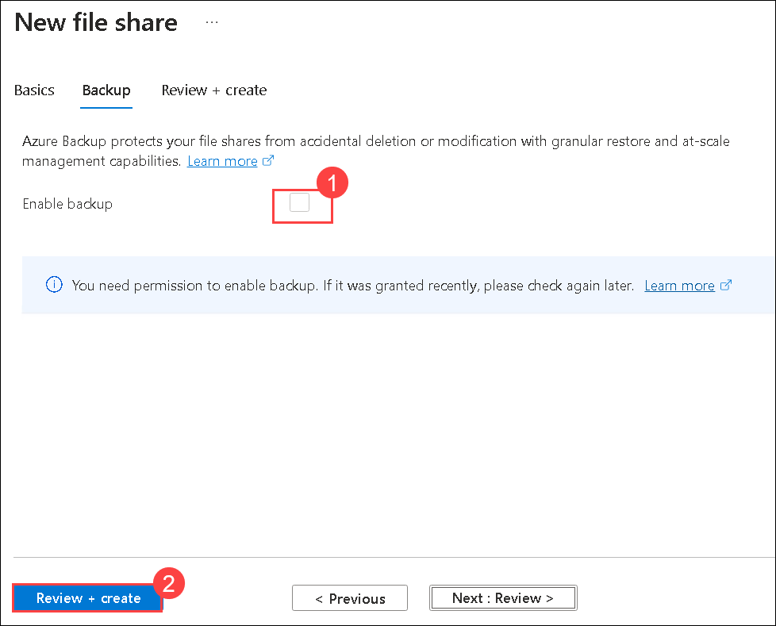

11. Click on **Create**.

    >**Note**: Now, retrieve and record the PowerShell script that creates a drive mapping to the Azure file share.

12. You will be redirected to the newly created file share. On the **my-file-share** blade, click **Connect**.

    

13. On the **Connect** blade, on the **Windows** tab, click on **Show Script** and copy the PowerShell script that creates a Z drive mapping to the file share. 

    >**Note**: Record this script. You will need this in a later in this lab in order to map the file share from the Azure virtual machine on the **Private** subnet.
    
    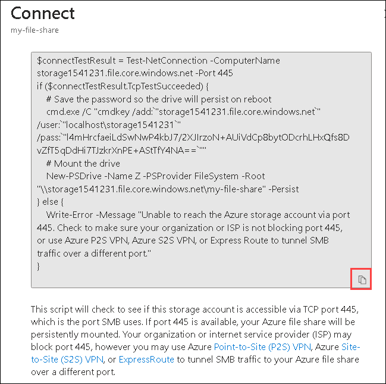

14. Navigate back to the storage account blade, then in the **Security + networking** section, click **Networking (1)**.
	
15. Under **Firewalls and virtual networks** blade, select the **Enabled from selected virtual networks and IP addresses (2)** option and click the **+ Add existing virtual network (3)** link. 

    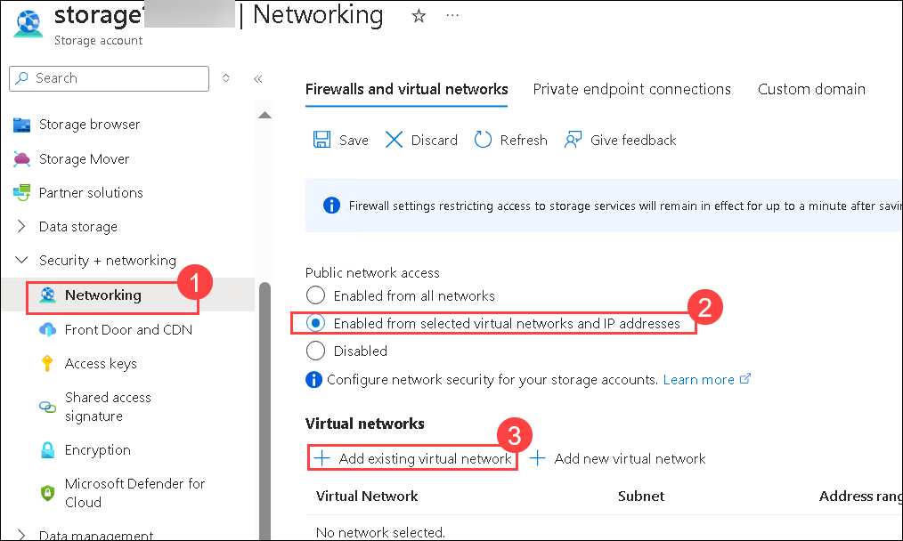

16. On the **Add networks** blade, specify the following settings, then click on **Enable (4)**.

    |Setting|Value|
    |---|---|
    |Subscription|**Leave the default Subscription (1)**|
    |Virtual networks|**myVirtualNetwork (2)**|
    |Subnets|**Private (3)**|

    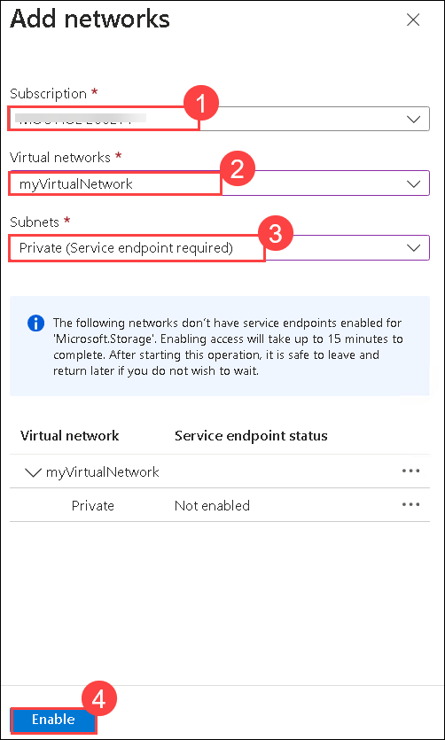    

17. On the **Add networks** blade, Click on **Add**. 

18. Back on the storage account blade, click **Save**.

    >**Note**: At this point in the lab you have configured a virtual network, a network security group, and a storage account with a file share. 

### Task 6: Deploy virtual machines into the designated subnets

In this task, you will create two virtual machines one in the Private subnet and one in the Public subnet. 

>**Note**: The first virtual machine will be connected to the Private subnet.

1. In the Azure portal, in the **Search resources, services, and docs** text box at the top of the Azure portal page, type **Virtual machines (1)** and select **Virtual machines (2)** from the services.

    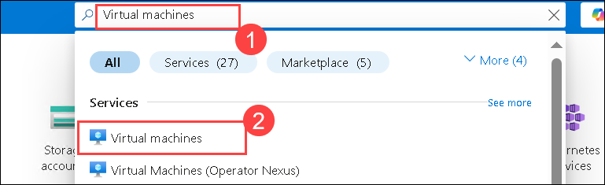   

1. On the **Virtual machines** blade, click **+ Create (1)** and, in the dropdown list, click **+ Azure Virtual machine (2)**.

    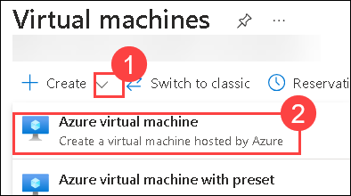   

1. On the **Basics** tab of the **Create a virtual machine** blade, specify the following settings (leave others with their default values) and then click on **Next: Disks > (10)**

    |Setting|Value|
    |---|---|
    |Subscription|**Leave the default (1)**|
    |Resource group|**AZ500LAB06 (2)**|
    |Virtual machine name|**myVmPrivate (3)**|
    |Region|**(US)East US (4)**|
    |Image|**Windows Server 2022 Datacenter: Azure Edition - X64 Gen 2 (5)**|
    |Username|**localadmin (6)**|
    |Password|**Pa55w.rd1234 (7)**|
    |Confirm password|**Pa55w.rd1234 (8)**|
    |Public inbound ports|**None (9)**|

    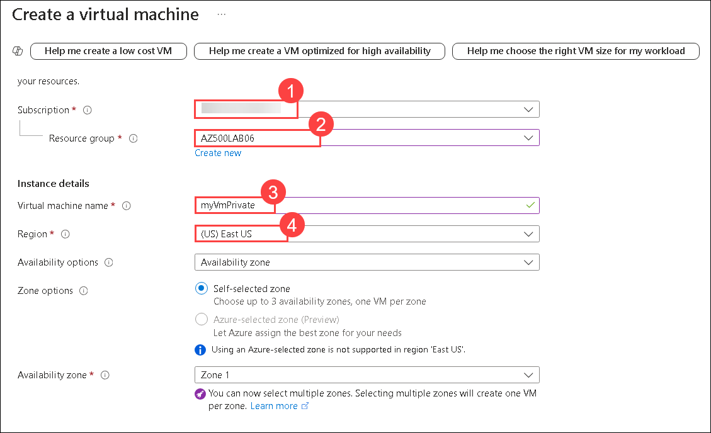       

    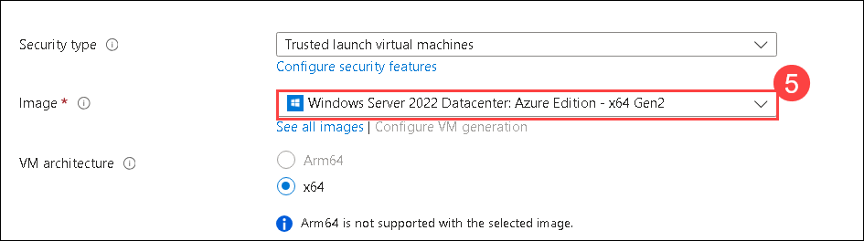   

    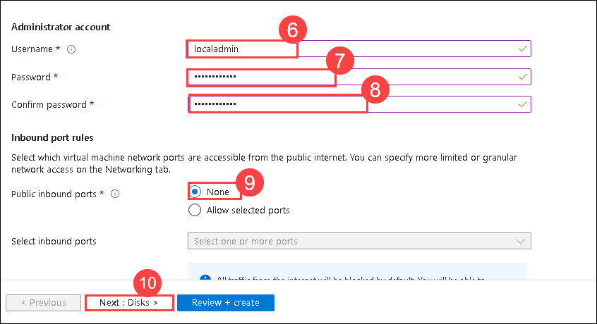       

     >**Note**: For public inbound ports, we will rely on the pre-created NSG. 

1. On the **Disks** tab of the **Create a virtual machine** blade, set the **OS disk type** to **Standard HDD (1)** and click **Next: Networking > (2)**.

    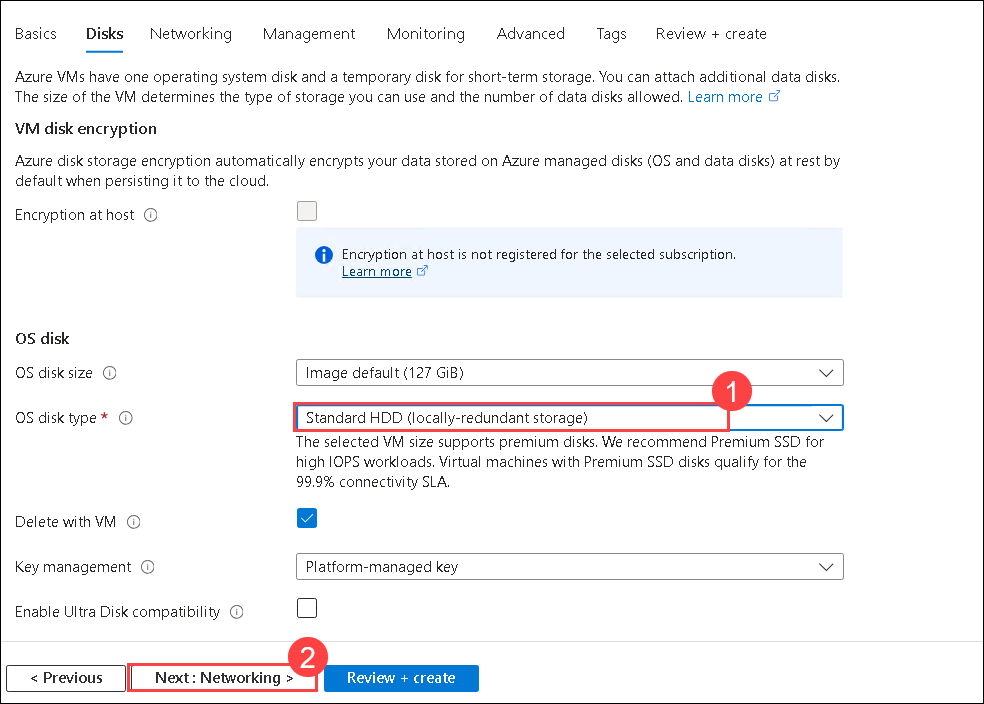   

1. On the **Networking** tab, specify the following settings (leave others with their default values) and then click on **Review+create (5)**

    |Setting|Value|
    |---|---|
    |Virtual network|**myVirtualNetwork (1)**|
    |Subnet|**Private (10.0.1.0/24) (2)**|
    |Public IP|**(new)myVmPrivate-ip (3)**|
    |NIC network security group|**None (4)**|

           

1. On the **Review + create** blade, ensure that validation was successful and click **Create**.

    >**Note**: The second virtual machine will be connected to the Public subnet.

1. On the **Virtual machines** blade, click **+ Add** and, in the dropdown list, click **+ Azure Virtual machine**.

1. On the **Basics** tab of the **Create a virtual machine** blade, specify the following settings (leave others with their default values):

    |Setting|Value|
    |---|---|
    |Subscription|the name of the Azure subscription you will be using in this lab|
    |Resource group|**AZ500LAB06**|
    |Virtual machine name|**myVmPublic**|
    |Region|**(US)East US**|
    |Image|**Windows Server 2022 Datacenter: Azure Edition - Gen 2**|
    |Username|**localadmin**|
    |Password|**Pa55w.rd1234**|
    |Confirm password|**Pa55w.rd1234**|
    |Public inbound ports|**None**|
    
    >**Note**: For public inbound ports, we will rely on the precreated NSG. 

1. Click **Next: Disks >** and, on the **Disks** tab, set the **OS disk type** to **Standard HDD** and click **Next: Networking >**.

1. On the **Networking** tab, specify the following settings (leave others with their default values) and then click on **Review+create (5)**

    |Setting|Value|
    |---|---|
    |Virtual network|**myVirtualNetwork (1)**|
    |Subnet|**Public (10.0.0.0/24) (2)**|
    |Public IP|**(new)myVmPublic-ip (3)**|
    |NIC network security group|**None (4)**|

    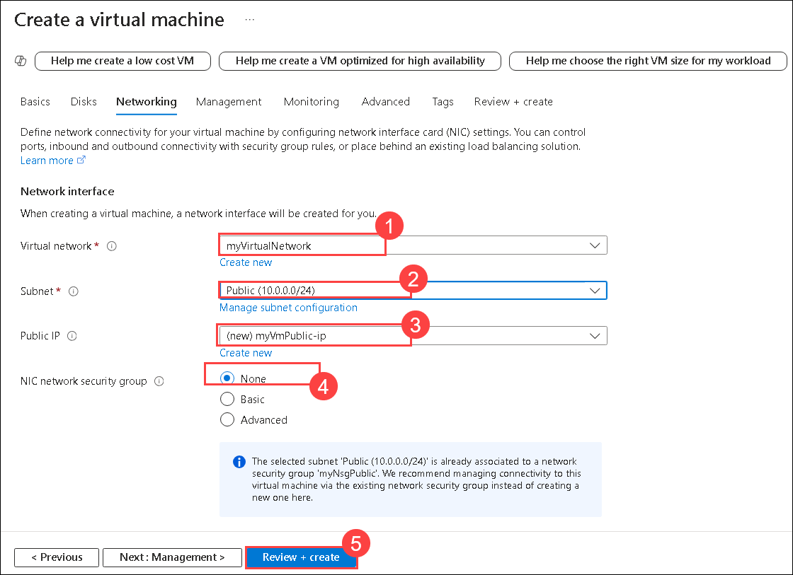       

1. On the **Review + create** blade, ensure that validation was successful and click **Create**.

    >**Note**: You can continue to the next task once the deployment of the **myVmPublic** Azure VM is completed.

### Task 7: Test the storage connection from the private subnet to confirm that access is allowed

In this task, you will connect to the myVMPrivate virtual machine via Remote Desktop and map a drive to the file share. 

1. Navigate back to the **Virtual machines** blade. 

1. On the **Virtual machines** blade, click the **myVMPrivate** entry.

    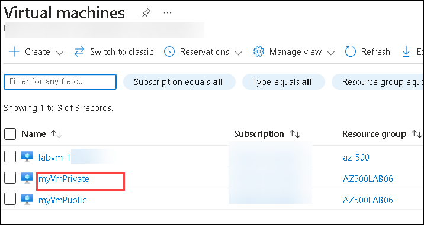  

1. On the **myVMPrivate** blade, click **Connect** and, in the drop down menu, select **Connect**.

    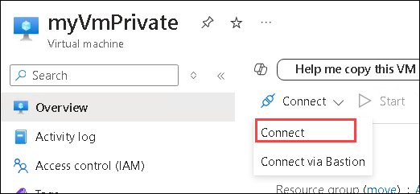  

1. Click **Download RDP File** and use it to connect to the **myVMPrivate** Azure VM via Remote Desktop. 

    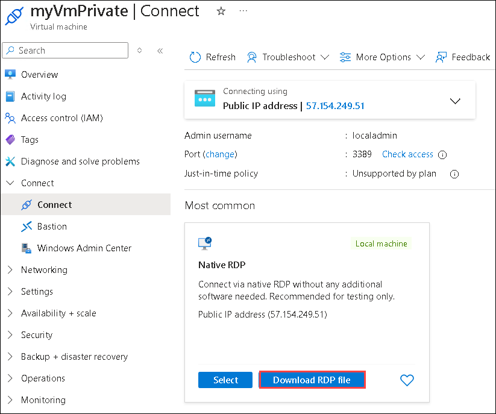  

1. Click on **Keep** for the warning pop up.

   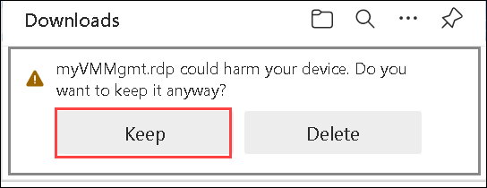  

1. Click on **Open file.**

     

1. Click on **Connect**.

   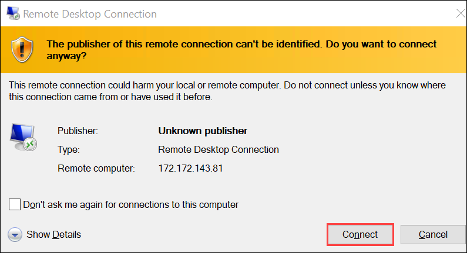  

1. On the **Windows Security** pop up, click on **More choices.**

   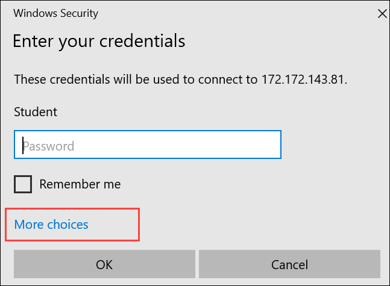  

1. Select **Use a different account.**

   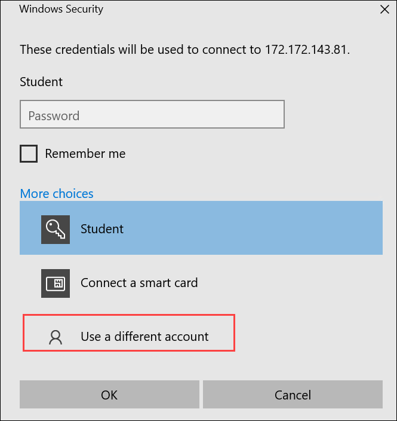       

1. When prompted to authenticate, provide the following credentials and then click **OK (3)**.

    |Setting|Value|
    |---|---|
    |User name|**localadmin (1)**|
    |Password|**Pa55w.rd1234 (2)**|

    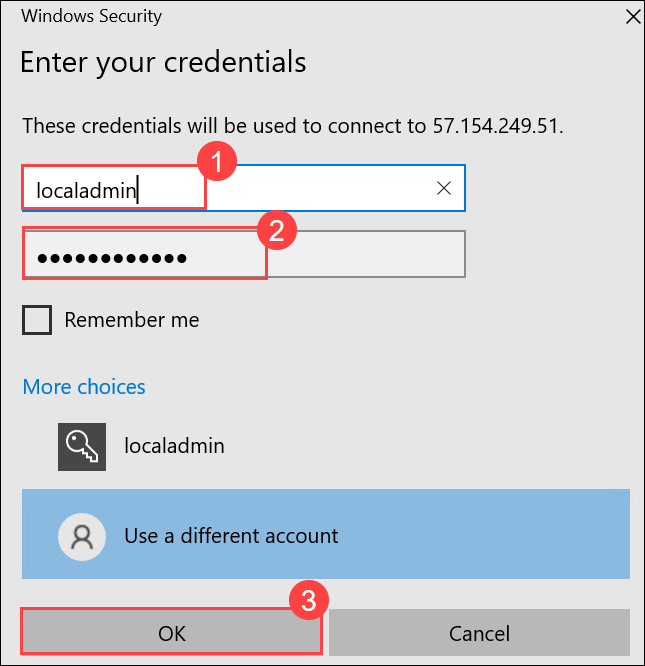     

    >**Note**: Wait for the Remote Desktop session to open and Server Manager to load.

    >**Note**: You will now map drive Z to an Azure File share within the Remote Desktop session to a Windows Server 2022 computer

1. Within the Remote Desktop session to **myVMPrivate**, click **Start** and then click **Windows PowerShell ISE**.

     

1. Within the **Windows PowerShell ISE** window, open the **Script** pane. Click on **File (1) -> New (2)**.

    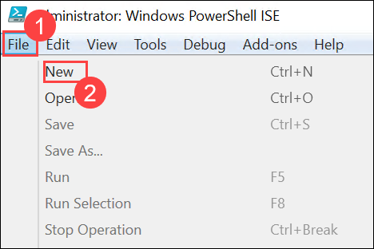 

1. Then **Paste and run the PowerShell script that you recorded earlier in this lab** and the click on **Run**. The script has the following format:

    ```powershell
    $connectTestResult = Test-NetConnection -ComputerName <storage_account_name>.file.core.windows.net -Port 445
    if ($connectTestResult.TcpTestSucceeded) {
       # Save the password so the drive will persist on reboot
       cmd.exe /C "cmdkey /add:`"<storage_account_name>.file.core.windows.net`" /user:`"localhost\<storage_account_name>`"  /pass:`"<storage_account_key>`""
       # Mount the drive
       New-PSDrive -Name Z -PSProvider FileSystem -Root "\\<storage_account_name>.file.core.windows.net\my-file-share" -Persist
    } else {
       Write-Error -Message "Unable to reach the Azure storage account via port 445. Check to make sure your organization or ISP is not blocking port 445, or use Azure P2S VPN, Azure S2S VPN, or Express Route to tunnel SMB traffic over a different port."
    }
    ```
    >**Note**: Dont copy this one, please paste the one that you had copied in the previous step.

    >**Note**: The `<storage_account_name>` placeholder represents the name of the storage account hosting the file share and `<storage_account_key>` one its primary key

    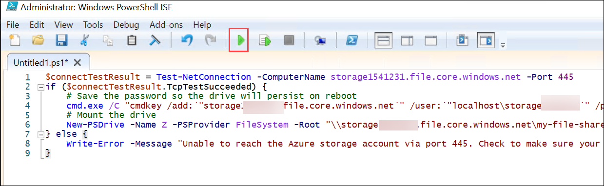     

1. Start File Explorer and verify that the Z: drive mapping has been successfully created.

    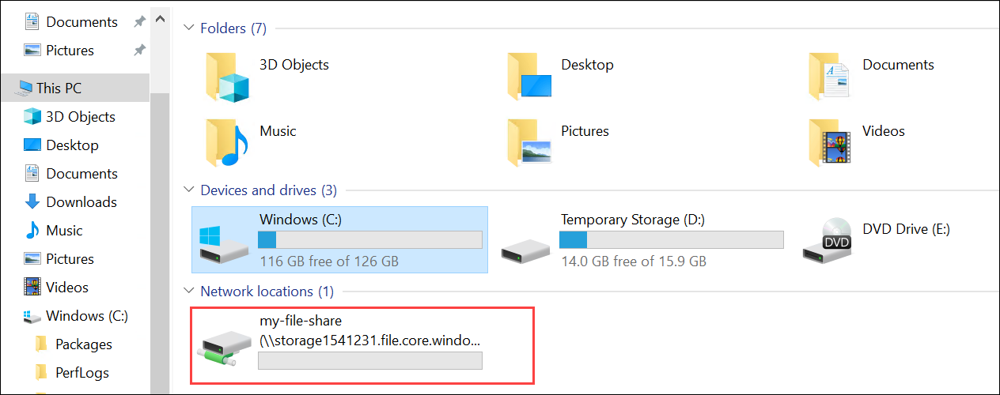   

1. Next, from the console pane of the **Windows PowerShell ISE** console, run the following to verify that the virtual machine has no outbound connectivity to the internet:

    ```powershell
    Test-NetConnection -ComputerName www.bing.com -Port 80
    ```

    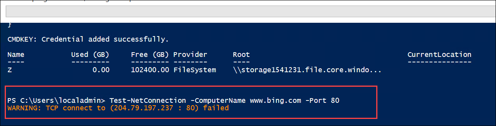       

    >**Note**: The test will fail because the network security group associated with the Private subnet does not allow outbound access to the internet.

1. Terminate the Remote Desktop session to the **myVMPrivate** Azure VM.

    >**Note**: At this point, you have confirmed that the virtual machine in the Private subnet can access the storage account. 

###  Task 8: Test the storage connection from the public subnet to confirm that access is denied 

1. Navigate back to the **Virtual machines** blade. 

1. On the **Virtual machines** blade, click the **myVMPublic** entry.

1. On the **myVMPublic** blade, click **Connect** and, in the drop down menu, click **Connect**. 

1. Click **Download RDP File** and use it to connect to the **myVMPublic** Azure VM via Remote Desktop.

1. Click on **Keep** for the warning pop up.

     

1. Click on **Open file.**

    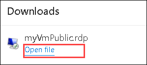 

1. Click on **Connect**.

     

1. On the **Windows Security** pop up, click on **More choices.**

     

1. Select **Use a different account.**

     

1. When prompted to authenticate, provide the following credentials and then click **OK**.

    |Setting|Value|
    |---|---|
    |User name|**localadmin**|
    |Password|**Pa55w.rd1234**|

    >**Note**: Wait for the Remote Desktop session to open and Server Manager to load.

    >**Note**: You will now map drive Z to an Azure File share within the Remote Desktop session to a Windows Server 2022 computer

1. Within the Remote Desktop session to **myVMPublic**, click **Start** and then click **Windows PowerShell ISE**.

1. Within the **Windows PowerShell ISE** window, open the **Script** pane by clickin on **File->New** from the top left corner. Then **paste and run the same PowerShell script** that you ran within the Remote Desktop session to the **myVMPrivate** Azure VM.

    >**Note**: This time, you will receive the **New-PSDrive : Access is denied** error. 

    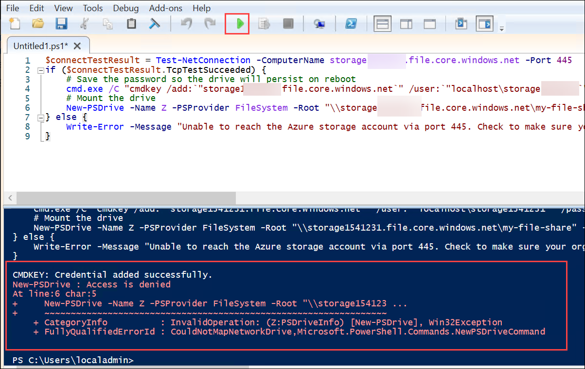       

     >**Note**: Access is denied because the *myVmPublic* virtual machine is deployed in the Public subnet. The Public subnet does not have a service endpoint enabled for the Azure Storage. The storage account only allows network access from the Private subnet.

1. Next, from the console pane of the **Windows PowerShell ISE** console, run the following to verify that the virtual machine has outbound connectivity to the internet: 

    ```powershell
    Test-NetConnection -ComputerName www.bing.com -Port 80
    ```

    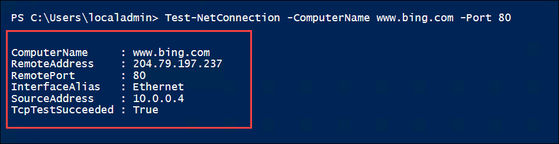       

    >**Note**: The test will succeed because there is no network security group associated with the Public subnet.

1. Terminate the Remote Desktop session to the **myVMPublic** Azure VM.

    >**Note**: At this point, you have confirmed that the virtual machine in the Public subnet cannot access the storage account, but has access to the internet.

   > **Congratulations** on completing the task! Now, it's time to validate it. Here are the steps:
   - If you receive a success message, you can proceed to the next task.
   - If not, carefully read the error message and retry the step, following the instructions in the lab guide.
   - If you need any assistance, please contact us at labs-support@spektrasystems.com. We are available 24/7 to help you out.
 
   <validation step="a34b7e41-b40a-47fc-b73d-1b8d40da1391" />

### You have successfully completed the lab
