# Lab 08: Azure Monitor

## Lab scenario
You have been asked to create a proof of concept for monitoring virtual machine performance. Specifically, you want to:
- Configure a virtual machine such that telemetry and logs can be collected.
- Show what telemetry and logs can be collected.
- Show how the data can be used and queried. 

> For all the resources in this lab, we are using the **East US** region.

## Lab objectives
In this lab, you will complete the following exercise:
- Exercise 1: Collect data from an Azure virtual machine with Azure Monitor

## Estimated timing: 45 minutes

## Architecture Diagram

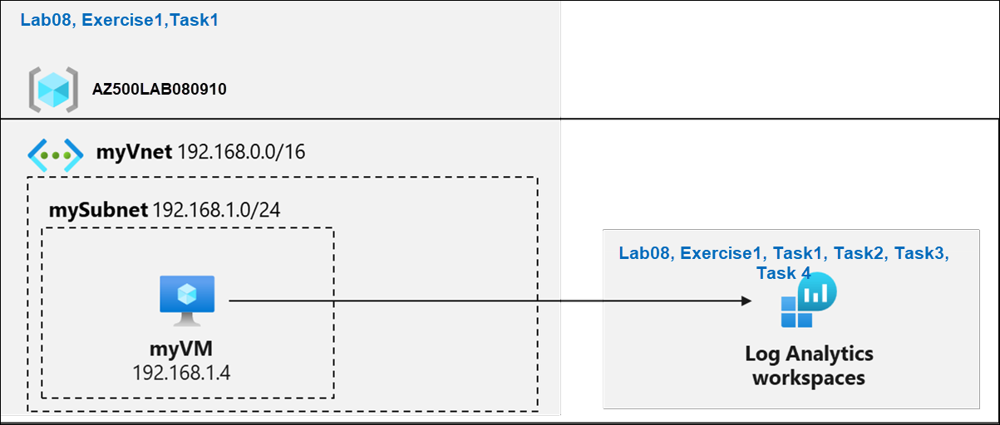

# Exercise 1: Collect data from an Azure virtual machine with Azure Monitor

In this exercise, you will complete the following tasks: 

- Task 1: Deploy an Azure virtual machine 
- Task 2: Create a Log Analytics workspace
- Task 3: Enable the Log Analytics virtual machine extension
- Task 4: Collect virtual machine event and performance data
- Task 5: View and query collected data 

## Task 1: Deploy an Azure virtual machine

1. From the Azure portal, open the **Azure Cloud Shell** by clicking on the icon in the top right of the Azure Portal.

    

1. The first time you open the Cloud Shell, you may be prompted to choose the type of shell you want to use (*Bash* or *PowerShell*). If so, select **Powershell**.

    
   
1. On the Getting started, select **No storage account required (1)** and select your **Subscription (2)** under storage account subscription. Click on **Apply (3)**.

     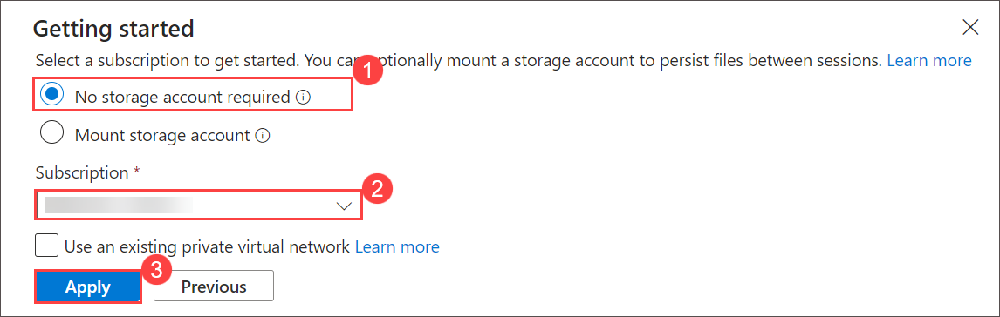

1. In the upper-left menu of the Cloud Shell pane, make sure you are using **Powershell**. If not selected select **Switch to Powershell**. In **Switch to Powershell in Cloud Shell** pop-up select **Confirm**.

1. In the PowerShell session within the Cloud Shell pane, run the following to create a resource group that will be used in this lab:
  
    ```powershell
    New-AzResourceGroup -Name AZ500LAB080910 -Location 'EastUS'
    ```

1. In the PowerShell session within the Cloud Shell pane, run the following to create a new Azure virtual machine. 

    ```powershell
    New-AzVm -ResourceGroupName "AZ500LAB080910" -Name "myVM" -Location 'EastUS' -VirtualNetworkName "myVnet" -SubnetName "mySubnet" -SecurityGroupName   "myNetworkSecurityGroup" -PublicIpAddressName "myPublicIpAddress" -OpenPorts 80,3389
    ```

1.  When prompted for credentials:

    |Setting|Value|
    |---|---|
    |User name|**localadmin**|
    |Password|**Pa55w.rd1234**|

    >**Note**: Wait for the deployment to complete. 

1. In the PowerShell session within the Cloud Shell pane, run the following to confirm that the virtual machine named **myVM** was created and its **ProvisioningState** is **Succeeded**.

    ```powershell
    Get-AzVM -Name 'myVM' -ResourceGroupName 'AZ500LAB080910' | Format-Table
    ```

1. Close the Cloud Shell pane. 

## Task 2: Create a Log Analytics workspace

In this task, you will create a Log Analytics workspace. 

1. In the Azure portal, in the **Search resources, services, and docs** text box at the top of the Azure portal page, type **Log Analytics workspaces** and press the **Enter** key.

   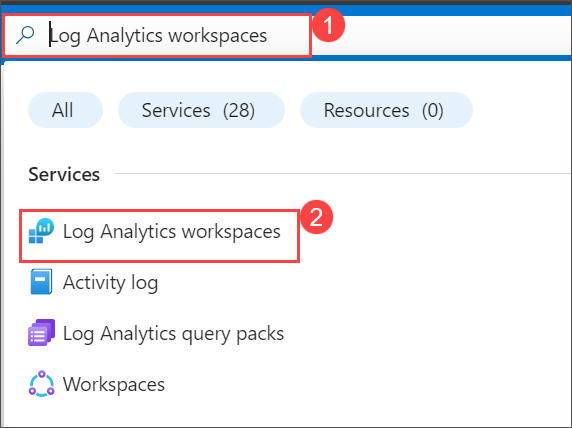


1. On the **Log Analytics workspaces** blade, click **+ Create**.

1. On the **Basics** tab of the **Create Log Analytics workspace** blade, specify the following settings (leave others with their default values):

    |Setting|Value|
    |---|---|
    |Subscription|the name of the Azure subscription you are using in this lab|
    |Resource group|**AZ500LAB080910**|
    |Name|any valid, globally unique name|
    |Region|**(US) East US**|

1. Click **Review + create**.

    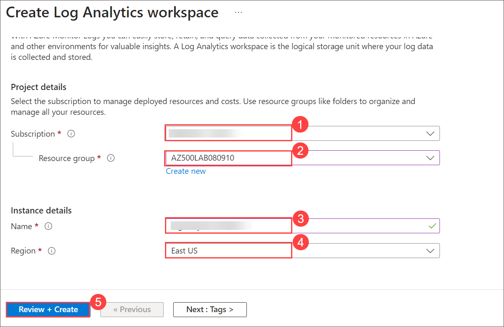
   
1. On the **Review + create** tab of the **Create Log Analytics workspace** blade, click **Create**.


## Task 3: Create an Azure storage account

In this task, you will create a storage account.

1. In the Azure portal, in the **Search resources, services, and docs** text box at the top of the Azure portal page, type **Storage accounts** and press the **Enter** key.

   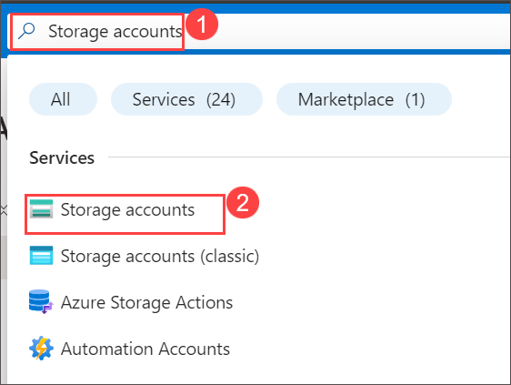

2. On the **Storage accounts** blade in the Azure portal, click the **+ Create** button to create a new storage account.

    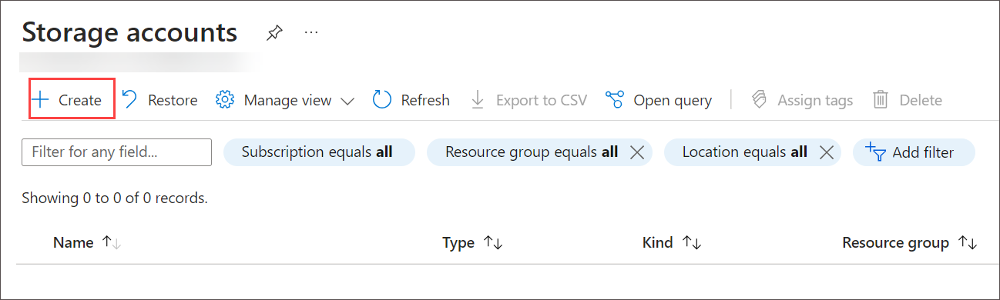

3. On the **Basics** tab of the **Create storage account** blade, specify the following settings (leave others with their default values):

    |Setting|Value|
    |---|---|
    |Subscription|the name of the Azure subscription you are using in this lab|
    |Resource group|**AZ500LAB080910**|
    |Storage account name|any globally unique name between 3 and 24 in length consisting of letters and digits|
    |Location|**(US) EastUS**|
    |Performance|**Standard (general-purpose v2 account)**|
    |Redundency|**Locally redundant storage (LRS)**|


      .png)
   
4. On the **Basics** tab of the **Create storage account** blade, click **Review**, wait for the validation process to complete, and click **Create**.

    >**Note**: Wait for the Storage account to be created. This should take about 2 minutes.

## Task 4: Create a Data Collection Rule.

In this task, you will create a data collection rule.

1. In the Azure portal, in the **Search resources, services, and docs** text box at the top of the Azure portal page, type **Monitor** and press the **Enter** key.

      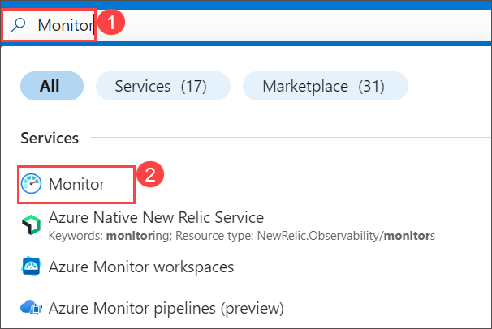
   
2. On the **Monitor Settings** blade, click **Data Collection Rules > Create**

   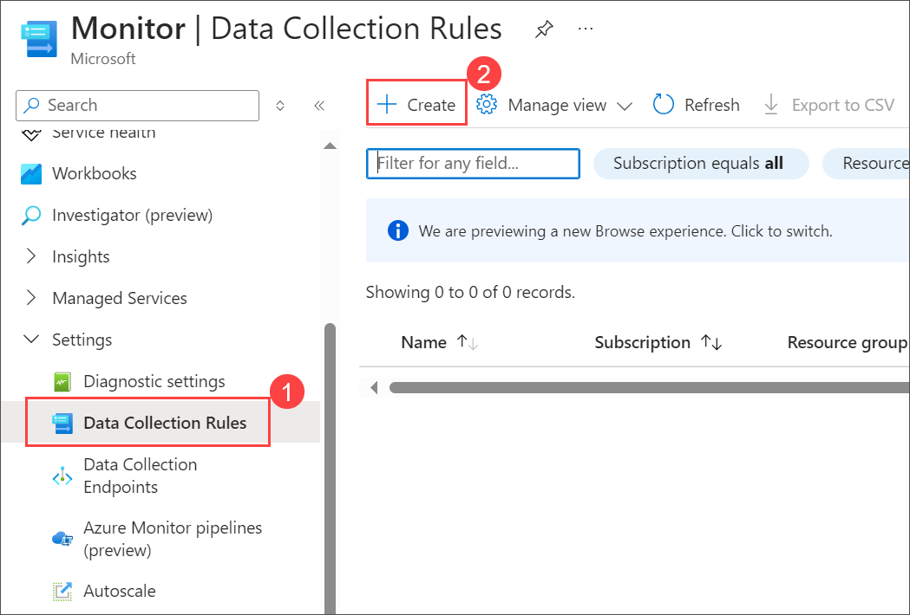

3. On the **Basics** tab of the **Create Data Collection Rule** blade, specify the following settings:
  
    |Setting|Value|
    |---|---|
    |**Rule details**|
    |Rule Name|**DCR1**|
    |Subscription|the name of the Azure subscription you are using in this lab|
    |Resource Group|**AZ500LAB080910**|
    |Region|**East US**|
    |Platform Type|**Windows**|
    |Data Collection Endpoint|*Leave Blank*|

    

4. Click on the button labeled **Next: Resources >** to proceed.
   
6. On the Resources tab, select **+ Add resources,** check **Enable Data Collection Endpoints.** In the Select a scope template, check **AZ500LAB080910,** and click **Apply.**

    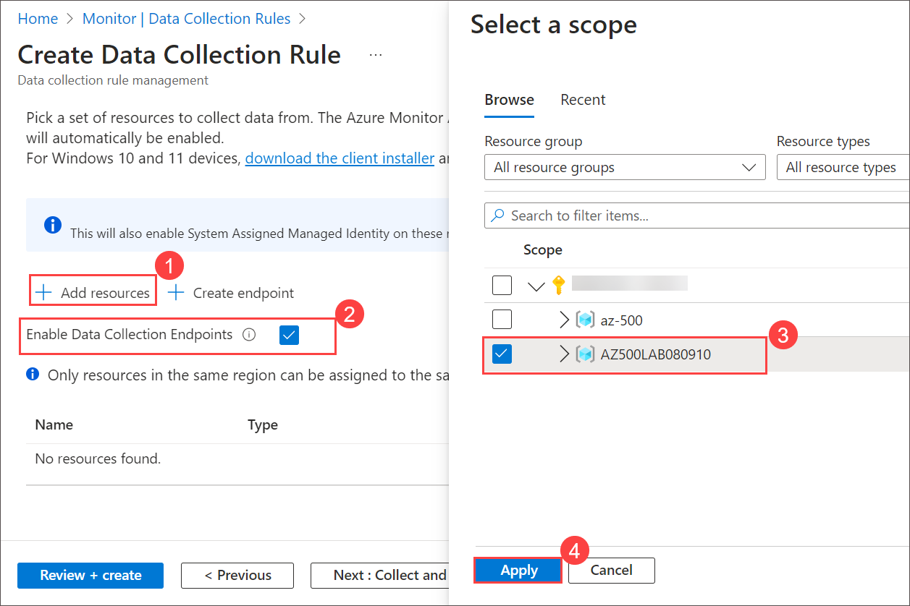

10. Click on the button labeled **Next: Collect and deliver >** to proceed.

11. Click **+ Add data source**, then on the **Add data source** page, change the **Data source type** drop-down menu to display **Performance Counters.** Leave the following default settings:

    |Setting|Value|
    |---|---|
    |**Performance counter**|**Sample rate (seconds)**|
    |CPU|60|
    |Memory|60|
    |Disk|60|
    |Network|60|

11. Click on the button labeled **Next: Destination >** to proceed.
  
12. Change the **Destination type** drop-down menu to display **Azure Monitor Logs.** In the **Subscription** window, ensure that your *Subscription* is displayed, then change the **Account or namespace** drop-down menu to reflect your previously created Log Analytics Workspace. Click on **Add data source**. 

     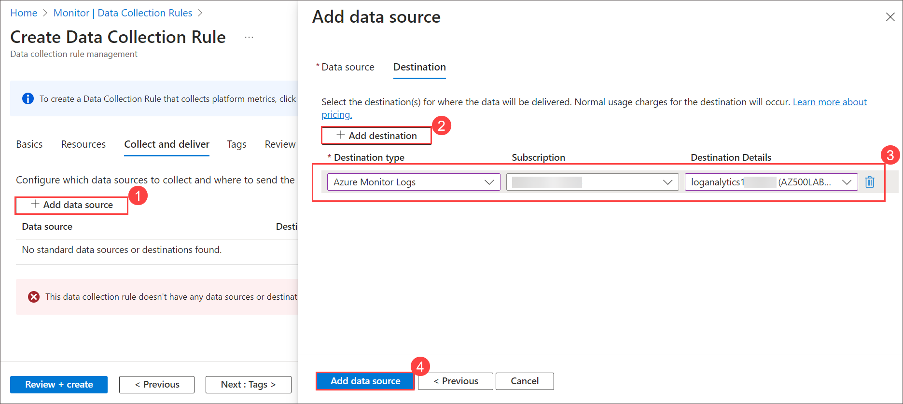

13. Click **Review + create.**

     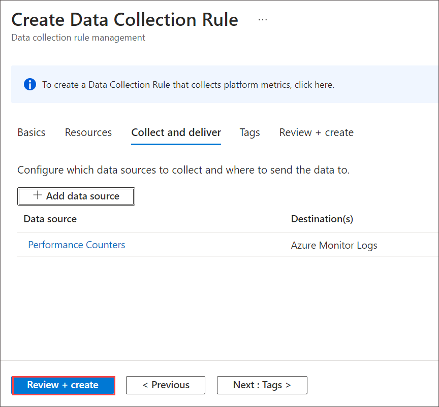

14. Click **Create.**

> Results: You deployed an Azure virtual machine, Log Analytics workspace, Azure storage account, and a data collection rule to collect events and performance counters from virtual machines with Azure Monitor Agent.

>**Note**: Do not remove the resources from this lab as they are needed for the Microsoft Defender for Cloud lab and the Microsoft Sentinel lab.

> **Congratulations** on completing the task! Now, it's time to validate it. Here are the steps:
   - If you receive a success message, you can proceed to the next task.
   - If not, carefully read the error message and retry the step, following the instructions in the lab guide.
   - If you need any assistance, please contact us at labs-support@spektrasystems.com. We are available 24/7 to help you out.
 
   <validation step="2438c3db-e10e-4895-88cd-b6f1ffa433ca" />

### You have successfully completed the lab, click on Next to start the next lab

 
