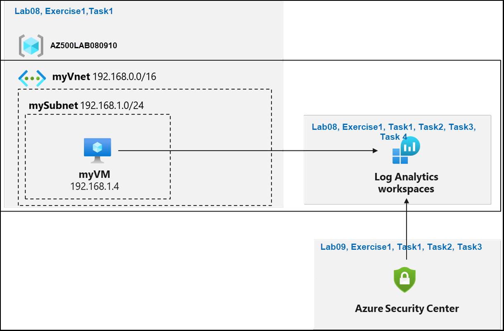
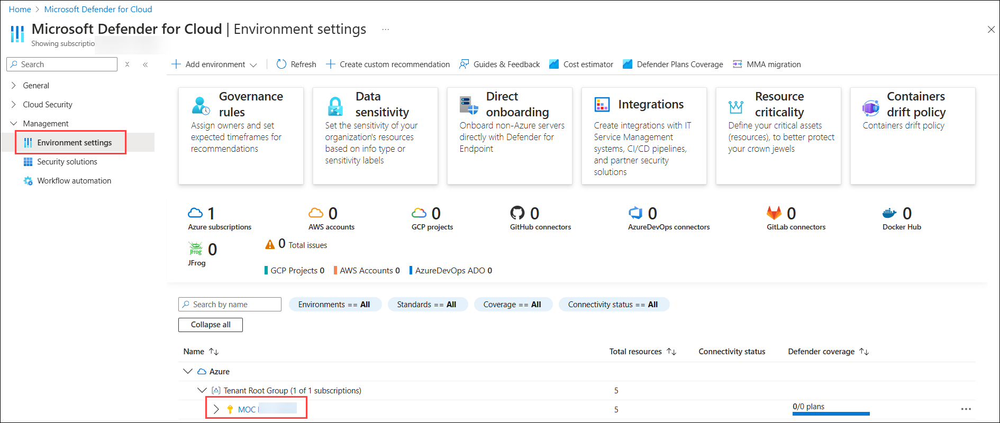
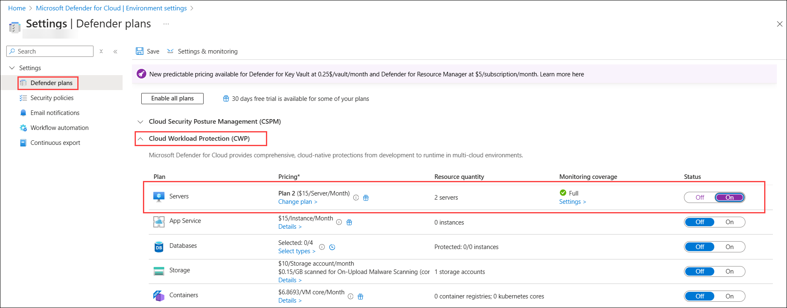
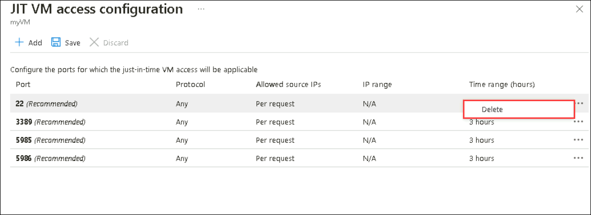

# Lab 09: Microsoft Defender for Cloud

## Lab scenario

You have been asked to create a proof of concept of Microsoft Defender for Cloud-based environment. Specifically, you want to:

- Configure Microsoft Defender for Cloud to monitor a virtual machine.
- Review Microsoft Defender for Cloud recommendations for the virtual machine.
- Implement recommendations for guest configuration and Just in time VM access. 
- Review how the Secure Score can be used to determine progress toward creating a more secure infrastructure.

 > For all the resources in this lab, we are using the **East US** region.

## Lab objectives

In this lab, you will complete the following exercise:

- Exercise 1: Implement Microsoft Defender for Cloud

## Architecture Diagram

 

# Exercise 1: Implement Microsoft Defender for Cloud

In this exercise, you will complete the following tasks:

- Task 1: Deploy an Azure virtual machine
- Task 2: Create a Log Analytics workspace
- Task 3: Configure Microsoft Defender for Cloud
- Task 4: Review the Microsoft Defender for Cloud recommendations
- Task 5: Implement the Microsoft Defender for Cloud recommendation to enable Just in time VM Access

## Task 1: Deploy an Azure virtual machine

1. From the Azure portal, open the **Azure Cloud Shell** by clicking on the icon in the top right of the Azure Portal.

    

1. The first time you open the Cloud Shell, you may be prompted to choose the type of shell you want to use (*Bash* or *PowerShell*). If so, select **Powershell**.

    
   
1. On the Getting started, select **No storage account required (1)** and select your **Subscription (2)** under storage account subscription. Click on **Apply (3)**.

     

1. In the upper-left menu of the Cloud Shell pane, make sure you are using **Powershell**. If not selected select **Switch to Powershell**. In **Switch to Powershell in Cloud Shell** pop-up select **Confirm**.

1. In the PowerShell session within the Cloud Shell pane, run the following to create a resource group that will be used in this lab:
  
    ```powershell
    New-AzResourceGroup -Name AZ500LAB080910 -Location 'EastUS'
    ```

1. In the PowerShell session within the Cloud Shell pane, run the following to create a new Azure virtual machine. 

    ```powershell
    New-AzVm -ResourceGroupName "AZ500LAB080910" -Name "myVM" -Location 'EastUS' -VirtualNetworkName "myVnet" -SubnetName "mySubnet" -SecurityGroupName   "myNetworkSecurityGroup" -PublicIpAddressName "myPublicIpAddress" -OpenPorts 80,3389,22
    ```

1.  When prompted for credentials:

    |Setting|Value|
    |---|---|
    |User name|**localadmin**|
    |Password|**Pa55w.rd1234**|

    >**Note**: Wait for the deployment to complete. 

1. In the PowerShell session within the Cloud Shell pane, run the following to confirm that the virtual machine named **myVM** was created and its **ProvisioningState** is **Succeeded**.

    ```powershell
    Get-AzVM -Name 'myVM' -ResourceGroupName 'AZ500LAB080910' | Format-Table
    ```

1. Close the Cloud Shell pane. 

## Task 2: Create a Log Analytics workspace

In this task, you will create a Log Analytics workspace. 

1. In the Azure portal, in the **Search resources, services, and docs** text box at the top of the Azure portal page, type **Log Analytics workspaces (1)** and select **Log Analytics workspaces (2)** from the services.

   

1. On the **Log Analytics workspaces** blade, click **+ Create**.

1. On the **Basics** tab of the **Create Log Analytics workspace** blade, specify the following settings (leave others with their default values) and then click on **Review+create (5)**.

    |Setting|Value|
    |---|---|
    |Subscription|**Leave the default Subscription (1)**|
    |Resource group|Select **AZ500LAB080910 (2)**|
    |Name| Enter **LogAnalytics<inject key="DeploymentID" enableCopy="false"/> (3)**|
    |Region|**(US) East US (4)**|

    
   
1. On the **Review + create** tab of the **Create Log Analytics workspace** blade, click **Create**.

## Task 3: Configure Microsoft Defender for Cloud

In this task, you will on-board and configure Microsoft Defender for Cloud.

1. In the Azure portal, in the **Search resources, services, and docs** text box at the top of the Azure portal page, type **Microsoft Defender for Cloud** and press the **Enter** key.

1. On the **Microsoft Defender for Cloud | Overview** blade, in the vertical menu on the left side, in the **Management** section, click **Environment Settings**. 
 
   >**Note**: If you get any pop-up you can click on **Maybe Later**

    

1. Expand the environment settings folders until the subscription section is displayed, then click the subscription to view details.

1. On the **Settings | Defender plans** blade, under Defender plans, expand **Cloud Workload Protection (CWP)**.

1. From the **Cloud Workload Protection (CWP)** Plan list, select **Servers**. On the right side of the page, change the Status from Off to On, then click Save.
   
     

## Task 4: Review the Microsoft Defender for Cloud recommendation

In this task, you will review the Microsoft Defender for Cloud recommendations. 

1. In the Azure portal, navigate back to the **Microsoft Defender for Cloud \| Overview** blade. 

1. On the **Microsoft Defender for Cloud \| Overview** blade, click on **Security posture** tile in the left navigation pane and review scores.

    >**Note**: Record the current score if it is available.

1. Navigate back to the **Microsoft Defender for Cloud \| Overview** blade, select **Assessed resources**.

    

1. On the **Inventory** blade, select the **myVM** entry.

    >**Note**: You might have to wait a few minutes and refresh the browser page for the entry to appear.
    
1. On the **Resource health** blade, on the **Recommendations** tab, review the list of recommendations for **myVM**.

## Task 5: Implement the Microsoft Defender for Cloud recommendation to enable Just in time VM Access

In this task, you will implement the Microsoft Defender for Cloud recommendation to enable Just in time VM Access on the virtual machine. 

1. In the Azure portal, navigate back to the **Microsoft Defender for Cloud \| Overview** blade, from the left navigation pane under the **Cloud Security** section select **Workload protections**.

2. On the **Workload protections** blade, scroll down to **Advanced protection** section and click on **Just-in-time- VM access** tile and, click on the **Just-in-time VM access blade**.

    >**Note**: If the VMs are not listed, navigate to **Virtual Machine** blade and click the **Configuration**, Click the **Enable the Just-in-time VMs** option       under the **Just-in-time Vm's access**. Repeat the above step to navigate back to the **Microsoft Defender for Cloud** and refresh the page, the VM will appear.

3. On the **Just in time VM access**, select **Not Configured** tab and then Select **myVM** entry.

    >**Note**: You might have to wait a few minutes before the **myVM** entry becomes available.

4. Select **Enable JIT on 1 VM**. option on the far right of the **Virtual machines** section.

5. On the **JIT VM access configuration** blade, on the far right of the row referencing the port **22**, click the ellipsis button and then click **Delete**.

   

6. On the **JIT VM access configuration** blade, click **Save**.

    >**Note**: Monitor the progress of configuration by clicking on the **Notifications** icon in the toolbar and viewing the **Notifications** blade. 

    >**Note**: It can take some time for the implementation of recommendations in this lab to be reflected by Secure Score. Periodically check the Secure Score to determine the impact of implementing these features. 

>**Results:** You have on-boarded Microsoft Defender for Cloud and implemented virtual machine recommendations. 

>**Note**: Do not remove the resources from this lab as they are needed for the Azure Sentinel lab.

> **Congratulations** on completing the task! Now, it's time to validate it. Here are the steps:
   - If you receive a success message, you can proceed to the next task.
   - If not, carefully read the error message and retry the step, following the instructions in the lab guide.
   - If you need any assistance, please contact us at labs-support@spektrasystems.com. We are available 24/7 to help you out.
 
   <validation step="0f458655-d9e7-46b8-a667-f110dceb559d" />
 
### You have successfully completed the lab, click on Next to start the next lab
