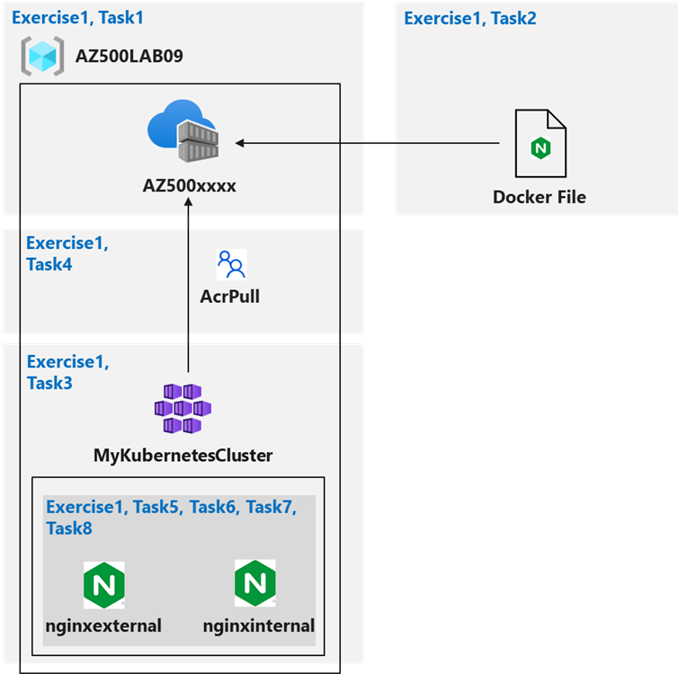

# Cloud Native Apps with Azure Services - Configure and Secure ACR & AKS

### Overall Estimated Duration: 45 Minutes

## Overview

In this lab, you will configure and secure Azure Container Registry (ACR) and Azure Kubernetes Service (AKS) to deploy containerized applications. The lab begins by creating an Azure Container Registry (ACR) to store Docker images and configuring AKS to access and pull those images. You will then create a Dockerfile, build a container, and push it to ACR. Afterward, you will set up an AKS cluster and secure access to the ACR from AKS. The lab also covers deploying both external and internal services to the AKS cluster, followed by verifying accessibility for both types of services hosted on AKS.

## Objectives

The objective of this lab is to provide hands-on experience with deploying and managing resources on Azure Kubernetes Service (AKS). By the end of this lab, you will be able to:

- **Configuring and Securing ACR and AKS** : Involves setting up Azure Container Registry to store Docker images and configuring Azure Kubernetes Service to securely access and deploy those images.

## Prerequisites

Participants should have:

- **Azure Platform Understanding:** Basic knowledge of Azure services, including Azure Kubernetes service.

- **Basic Knowledge of Kubernetes:** A basic understanding of Kubernetes concepts such as pods, containers, deployments, services.

- **Understanding of Docker:** Understanding the fundamentals of Docker, including creating Dockerfiles, building images, and pushing/pulling images to/from a registry.

## Architechture

This architecture illustrates the process of storing Docker images in Azure Container Registry (ACR) and deploying them to Azure Kubernetes Service (AKS). A Dockerfile is used to build container images, which are then pushed to ACR. The AKS cluster is configured to securely pull images from ACR and deploy them as external or internal services, ensuring efficient management and orchestration of containerized applications.

## Architechture Diagram

## Explanation of Components

- **Azure Kubernetes Service (AKS):** A fully managed Kubernetes service that provides a platform for deploying and managing containerized applications.

- **Azure Container Registry (ACR):** A private, fully managed Docker container registry that allows you to store, manage, and secure Docker container images in Azure.

- **Dockerfile:** A text file containing instructions to build a Docker image, defining the application's environment, dependencies, and configurations for container deployment.

## Getting Started with Lab
 
Welcome to your Cloud Native Apps with Azure Services! We've prepared a seamless environment for you to explore and learn Azure Security Technologies. Let's begin by making the most of this experience:

## Accessing Your Lab Environment
 
Once you're ready to dive in, your virtual machine and lab guide will be right at your fingertips within your web browser.
 

### Virtual Machine & Lab Guide
 
Your virtual machine is your workhorse throughout the workshop. The lab guide is your roadmap to success.
 
## Exploring Your Lab Resources
 
To get a better understanding of your lab resources and credentials, navigate to the **Environment Details** tab.
 

 
## Utilizing the Split Window Feature
 
For convenience, you can open the lab guide in a separate window by selecting the **Split Window** button from the top right corner.
 

 
## Managing Your Virtual Machine
 
Feel free to start, stop, or restart your virtual machine as needed from the **Resources** tab. Your experience is in your hands!
 

## Lab Validation

1. After completing the task, hit the **Validate** button under Validation tab integrated within your lab guide. If you receive a success message, you can proceed to the next task, if not, carefully read the error message and retry the step, following the instructions in the lab guide.

   

1. You can also validate the task by navigating to the **Lab Validation** tab, from the upper right corner in the lab guide section.

   

1. If you need any assistance, please contact us at labs-support@spektrasystems.com.

## **Lab Duration Extension**

1. To extend the duration of the lab, kindly click the **Hourglass** icon in the top right corner of the lab environment. 

    

    >**Note:** You will get the **Hourglass** icon when 10 minutes are remaining in the lab.

2. Click **OK** to extend your lab duration.
 
   

3. If you have not extended the duration prior to when the lab is about to end, a pop-up will appear, giving you the option to extend. Click **OK** to proceed.
     
## Let's Get Started with Azure Portal
 
1. On your virtual machine, click on the Azure Portal icon as shown below:
 
    
 
2. You'll see the **Sign into Microsoft Azure** tab. Here, enter your credentials:
 
   - **Email/Username:** <inject key="AzureAdUserEmail"></inject>
 
      
 
3. Next, provide your password:
 
   - **Password:** <inject key="AzureAdUserPassword"></inject>
 
     

1. If you are directed to the **Security Defaults Enabled** pop up, please click on **Ask later**    
   
   
 
4. If prompted to stay signed in, you can click "No."

    
 
5. If a **Welcome to Microsoft Azure** pop-up window appears, simply click **Cancel** to skip the tour.

## Support Contact

The CloudLabs support team is available 24/7, 365 days a year, via email and live chat to ensure seamless assistance at any time. We offer dedicated support channels tailored specifically for both learners and instructors, ensuring that all your needs are promptly and efficiently addressed.

Learner Support Contacts:

- Email Support: cloudlabs-support@spektrasystems.com

- Live Chat Support: https://cloudlabs.ai/labs-support
   
Now, click on Next from the lower right corner to move to the next page.

### Happy Learning!!
 

