# Lab 01 - Configuring and Securing ACR and AKS

## Overview

You have been asked to deploy a proof of concept with Azure Container Registry and Azure Kubernetes Service. Specifically, the proof of concept should demonstrate:

- Using Dockerfile to build an image.
- Using Azure Container Registry to store images.
- Configuring an Azure Kubernetes Service.
- Securing and accessing container applications both internally and externally. 

   > For all the resources in this lab, we are using the **East US** region. Verify with your instructor this is the region to use for class. 

## Lab Objectives

- Task 1: Create an Azure Container Registry.
- Task 2: Create a Dockerfile, build a container and push it to Azure Container Registry.
- Task 3: Create an Azure Kubernetes Service cluster.
- Task 4: Grant the AKS cluster permissions to access the ACR.
- Task 5: Deploy an external service to AKS.
- Task 6: Verify the you can access an external AKS-hosted service.
- Task 7: Deploy an internal service to AKS.
- Task 8: Verify the you can access an internal AKS-hosted service.

### Task 1: Create an Azure Container Registry

In this task, you will set up a resource group and an Azure Container Registry (ACR). We start by opening Cloud Shell in Bash and creating a new resource group and virtual network using Azure CLI commands. Next, you will verify the creation of the resource group and then create a new ACR instance with a unique name. Finally, you will confirm the creation of the ACR and record its name for future use.

1. In the Azure portal click on **Cloud Shell**, open it with the **>_** (1) button on the top of the Azure portal and select `Bash` (2).

   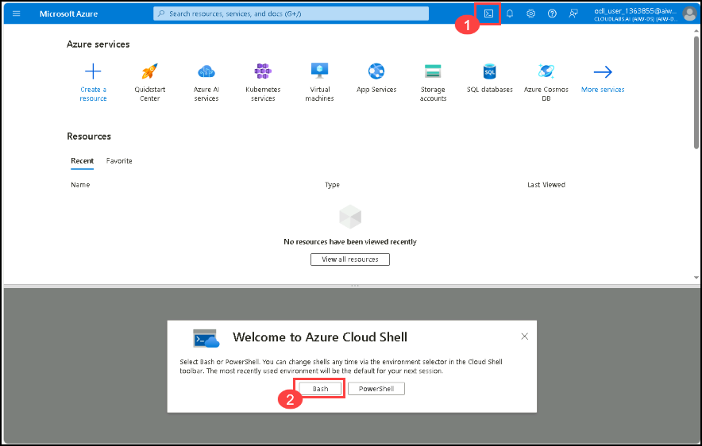

1. If You don't have pre-created storage account, select **Mount storage account** and then click on **Apply**.

   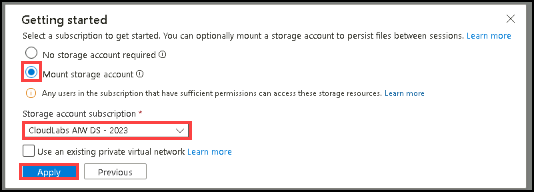
   
1. Select **I want to create a storage**, click on **Next**. provide all the below details Click on **Create**.

    - **Resource group**: Select the **<inject key="resourcegroup" enableCopy="true"/>**  Resource group.
    - **Region**: **<inject key="region"  enableCopy="false"/>**.
    - **Storage account**: Enter the name as **storage<inject key="DeploymentID"  enableCopy="false"/>** .
    - **File share**: Enter `blob` 

        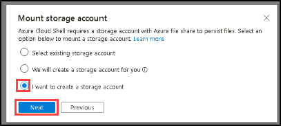

        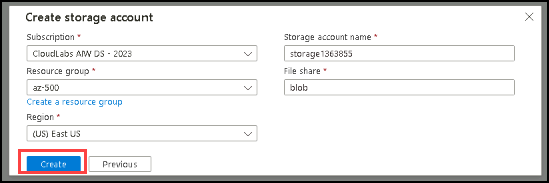

1. In the Bash session within the Cloud Shell pane, run the following to create a new resource group and virtual network for this lab:

    ```sh
    az group create --name AZ500LAB09 --location eastus
    az network vnet create --resource-group AZ500LAB09 --name AZ500LAB09-vnet --address-prefixes 10.0.0.0/16 --subnet-name default --subnet-prefix 10.0.0.0/24
    ```

1. In the Bash session within the Cloud Shell pane, run the following to verify the resource group was created:

    ```
    az group list --query "[?name=='AZ500LAB09']" -o table
    ```

1. In the Bash session within the Cloud Shell pane, run the following to create a new Azure Container Registry (ACR) instance (The name of the ACR must be globally unique): 

    ```sh
    az acr create --resource-group AZ500LAB09 --name az500$RANDOM$RANDOM --sku Basic
    ```

1. In the Bash session within the Cloud Shell pane, run the following to confirm that the new ACR was created:

    ```sh
    az acr list --resource-group AZ500LAB09
    ```

    >**Note**: Record the name of the ACR. You will need it in the next task.
    
    .png)
   
### Task 2: Create a Dockerfile, build a container and push it to Azure Container Registry

In this task, you will create a Dockerfile, build a container image from it, and push the image to Azure Container Registry (ACR). You will start by creating a Dockerfile with an Nginx base image, then build and push the image to ACR using Azure CLI commands. After the process completes, you will verify the image's presence and version in the Azure portal by checking the ACR's repositories and image tags.

1. In the Bash session within the Cloud Shell pane, run the following to create a Dockerfile to create an Nginx-based image: 

    ```sh
    echo FROM nginx > Dockerfile
    ```

1. In the Bash session within the Cloud Shell pane, run the following to build an image from the Dockerfile and push the image to the new ACR. 

    >**Note**: The trailing period at the end of the command line is required. It designates the current directory as the location of Dockerfile. 

    ```sh
    ACRNAME=$(az acr list --resource-group AZ500LAB09 --query '[].{Name:name}' --output tsv)

    az acr build --resource-group AZ500LAB09 --image sample/nginx:v1 --registry $ACRNAME --file Dockerfile .
    ```

    >**Note**: Wait for the command to successfully complete.

1. Close the Cloud Shell pane.

1. In the Azure portal, scroll down and select **Resource groups**.

   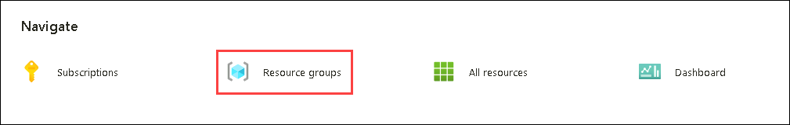

1. navigate to the **AZ500LAB09** resource group and, in the list of resources, click the entry representing the Azure Container Registry instance you provisioned in the previous task.

   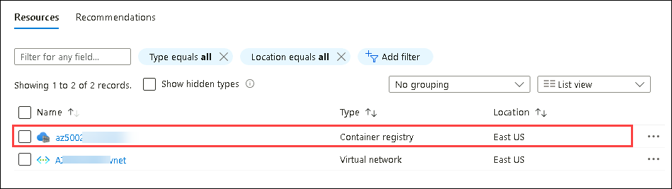

1. On the Container registry blade, in the **Services** section, click **Repositories**. Verify that the list of repositories includes the new container image named **sample/nginx**.

   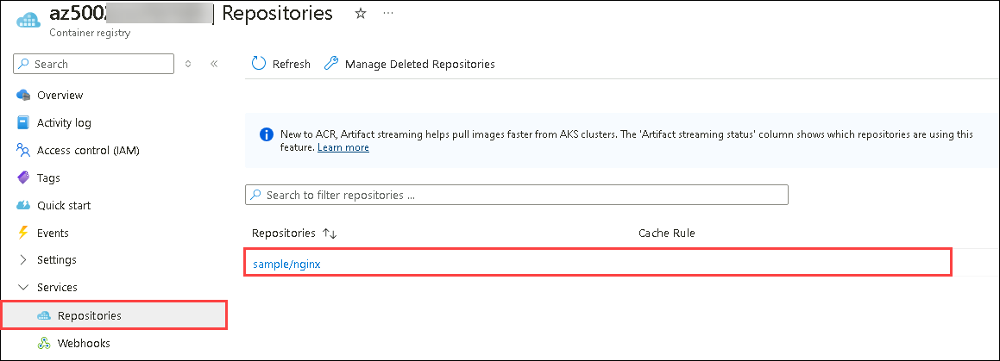

1. Click the **sample/nginx** entry and verify presence of the **v1** tag that identifies the image version.

1. Click the **v1** entry to view the image manifest.

    >**Note**: The manifest includes the sha256 digest, manifest creation date, and platform entries. 

### Task 3: Create an Azure Kubernetes Service cluster

In this task, you will create an Azure Kubernetes Service (AKS) cluster and review its resources. you will start by initiating the creation of a Kubernetes cluster in the Azure portal, configuring basic settings such as the cluster name, resource group, and region, and setting up node pools and networking. Once deployed, you will check the new resource group for AKS components, and use Cloud Shell to connect to the cluster and verify its nodes are ready. 

1. In the Azure portal, in the **Search resources, services, and docs** text box at the top of the Azure portal page, type **Kubernetes services** and press the **Enter** key.

   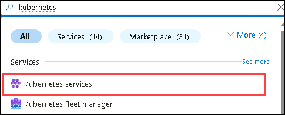

1. On the **Kubernetes services** blade, click **+ Create** and, in the drop-down menu, click **+ Create Kubernetes cluster**

   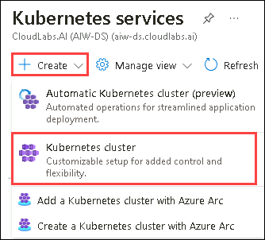

1. On the **Basics** tab of the **Create Kubernetes cluster** blade, for **Cluster preset configuration**, select **Dev/Test**. Now specify the following settings (leave others with their default values):

    |Setting|Value|
    |----|----|
    |Subscription|the name of the Azure subscription you are using in this lab|
    |Resource group|**AZ500LAB09**|
    |Kubernetes cluster name|**MyKubernetesCluster**|
    |Region|**(US) East US**|
    |Availability zones |**None**|

1. Click **Next: Node Pools >**, on the **Node Pools** tab of the **Create Kubernetes cluster** blade, specify the following settings (leave others with their default values):

    |Setting|Value|
    |----|----|
    |Enable virtual nodes|cleared checkbox|

    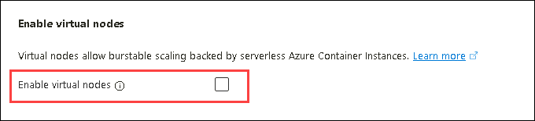
	
1. Click **Next: Networking >**, on the **Networking** tab of the **Create Kubernetes cluster** blade, specify the following settings (leave others with their default values):

    |Setting|Value|
    |----|----|
    |Network configuration|**Azure CNI Node Subnet**|
    |DNS name prefix|**Leave the default value**|

    >**Note**: AKS can be configured as a private cluster. This assigns a private IP to the API server to ensure network traffic between your API server and your node pools remains on the private network only. For more information, visit [Create a private Azure Kubernetes Service cluster](https://docs.microsoft.com/en-us/azure/aks/private-clusters) page.

1. Click **Next** twice so that you will be navigated to **Monitoring** tab. on the Monitoring tab of the Create Kubernetes cluster blade, uncheck the box of **Enable container logs** under Container Insights.

    >**Note**: In production scenarios, you would want to enable monitoring. Monitoring is disabled in this case since it is not covered in the lab. 

1. Click **Review + Create** and then click **Create**.

    >**Note**: Wait for the deployment to complete. This might take about 10 minutes.

1. Once the deployment completes, in the Azure portal, in the **Search resources, services, and docs** text box at the top of the Azure portal page, type **Resource groups** and press the **Enter** key.

1. On the **Resource groups** blade, in the listing of resource groups, note a new resource group named **MC_AZ500LAB09_MyKubernetesCluster_eastus** that holds components of the AKS Nodes. Review resources in this resource group. 
	
1. Navigate back to the **Resource groups** blade and click the **AZ500LAB09** entry. 

   

    >**Note**: In the list of resources, note the AKS Cluster.

1. In the Azure portal, open a Bash session in the Cloud Shell. 

    >**Note**: Ensure **Bash** is selected in the drop-down menu in the upper-left corner of the Cloud Shell pane.

1. In the Bash session within the Cloud Shell pane, run the following to connect to the Kubernetes cluster:

    ```sh
    az aks get-credentials --resource-group AZ500LAB09 --name MyKubernetesCluster
    ```

1. In the Bash session within the Cloud Shell pane, run the following to list nodes of the Kubernetes cluster: 

    ```sh
    kubectl get nodes
    ```

    >**Note**: Verify that the **Status** of the cluster node is listed as **Ready**.

### Task 4: Grant the AKS cluster permissions to access the ACR and manage its virtual network

In this task, you will grant an Azure Kubernetes Service (AKS) cluster the necessary permissions to access an Azure Container Registry (ACR) and manage its virtual network. You will first configure the AKS cluster to access the ACR by attaching it and assigning the necessary role for image pulling. Next, you will provide the AKS cluster with the Contributor role to manage its virtual network, ensuring it can interact with network resources. Finally, you will confirm the AKS cluster's ability to pull container images from the ACR by updating its configuration.

1. In the Bash session within the Cloud Shell pane, run the following to configure the AKS cluster to use the Azure Container Registry instance you created earlier in this lab. 

    ```sh
    ACRNAME=$(az acr list --resource-group AZ500LAB09 --query '[].{Name:name}' --output tsv)
    
    az aks update -n MyKubernetesCluster -g AZ500LAB09 --attach-acr $ACRNAME

    ```

    >**Note**: This command grants the 'acrpull' role assignment to the ACR.
    >**Note**: It may take a few minutes for this command to complete.

1. In the Bash session within the Cloud Shell pane, run the following to grant the AKS cluster the Contributor role to its virtual network. 

    ```sh
    RG_AKS=AZ500LAB09
    
    AKS_VNET_NAME=AZ500LAB09-vnet
    
    AKS_CLUSTER_NAME=MyKubernetesCluster
    
    AKS_VNET_ID=$(az network vnet show --name $AKS_VNET_NAME --resource-group $RG_AKS --query id -o tsv)
    
    AKS_MANAGED_ID=$(az aks show --name $AKS_CLUSTER_NAME --resource-group $RG_AKS --query identity.principalId -o tsv)
    
    az role assignment create --assignee $AKS_MANAGED_ID --role "Contributor" --scope $AKS_VNET_ID
    ```

1. In the Bash session within the Cloud Shell pane, run the following to which allows the AKS cluster to pull container images from the specified ACR.

   ```sh
   az aks update -n $AKS_CLUSTER_NAME -g <$RESOURCE_GROUP_NAME> --attach-acr /subscriptions/<$subscriptionId>/resourceGroups/<$RESOURCE_GROUP_NAME>/providers/Microsoft.ContainerRegistry/registries/<contosotradersacr$deploymentid>
   ```
    >**Note**: Kindly replace the Resource group <$RESOURCE_GROUP_NAME> with **$RG_AKS**, <$subscriptionId> with **<inject key="SubscriptionID" enableCopy="false"/>** and <contosotradersacr$deploymentid> with **ACR Name** which you recorded earlier.

### Task 5: Deploy an external service to AKS

In this task, you'll deploy an external service to your Azure Kubernetes Service (AKS) cluster. Begin by uploading the necessary YAML manifest files for the external service to the Cloud Shell. Edit the `nginxexternal.yaml` file to replace the placeholder with the name of your Azure Container Registry (ACR). After saving your changes, apply the updated YAML file to the AKS cluster using `kubectl`. Finally, verify the deployment and service creation by reviewing the command output.

1. In the Bash session within the Cloud Shell pane, click the **Manage files** icon, in the drop-down menu, click **Upload**, in the **Open** dialog box, naviate to the location where you downloaded the lab files, select **C:\AllFiles\AZ500-AzureSecurityTechnologies-prod\Allfiles\Labs\09\\nginxexternal.yaml** click **Open**. Next, select **C:\AllFiles\AZ500-AzureSecurityTechnologies-prod\Allfiles\Labs\09\\nginxinternal.yaml**, and click **Open**.

    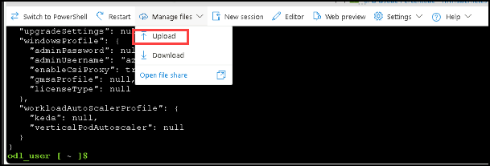
   
1. In the Bash session within the Cloud Shell pane, run the following to identify the name of the Azure Container Registry instance:

    ```sh
    echo $ACRNAME
    ```

    >**Note**: Record the Azure Container Registry instance name. You will need it later in this task.

    .png)
 
1. In the Bash session within the Cloud Shell pane, run the following to open the nginxexternal.yaml file, so you can edit its content. 

    ```sh
    code ./nginxexternal.yaml
    ```

    >**Note**: This is the *external* yaml file. If you get a pop-up to **Switch to Classic Cloud Shell** then click on **Confirm**, and repeat the above step.

    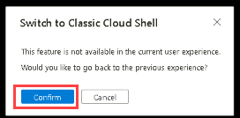

1. In the editor pane, scroll down to **line 24** and replace the **`<ACRUniquename>`** placeholder with the ACR name.

    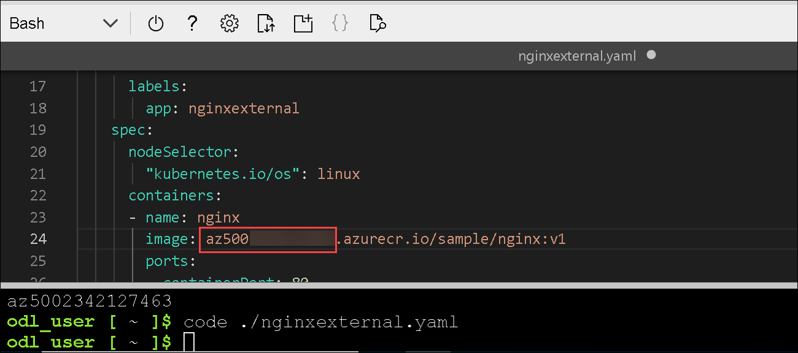
   
1. Now to save this edited yaml file, perform **CTRL + S** and then **CTRL + Q** to exit. 

1. In the Bash session within the Cloud Shell pane, run the following to apply the change to the cluster:

    ```sh
    kubectl apply -f nginxexternal.yaml
    ```

1. In the Bash session within the Cloud Shell pane, review the output of the command you run in the previous task to verify that the deployment and the corresponding service have been created. 

   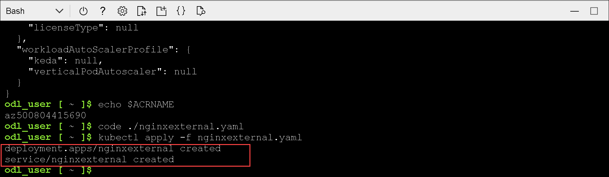
  
### Task 6: Verify the you can access an external AKS-hosted service

In this task, you will verify the container can be accessed externally using the public IP address.

1. In the Bash session within the Cloud Shell pane, run the following to retrieve information about the nginxexternal service including name, type, IP addresses, and ports. 

    ```sh
    kubectl get service nginxexternal
    ```

1. In the Bash session within the Cloud Shell pane, review the output and record the value in the External-IP column. You will need it in the next step. 

    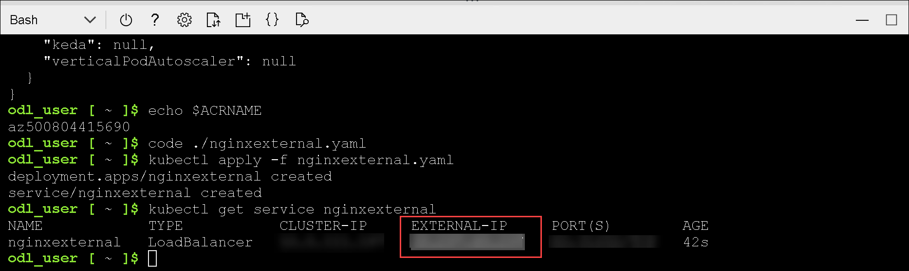

1. Open a new broswer and browse to the IP address you identified in the previous step.

1. Ensure the **Welcome to nginx!** page displays. 

    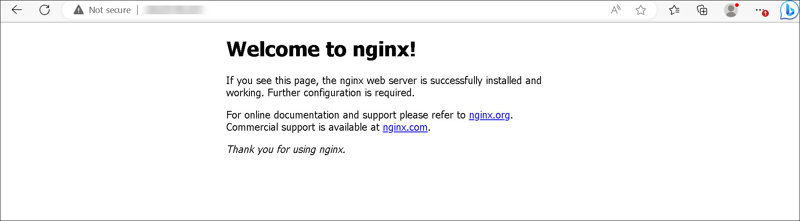
  
### Task 7: Deploy an internal service to AKS

In this task, you'll deploy a service within the AKS cluster that is only accessible internally. First, update the configuration file to include the correct Azure Container Registry name, then apply these changes to the cluster. After deploying, find and note the private IP address assigned to this service, which you'll use to access the service from within the cluster.

1. In the Bash session within the Cloud Shell pane, run the following to open the nginxintenal.yaml file, so you can edit its content. 

    ```sh
    code ./nginxinternal.yaml
    ```

    >**Note**: This is the *internal* yaml file.

1. In the editor pane, scroll down to the line containing the reference to the container image and replace the **`<ACRUniquename>`** placeholder with the ACR name.

   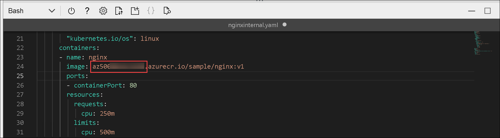

1. Now to save this edited yaml file, perform CTRL + S and then CTRL + Q to exit. 

1. In the Bash session within the Cloud Shell pane, run the following to apply the change to the cluster:

    ```sh
    kubectl apply -f nginxinternal.yaml
    ```

1.  In the Bash session within the Cloud Shell pane, review the output to verify your deployment and the service have been created:

    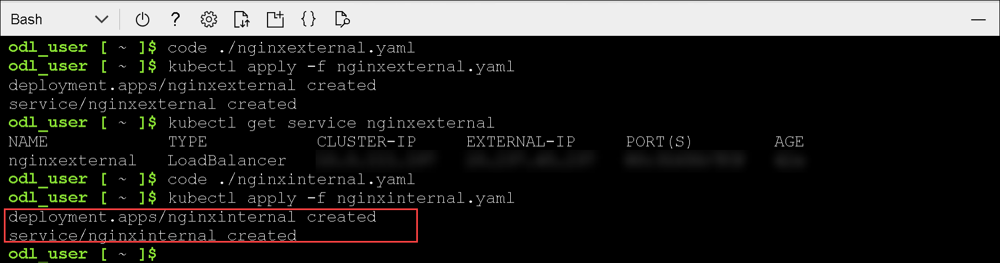

1. In the Bash session within the Cloud Shell pane, run the following to retrieve information about the nginxinternal service including name, type, IP addresses, and ports. 

    ```sh
    kubectl get service nginxinternal
    ```

1. In the Bash session within the Cloud Shell pane, review the output. The External-IP is, in this case, a private IP address. It will be in **Pending** state, so you could use the **CLUSTER-IP** address.

    >**Note**: Record this IP address. You will need it in the next task. 

    >**Note**: To access the internal service endpoint, you will connect interactively to one of the pods running in the cluster. 

### Task 8: Verify the you can access an internal AKS-hosted service

In this task, you will verify access to the internal service hosted on AKS by using one of the cluster's pods. Start by listing the available pods and selecting one to use. Connect to this pod interactively and then check if you can reach the internal service using its private IP address.

1. In the Bash session within the Cloud Shell pane, run the following to list the pods in the default namespace on the AKS cluster:

    ```sh
    kubectl get pods
    ```

1. In the listing of the pods, copy the first entry in the **NAME** column.

   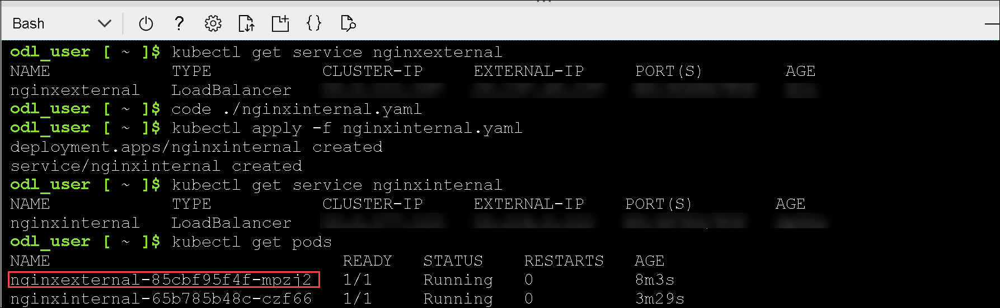

   >**Note**: This is the pod you will use in the subsequent steps.

1. In the Bash session within the Cloud Shell pane, run the following to connect interactively to the first pod (replace the `<pod_name>` placeholder with the name you copied in the previous step):

    ```sh
    kubectl exec -it <pod_name> -- /bin/bash
    ```

1. In the Bash session within the Cloud Shell pane, run the following to verify that the nginx web site is available via the private IP address of the service (replace the `<internal_IP>` placeholder with the IP address you recorded in the previous task):

    ```sh
    curl http://<internal_IP>
    ```

1. Close the Cloud Shell pane.

   > **Result:** You have configured and secured ACR and AKS.

>**Congratulations** on completing the task! Now, it's time to validate it.
<validation step="d57eeea8-6168-46ed-ae17-6c4a5fdb0f4d" />

### Review

In this lab, you have completed:

- Created an Azure Container Registry.
- Created a Dockerfile, build a container and push it to Azure Container Registry.
- Created an Azure Kubernetes Service cluster.
- Granted the AKS cluster permissions to access the ACR.
- Deployed an external service to AKS.
- Verified the you can access an external AKS-hosted service.
- Deployed an internal service to AKS.
- Verified the you can access an internal AKS-hosted service.

## You have successfully completed the lab
